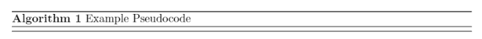
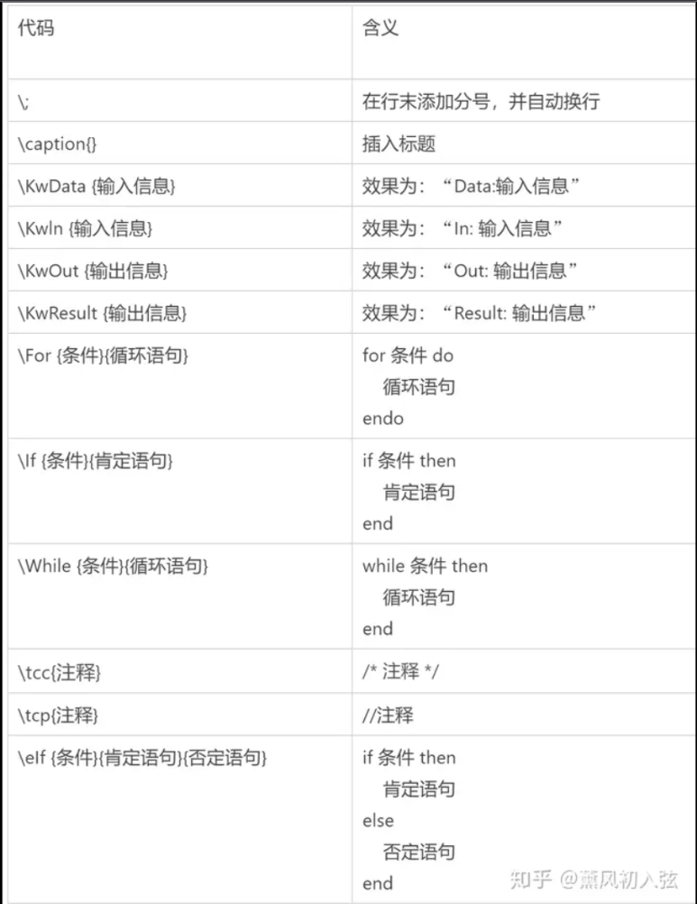

### 伪代码书写规范

伪代码是一种接近自然语言的算法描述形式，目的是在不涉及具体编程语言的情况下将算法的流程和含义清楚的表达出来，因此没有一个统一的规范。

一般来说：

1. 有一个标题和编号

2. 明确输入和输出

3. 赋值一般使用 `<-` 来表示

4. `A[i]` 表示 A 的第 i 个元素，`A[1...j]` 表示从下标 1 到 j 的子数组

5. 返回值使用 `return` 关键字

6. 函数的调用使用函数名 + 传入参数的形式

#### 参考

https://shuzang.github.io/2021/pseudocode-specification/


### algorithm 包

#### 简单的语句

在 `.tex` 文件中，先引入宏包

```latex
\usepackage{algorithm}
\usepackage{algorithmic}
```

然后写入

```latex
\begin{algorithm}
    \caption{Example Pseudocode}
\end{algorithm}
```

这样就可以创建一个伪代码环境，如下如所示



此时伪代码是空的，我们在 `algorithm` 模块中嵌入一个 `algorithmi` 块，可以发现我们是在代码块中内嵌数学公式：

```latex
\begin{algorithm}
    \caption{Example Pseudocode}
    \begin{algorithmic}
        \STATE $x\gets0$
    \end{algorithmic}
\end{algorithm}
```

也就是说，伪代码是一个赋值语句，一行普通语句以 `\STATE` 开头：

```latex
\usepackage{amsmath}

\begin{algorithm}
    \caption{Example Pseudocode}
    \begin{algorithmic}
        \STATE $x\gets0$
        \STATE $y\gets\sqrt{x}+1$
        \STATE $z\gets\dfrac{x}{y}$
    \end{algorithmic}
\end{algorithm}
```

#### 判断结构

一个简单的判断结构：

```latex
\begin{algorithm}
    \caption{Example Pseudocode}
    \begin{algorithmic}
        \STATE $x\gets0$
        \IF {$x\leq 0$}
        \STATE $x\gets x+1$
        \ENDIF
    \end{algorithmic}
\end{algorithm}
```

我们不需要手动缩进，只需要用 `\IF` 和 `\ENDIF` 限制范围即可。此外，`IF` 后面的条件外面需要加上 `{}` 。类似的，加上 `\ELSE` 就可以实现一个完整的 `if-else` 子句。

```latex
\begin{algorithm}
    \caption{Example Pseudocode}
    \begin{algorithmic}
        \STATE $x\gets0$
        \IF {$x\leq 0$}
        \STATE $x\gets x+1$
        \ELSE
        \STATE $x\gets x-1$
        \ENDIF
    \end{algorithmic}
\end{algorithm}
```

#### 循环语句

除了 `while`，`algorithmic` 还支持四种循环方法：

```latex
% for循环
\begin{algorithmic}
    \FOR {<condition>}
    \STATE <text>
    \ENDFOR
\end{algorithmic}

% forall循环
\begin{algorithmic}
    \FORALL {<condition>}
    \STATE <text>
    \ENDFOR
\end{algorithmic}

% repeat循环
\begin{algorithmic}
    \REPEAT <text>
    \UNTIL {<condition>}
\end{algorithmic}

% loop循环
\begin{algorithmic}
    \LOOP <text>
    \ENDLOOP
\end{algorithmic}
```

#### 输入输出

在算法为代码中，我们常常需要说明算法的输入和输出，帮助读者更好的阅读代码。

```latex
\begin{algorithm}
    \caption{Example Pseudocode}
    \begin{algorithmic}
        \ENSURE{$x$}
        \REQUIRE{$y$}
        \STATE $x\gets0$
        \IF{$x\leq0$}
        \STATE{$y\gets-1$}
        \ELSE
        \STATE{$y\gets1$}
        \ENDIF
    \end{algorithmic}
\end{algorithm}
```

其中，输入对应 `\REQUIRE`，输出对应 `\ENSURE`

如果喜欢使用 `INPUT` 表示输入，`OUTPUT` 表示输出，可以对于关键字进行重新定义：

```latex
\renewcommand{\algorithmicrequire}{\textbf{Input:}}
\renewcommand{\algorithmicensure}{\textbf{Output:}}
```

#### 杂项

##### 显示行号

在 `\begin{algorithmic}` 后面加上 `[1]`，算法伪代码会显示行号：

```latex
\begin{algorithm}
    \caption{Example Pseudocode}
    \begin{algorithmic}[1]
        \STATE $x\gets0$
        \IF {$x\leq1$}
        \STATE $x\gets x+1$
        \ENDIF
    \end{algorithmic}
\end{algorithm}
```

> 注意：[1] 表示每一行都显示行号，如果是 [2]，表示每两行显示一个行号

##### 注释

`\COMMENT` 命令会在算法伪代码中加上注释：

```latex
\begin{algorithm}
    \caption{Example Pseudocode}
    \begin{algorithmic}
        \STATE $x\gets0$\COMMENT{This is a comment}
        \IF {$x\leq1$}
        \STATE $x\gets x+1$
        \ENDIF
    \end{algorithmic}
\end{algorithm}
```

如果是 `IF`、`FOR` 这些语句，则需要这样写注释：

```latex
\IF[This is a comment]{<text>}
```

但是这样的显示效果不是很好，注释和代码之间的距离太小，我们可以使用 `\Comment` 来注释（这一次只有首字母是大写）。

#### 参考

https://welts.xyz/2022/01/17/pseudocode/

### algorithm2e 包

在 `beamer` 中，一般更经常使用 `algorithm2e`，并且它们的语法也有着挺大的不同。

#### 基本语法



#### 例子

```latex
\def\SetClass{article}
\documentclass{\SetClass}
\usepackage[ruled,linesnumbered]{algorithm2e}
\begin{document}
\begin{algorithm}
\caption{Simulation-optimization heuristic}\label{algorithm}
\KwData{current period $t$, initial inventory $I_{t-1}$, initial capital $B_{t-1}$, demand samples}
\KwResult{Optimal order quantity $Q^{\ast}_{t}$}
$r\leftarrow t$\;
$\Delta B^{\ast}\leftarrow -\infty$\;
\While{$\Delta B\leq \Delta B^{\ast}$ and $r\leq T$}{$Q\leftarrow\arg\max_{Q\geq 0}\Delta B^{Q}_{t,r}(I_{t-1},B_{t-1})$\;
$\Delta B\leftarrow \Delta B^{Q}_{t,r}(I_{t-1},B_{t-1})/(r-t+1)$\;
\If{$\Delta B\geq \Delta B^{\ast}$}{$Q^{\ast}\leftarrow Q$\;
$\Delta B^{\ast}\leftarrow \Delta B$\;}
$r\leftarrow r+1$\;}
\end{algorithm}
\end{document}
```

#### 参考

https://www.zhihu.com/tardis/zm/art/166418214?source_id=1003