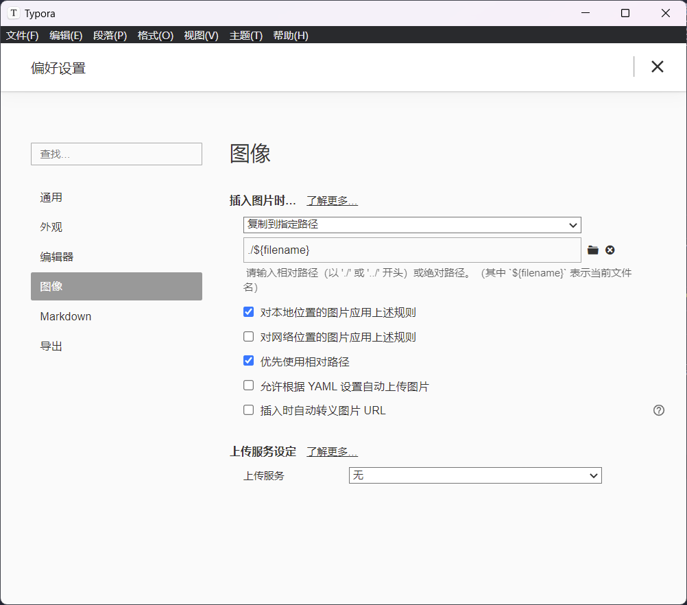

#### 字体的设置

参见 

https://hexo-next.readthedocs.io/zh-cn/latest/next/advanced/%E5%AD%97%E4%BD%93%E8%AE%BE%E7%BD%AE/

对于字体大小的设置：

https://marshzero.github.io/2021/12/09/Hexo%20NexT%20%E5%AD%97%E4%BD%93%E7%BE%8E%E5%8C%96%20%E7%B1%BBMeme/

#### 数学公式的配置

使用 mathjax 渲染，卸载掉之前的插件。

具体参见：

1. https://blog.csdn.net/weixin_45073562/article/details/120289648
2. https://hexo-next.readthedocs.io/zh-cn/latest/next/advanced/%E9%85%8D%E7%BD%AEMathJax/

#### 评论系统的配置

1. https://blog.csdn.net/weixin_48927364/article/details/123321038
2. https://qianfanguojin.top/2022/01/20/Hexo%E5%8D%9A%E5%AE%A2%E8%BF%9B%E9%98%B6%EF%BC%9A%E4%B8%BA-Next-%E4%B8%BB%E9%A2%98%E6%B7%BB%E5%8A%A0-Waline-%E8%AF%84%E8%AE%BA%E7%B3%BB%E7%BB%9F/

#### 侧边 menu 的配置

https://qianfanguojin.top/tags/Hexo/

#### 插入图片

之前版本的 `hexo-asset-image` 已经过时了，不更新了。先 `npm uninstall hexo-asset-image`，再 `npm install hexo-asset-img`，使用这个新的包。

然后了，打开 hexo 下的 `_config.yml`，更改 `post_asset_folder` 为 `true`。此时，我们已经可以使用 `asset_img xxx.png xxx` 或者 ``

#### 配置标签(tags)页面

先使用 `hexo new page tags` 命令创建 tags 页面，然后修改 `front-matter`，在其中添加 `type: "tags"` 和 `layout: "tags"`

#### hexo deploy 报错

当执行 `hexo d` 报错 `error: spawn failed...` 的时候

#### 修改 sidebar 以及页面主题颜色

参考：

1. https://www.jianshu.com/p/2a8d399f1266

2. https://blog.csdn.net/weixin_44543463/article/details/119749738

不过有些时候还是需要自己打开开发者工具寻找一下，自己修改。因为网上查到的资料使用的 hexo 版本差异很大。

#### 封面图片配置

参考：

https://cloud.tencent.com/developer/article/1964392

但是这种方式插入图片，使用的 CSS 格式和文章中的格式一致，所以感觉可能不是很好修改样式，就先不搞这个了。

#### 段落间距设置

直接开发者工具找到 `h` 的配置 CSS 地址，然后修改即可。

#### 配置文章标题悬浮下划线

此处是受到 Menci 的博客启发，网上找了很久没有找到如何操作。只得查看 Menci 博客源码，直接摘了过来。

Menci 的 OI 博客：https://oi.men.ci/