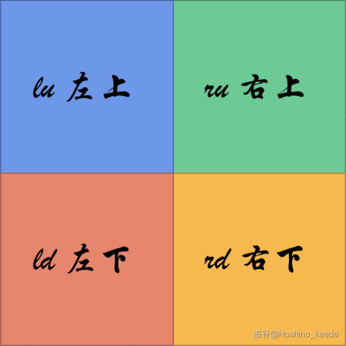
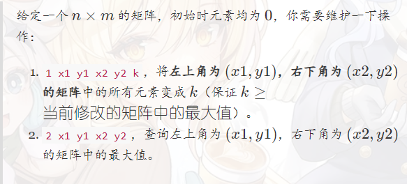

二维线段树是一类算法竞赛中不常用的用来维护二维平面上的一个矩阵中的信息（如矩阵和、矩阵中的最大值）的数据结构，主流的二位线段树有两种写法：

- 四叉树写法
- 树套树写法

两种写法的时间复杂度理论上都是 $n\log^{2}n$ 。其中，第一种写法的用途更加广泛，也更好理解，但是时间复杂度经常假到 $n^{2}$ 并且还有比较大的常数。

**区间修改 - 区间查询**

**单点修改 - 区间查询**

#### 四叉树写法

这种方式比较亲民，我们先看这种方式。

类比一维线段树，我们二维线段树将几个区间分割为四个部分，如下图：



#### 树套树写法

我们要讲的二维线段树，就是运用的线段树套线段树。

其中，需要使用永久标记。

##### 一维线段树永久标记

```c++
#include <iostream>
#include <algorithm>
#define int long long

const int N = 1e5 + 5;
int n, m;

struct Tree {
    int l, r, lazy;
    int sum;
} t[N << 2];

void push_up(int cur) {
    t[cur].sum = t[cur << 1].sum + t[cur << 1 | 1].sum;
}

void build(int cur, int l, int r) {
    t[cur].l = l; t[cur].r = r;
    t[cur].lazy = 0; t[cur].sum = 0;
    if (l == r) {
        std::cin >> t[cur].sum;
        return ;
    }
    int mid = (l + r) >> 1;
    build(cur << 1, l, mid);
    build(cur << 1 | 1, mid + 1, r);
    push_up(cur);
}

void add(int cur, int l, int r, int k) {
    // t[cur].sum += k * (t[cur].r - t[cur].l + 1);
    if (std::min(t[cur].r, r) >= std::max(t[cur].l, l)) {
        t[cur].sum += k * (std::min(t[cur].r, r) - std::max(t[cur].l, l) + 1);
    }
    if (t[cur].l >= l && t[cur].r <= r) {
        t[cur].lazy += k;
        return ;
    }
    int mid = (t[cur].l + t[cur].r) >> 1;
    if (l <= mid) add(cur << 1, l, r, k);
    if (r >= mid + 1) add(cur << 1 | 1, l, r, k);
}

int query(int cur, int l, int r, int sum) {
    if (t[cur].l >= l && t[cur].r <= r) {
        return t[cur].sum + sum * (t[cur].r - t[cur].l + 1);
    }
    int mid = (t[cur].l + t[cur].r) >> 1;
    int res = 0;
    if (l <= mid) res += query(cur << 1, l, r, sum + t[cur].lazy);
    if (r >= mid + 1) res += query(cur << 1 | 1, l, r, sum + t[cur].lazy);
    return res;
}

signed main() {
    std::cin >> n >> m;
    build(1, 1, n);
    int x, y, k, opt;
    while (m--) {
        std::cin >> opt;
        if (opt == 1) {
            std::cin >> x >> y >> k;
            add(1, x, y, k);
        } else {
            std::cin >> x >> y;
            std::cout << query(1, x, y, 0) << "\n";
        }
    }
    return 0;
}
```

标记永久化可以用于各种树套树上，同样的，二位线段树也适用。

我们此时再看题目：



首先是内层的线段树，内层的线段树的定义要写在外层线段树之前，因为后者会调用前者。内层线段树和普通的线段树是一样的，是否标记永久化都可以：

##### 缺陷


#### 参考

1. https://www.cppblog.com/menjitianya/archive/2015/10/06/211956.html
