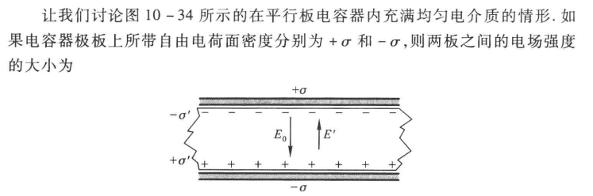
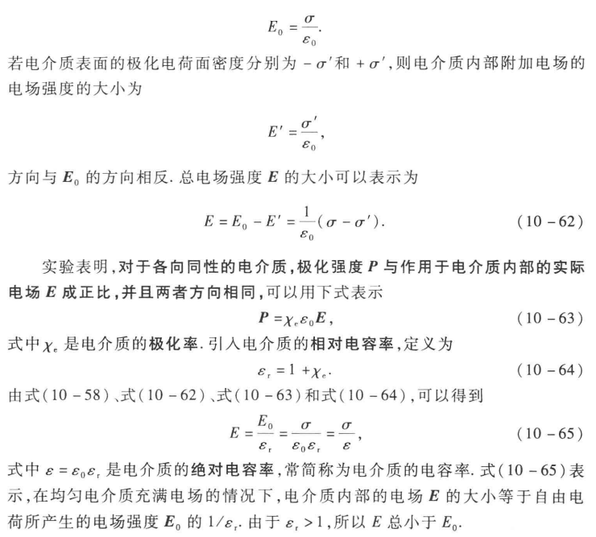

### 第十章 电荷和静电场

电荷量的单位是 C（库伦）

库仑定律：**真空中**两个相对于观察者**静止**的**点电荷**之间的相互作用力
$$
F = \dfrac{1}{4\pi\varepsilon_0} \dfrac{q_1q_2}{r^2}
$$
其中，$\varepsilon_0$ 表示真空电容率。

电场强度的单位可以是 $N \cdot C^{-1}$ 也可以是 $V \cdot m$

##### 高斯定理

在与电场强度垂直的单位面积上，穿过曲线的条数与该处电场强度的大小成正比。

电场线的性质：

1. 起于正电荷（或者无穷远处），止于负电荷处（或者无穷远）
2. 不闭合，也不在没有电荷的地方中断
3. 两条电场线不会在没有电荷的地方相交

电通量大于 0，表示电场线从曲面内部穿出，小于 0，表示电场线传入曲面内部

高斯面外部的电荷，只对高斯面上的电场强度有贡献，但是对于高斯面的电通量没有贡献。

均匀带电球体在空间中各点产生的电场强度随到球心距离的变化情况。

##### 电势及其与电场强度的关系

电场强度反应了静电场力的性质，静电场的另一方面的性质，即能的性质，**是由电势这个量来反映或者描述的。**

静电场属于保守场

**静电场的环路定理**：
由保守场，可以得到 $\oint_LF\cdot\mathrm{d}\boldsymbol{l}=0$ 所以 $\oint_Lq_0\boldsymbol{E}\cdot\mathrm{d}\boldsymbol{l}=0$，有 $\oint_L\boldsymbol{E}\cdot\mathrm{d}\boldsymbol{l}=0$，最后一个式子就是静电场的环路定理。

如果选择无穷远处的电势为 0，那么可以得到电势的公式为：
$$
V_p = V_p - V_{\infty} = \int_p^{\infty} \boldsymbol{E} \cdot \mathrm{d}\boldsymbol{l}
$$

##### 等势面

等势面处处与电场线正交。

##### 静电场中的金属导体

静电平衡下的金属导体的性质：

1. 整个导体是一个等势体，导体的表面是等势面（静电平衡状态下内部电场强度为 0）
2. 导体表面的场强处处与表面垂直
3. 导体内部不存在净电荷，所有过剩净电荷都分布在导体表面上

##### 电容和电容器

电容串联的时候电荷量一样，并联的时候电压一样。

##### 静电场中的电介质

绝缘体都属于电介质，在这种物质中，不存在自由电荷，所有电荷都被束缚在分子的范围内，所以，电解质在静电场中将表现出与导体根本不同的行为和性质。

为了表征电介质的极化状态，我们引入了极化强度这个物理量，定义为，在电介质的单位体积重分子电矩的矢量和，$P=\frac{\sum p}{\Delta\tau}$

平行板电容器中充满电介质时，内部电场的推导：

所以 U 减小了，所以电容器的电容扩大为原来的 $\varepsilon_r$ 倍。

##### 电介质存在时的高斯定理

 

### 第十五章 波与粒子

普朗克首先引入了能量子的概念，成功解释了黑体辐射的规律；爱因斯坦提出光子的理论，圆满地解释了光电效应和康普顿效应的实验规律；波尔引进的量子化概念，在解释氢原子光谱的规律性上取得了极大的成功。

这些新的假说和概念将 **经典概念中的粒子和波联系起来了，从而为量子力学的建立奠定了基础**。

#### 黑体辐射

##### 热辐射

分子中都包含带电粒子，做分子热运动的时候会向外辐射电磁波，这种电磁波和温度有关，所以被称为**热辐射**。

为了定量描述辐射，我们首先引入 **辐射出射度**（简称 辐出度），表示 **单位时间内** 从 **单位面积** 上发射出的 **各种波长** 的电磁波能量的平和，显然这个量和 T 温度有关，记为 $M(T)$。

如果是波长在 $\lambda \sim \lambda + \mathrm{d}\lambda$ 区间内，就记为 $M_\lambda(T) =\dfrac{\mathrm{d} M(T)}{\mathrm{d}\lambda}$ 为 **单色辐出度**。

物体不仅仅能辐射电磁波，还可以**吸收和反射**电磁波，其中吸收和反射的情况也和自身的温度有关。

**黑体：**一个物体在**任何温度**下对**任何波长**的入射入射能的吸收比都等于 1，即 $\alpha_0(\lambda, T) = 1$ 就称这种物体为 **绝对黑体**，简称 **黑体**。

基尔霍夫辐射定律：
$$
\dfrac{M_\lambda(T)}{\alpha(\lambda, T)} = M_{\lambda0}(T)
$$
任何物体的单色辐出度与单色吸收比之比，等于同一温度下绝对黑体的**单色辐出度**。

##### 黑体辐射的基本规律

斯特藩-玻尔兹曼定律：黑体的辐射出射度与黑体温度的四次方成正比 $M_0(T) = \sigma T^{4}$

维恩位移定律：随着黑体温度的升高，单色辐出度的最大值所对应的波长 $\lambda_m$ 应按照 $T^{-1}$ 的规律向短波方向移动，即 $\lambda_m T = b$

这两个定律经常用于测量高温物体的温度，也是遥感和红外跟踪技术的依据。

##### 普朗克辐射公式和能量子的概念

**普朗克辐射公式**：
$$
M_{\lambda0}(T)=\frac{2\pi hc^{2}}{\lambda^{5}}\Big(\frac1{\mathrm{e}^{hc/\lambda kT}-1}\Big).
$$
其中 h 为普朗克常量。

#### 光电效应

##### 光电效应的实验规律

1. 光强增大，饱和电流增大（光强影响光子的个数，进而影响可以激发的电子的个数，所以影响饱和电流大小）
2. 光子的频率决定是否可以激发电子，使其冲出金属。
   电子在金属中，可以是在金属表面，也可以是更内部，其中，逸出功的对象是 **金属表面的电子**。
   这说明，对于不同位置的电子，再加上光子碰撞的角度不同，获得的能量是不一样的，有大有小，这就是为什么同一光强下，我们施加的电压**可以影响电流的大小**（不是饱和电流）。
3. 光电效应几乎是瞬间发生的

##### 公式

光子的能量：$\varepsilon=h\nu$

光速运动的光子的质量：$m_r = \dfrac{\varepsilon}{c^{2}} = \dfrac{h\nu}{c^{2}}$

光子的动量：$p = m_r c = \dfrac{h\nu}{c} = \dfrac{h}{\lambda}$

光电效应的爱因斯坦方程：$h\nu = \dfrac{1}{2}mu^{2} + A$，其中 A 表示逸出功

我们令 $\dfrac{1}{2}mu^{2} = 0$ 就得到了光子的频率 **红限**，$\nu_0 = \dfrac{A}{h}$

又有
$$
\begin{aligned}
\dfrac{1}{2}mu^{2} = eU_a \\
U_a = K\nu - V_0
\end{aligned}
$$
至于第二个式子，是因为实验证明了 **遏止电压和光子的频率呈线性关系**

得到：
$$
K = \dfrac{h}{e}, V_0 = \dfrac{A}{e}
$$

#### 康普顿效应

X 射线经过金属、石墨等物质散射后不仅有与入射光波长相同的射线，还有波长大于入射光线的射线，这就是 **康普顿效应**

推导见课本 P150

波长改变公式：$\Delta\lambda = \lambda - \lambda_0 = \dfrac{h}{m_0c} (1 - \cos \varphi)$

其中，$m_0$ 是电子的质量，$\varphi$ 是光子的散射角。

#### 氢原子光谱和玻尔的量子论

#### 微观粒子的波动性

静质量为 $\mu$ 以速率为 $u$ 作匀速运动的实物粒子，波长为：
$$
\lambda = \dfrac{h}{p} = \dfrac{h}{\mu_0u}\sqrt{1 - (\frac{u}{c})^{2}}
$$
这种波称为 **德布罗意波**

后来证实了不仅仅是电子具有波动性，其他微观粒子比如原子、中子和质子等也都有波动性。