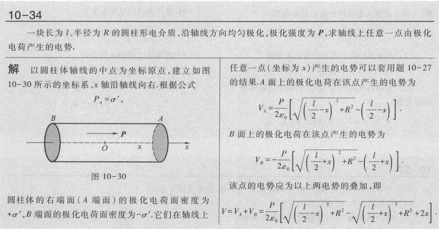
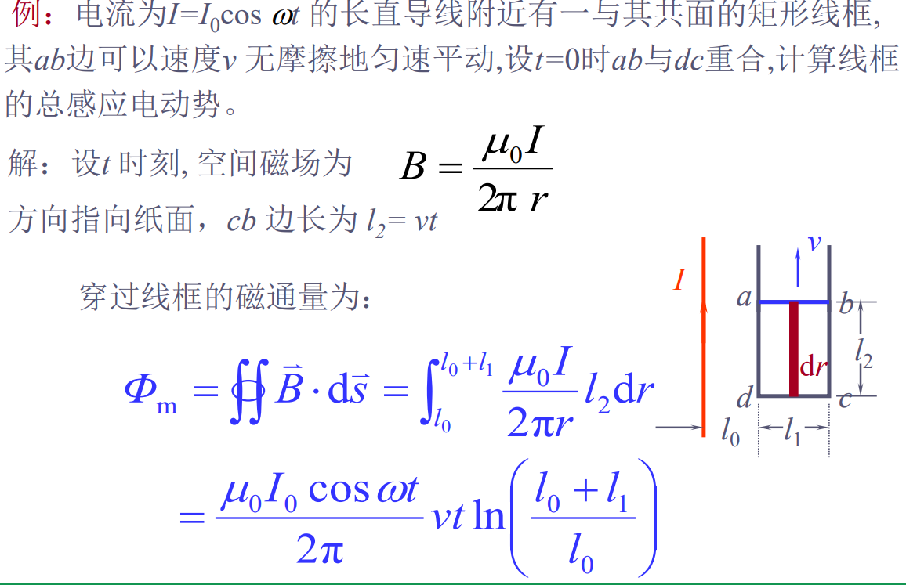

### 第十章 电荷和静电场

电荷量的单位是 C（库伦）

库仑定律：**真空中**两个相对于观察者**静止**的**点电荷**之间的相互作用力
$$
F = \dfrac{1}{4\pi\varepsilon_0} \dfrac{q_1q_2}{r^2}
$$
其中，$\varepsilon_0$ 表示真空电容率。

电场强度的单位可以是 $N \cdot C^{-1}$ 也可以是 $V \cdot m$

##### 高斯定理

在与电场强度垂直的单位面积上，穿过曲线的条数与该处电场强度的大小成正比。

电场线的性质：

1. 起于正电荷（或者无穷远处），止于负电荷处（或者无穷远）
2. 不闭合，也不在没有电荷的地方中断
3. 两条电场线不会在没有电荷的地方相交

电通量大于 0，表示电场线从曲面内部穿出，小于 0，表示电场线传入曲面内部

**高斯面外部的电荷，只对高斯面上的电场强度有贡献，但是对于高斯面的电通量没有贡献。**

均匀带电球体在空间中各点产生的电场强度随到球心距离的变化情况。

##### 电势及其与电场强度的关系

电场强度反应了静电场力的性质，静电场的另一方面的性质，即能的性质，**是由电势这个量来反映或者描述的。**

静电场属于保守场

**静电场的环路定理**：
由保守场，可以得到 $\oint_LF\cdot\mathrm{d}\boldsymbol{l}=0$ 所以 $\oint_Lq_0\boldsymbol{E}\cdot\mathrm{d}\boldsymbol{l}=0$，有 $\oint_L\boldsymbol{E}\cdot\mathrm{d}\boldsymbol{l}=0$，最后一个式子就是静电场的环路定理。

如果选择无穷远处的电势为 0，那么可以得到电势的公式为：
$$
V_p = V_p - V_{\infty} = \int_p^{\infty} \boldsymbol{E} \cdot \mathrm{d}\boldsymbol{l}
$$

##### 等势面

等势面处处与电场线正交。

##### 静电场中的金属导体

静电平衡下的金属导体的性质：

1. 整个导体是一个等势体，导体的表面是等势面（静电平衡状态下内部电场强度为 0）
2. 导体表面的场强处处与表面垂直
3. 导体内部不存在净电荷，所有过剩净电荷都分布在导体表面上

##### 电容和电容器

电容串联的时候电荷量一样，并联的时候电压一样。

##### 极化强度

存在有极分子电介质和无极分子电介质。

 对于电偶极子，从负电荷到正电荷所引的有向线段 l 称为电偶极子的轴，电荷 q 与电偶极子的轴 l 的乘积，定义为电偶极子的电矩，用 p 表示，即 $\bold{p} = q \bold{l}$

**极化强度：**为了表征电介质的极化状态，引入极化强度这个概念，定义为，在电介质的单位体积中分子电矩的矢量和，以 P 表示 $\bold{P} = \dfrac{\sum p}{\Delta \tau}$

关于极化电荷和极化强度关系的推导，参见课本 P311 页。此处，有结论：$\sigma^{'}=P\cdot n$

其中，$\sigma$ 是极化电荷的面密度，$P$ 是极端强度向量，$n$ 是面的法向量。

**关于这一块的推导：**

其中，$\mathrm{d}q'$ 表示取的一个柱体内部，传出表面的电荷数量。

##### 极化电荷对电场的影响

极化电荷在空间中也会产生电场，我们叫做「附加电场」。

##### 静电场中的电介质

绝缘体都属于电介质，在这种物质中，不存在自由电荷，所有电荷都被束缚在分子的范围内，所以，电解质在静电场中将表现出与导体根本不同的行为和性质。

为了表征电介质的极化状态，我们引入了极化强度这个物理量，定义为，在电介质的单位体积重分子电矩的矢量和，$P=\frac{\sum p}{\Delta\tau}$

对于各向同性的电介质，极化强度 P 与作用于电介质内部的实际电场 E 成正比，并且两者方向相同。
$$
P=\chi_{e}\varepsilon_{0}E
$$
其中，$\chi_e$ 表示极化率，引入电介质的相对电容率 $\varepsilon_{_r}=1+\chi_{_e}$

所以，真实的电场强度为：
$$
E = \dfrac{E_0}{\varepsilon_r} = \dfrac{\sigma}{\varepsilon_0 \varepsilon_r} = \dfrac{\sigma}{\varepsilon}
$$

##### 电介质存在时的高斯定理

$$
D = \varepsilon_0 E + P = \varepsilon_0 \varepsilon_r E = \varepsilon E
$$

其中，D 叫做电位移。

总结一下这一部分的公式，感觉比较杂：
$$
D = \varepsilon_0 \varepsilon_r E = \varepsilon E \\ 
E = \dfrac{E_0}{\varepsilon_r} = \dfrac{\sigma}{\varepsilon_0 \varepsilon_r} = \dfrac{\sigma}{\varepsilon} \\
E_0 = \dfrac{\sigma}{\varepsilon_0}
$$
其中，$E = E_0 - E' = \dfrac{1}{\varepsilon_0}(\sigma - \sigma') = \dfrac{1}{\varepsilon_0}(E_0\varepsilon_0 - \chi_e \varepsilon_0E) = E_0 - \chi_eE$

最后得到，$E = \dfrac{E_0}{\varepsilon_r}$
$$
\oiint_sD\cdot\mathrm{d}S=\sum_iq_{0i}
$$

##### 静电场的能量

> 一个带电体系所具有的静电能就是该体系所具有的电势能，它等于把各电荷元从无限远离的状态聚集成该带电体系的过程中，外界所作的功.

$$
\mathrm{d}A=\mathrm{d}qu_{AB}=\frac{1}{C}q\mathrm{d}q
$$

元功的定义，所以对它进行积分，我们可以得到：
$$
A=\int_{0}^{Q}\frac{1}{C}q\mathrm{d}q=\frac{1}{2}\frac{Q^{2}}{C}
$$
如果，电容器所带的电荷量为 Q 时两极板之间的电势差为 $U_{AB}$，那么平行板电容器极板间的电场能量还可以表示为：
$$
\begin{aligned}W_{_e}&=\frac{1}{2}QU_{_{AB}},\\\\W_{_e}&=\frac{1}{2}CU_{_{AB}}^2.\end{aligned}
$$
经典能的能量密度：
$$
w_{_e}=\frac{W_e}{Sd}=\frac{1}{2}\varepsilon E^2=\frac{1}{2}DE
$$
这个公式不仅仅适用于各向同性电介质中的静电场，也适用于真空中的静电场。

### 第十一章 电流和恒磁场

#### 恒定电流条件和导电规律

在导体中可以存在大量**可以自由运动的带电粒子**，带电粒子的定向运动形成电流，提供电流的带电粒子就被称为**载流子**。（比如金属导体中就是自由电子，电解液中就是正负离子）。

电流 $I = \dfrac{\mathrm{d}Q}{\mathrm{d}t}$，只是反应了单位时间内载流子通过整个界面的状况，不涉及载流子穿过横截面时各处的细节。为了描述分布，引入了 **电流密度。**
$$
j = \dfrac{\mathrm{d}I}{\mathrm{d}S} e_n
$$
导体电阻：$R = \dfrac{U}{I} = \rho \dfrac{l}{S}$

#### 磁场和磁感应强度

磁感应强度单位为 $T$ 特斯拉。（是按照**试探电荷在磁场中所受磁力的大小和方向**来定义的，不过这个试探电荷是运动的，而不是静止的。）

#### 毕奥萨法尔定律

磁场是由电路产生的，为了求得任意形状的载流导线所产生的磁场，我们可以将导线分为许多的电流元 $I \mathrm{d}l$.

对于一个电流元产生的磁感应强度：
$$
\mathrm{d}\bold{B} = \dfrac{\mu_0}{4\pi}\dfrac{I \mathrm{d}\bold{l} \times \bold{r}}{r^{3}}
$$
满足右手定则。

推导可以得到结论，对于直导线，距离导线为 r 的地方的磁感应强度为：
$$
B = \dfrac{\mu_0}{4\pi} \dfrac{2 I}{r}
$$

#### 磁场的高斯定理和安排环路定理

磁场的高斯定理：
$$
\oiint_{s}\bold{B}\cdot\mathrm{d}\bold{S}=0
$$
这是一个 **恒定电流磁场** 的普遍性质。

#### 安培环路定理

$$
\oint_{\iota}B\cdot\mathrm{d}l=\mu_{0}\sum_{i}I_{i}
$$

表示， 在**恒定电流磁场**中，磁感应强度沿任意闭合环路的积分等于此闭合环路所包围的电流代数和的 $\mu_0$ 倍。

借此，我们可以推导出**密集螺线管内部的磁感应强度大小**，见课本 P344，最后得到 $B = \mu_0 n I$

#### 磁场对电流的作用

磁场的**基本属性**就是对于其中的运动电荷**要传递力的作用**。载流导线处于磁场中，作定向运动的自由电子所受的洛伦兹力，传递给金属晶格，宏观上就表现为磁场对于载流导线的作用。(其中对于 $I \mathrm{d}\bold{l}$ 我们还是看作是一个**电流元**。)

安培定律：
$$
\mathrm{d}\bold{F} = I \mathrm{d}\bold{l} \times \bold{B}
$$

#### 带电粒子在磁场中的运动

我们可以**由安培定律推导得到洛伦兹力**的表达式。

由安培定律和 $I = nqSv$ 所以可以表示为 $I \mathrm{d}\bold{l} = nqSdl \bold{v} = Nq\bold{v}$ 可以得到，$\mathrm{d}\bold{F} = Nq\bold{v} \times \bold{B}$，所以对于单个载流子，受到的力就是 $F_L = q \bold{v} \times \bold{B}$

（其中，n 表示单位体积内载流子的数密度为 n，N 是电流元所包含的载流子的总数。）

**这里还是有一些跟高中距离很近的题目的。**

#### 磁介质的磁化

磁介质的概述：凡是处于磁场中能够**对于磁场发生影响**的物质都属于磁介质。实验表明，一切由原子、分子构成的物质都能够对于磁场发成影响，所以都是磁介质。（物质的磁性可以从其电结构中得到解释）

类比电极化强度，磁介质的磁化强度可以定义为：单位体积内分子磁矩的矢量和，可以表示为：
$$
\bold{M} = \dfrac{\sum \bold{m}}{\Delta \tau}
$$

对于如图的柱形导体，外面绕着很多圈螺线管，于是，任意点的磁感应强度 B 等于该点的外磁场 $B_0$ 与磁介质的磁化电流产生的附加磁感应强度 $B'$ 的矢量和，即 $B = B_0 + B'$

如果是顺磁质，$B_0$ 与 $B'$ 同向，如果是抗磁质，$B_0$ 与 $B'$ 反向。

最后可以得到：$B = B_0 + \mu_0M$
$$
\oint_LM\cdot\mathrm{d}l=\sum_{(Lits)}I^{\prime}
$$
这是磁化强度 M 和磁化电流 $I'$ 之间的普遍关系。

#### 有磁介质存在时的安培环路定理

$$
\oint_{L}\boldsymbol{B}\cdot\mathrm{d}\boldsymbol{l}=\mu_{0}\left(\sum_{i}I_{0i}+\sum_{i}I_{i}^{\prime}\right)
$$

整理可以得到：
$$
\oint_{L}\Big(\frac{\boldsymbol{B}}{\boldsymbol{\mu}_{0}}-\boldsymbol{M}\Big)\cdot\mathrm{d}\boldsymbol{l}=\sum_{i}I_{0i}
$$
然后，我们定义 H 为磁场强度矢量，表示为：
$$
H=\frac{B}{\mu_{0}}-\boldsymbol{M}
$$
所以就有
$$
\oint_LH\cdot\mathrm{d}l=\sum_iI_{0i}
$$
对于各相同性的顺磁质和抗磁质，磁化强度和磁场强度成正比
$$
B = \mu_0 (1 + \chi_m)H
$$
定义 $\mu_r = 1 + \chi_m$

所以，$B = \mu_0\mu_r H= \mu H$

#### 磁矩与力矩

磁场对于载流线圈的作用：

磁矩定义为：$\bold{m} = I S e_n$

力矩可以表示为：$\bold{M} = \bold{m} \times \bold{B}$

#### 抗磁性

#### 铁磁性

### 第十二章 电磁感应和麦克斯韦电磁理论

#### 电磁感应及其基本规律

法拉第电磁感应定律：
$$
{\mathscr{E}}=-\frac{\mathrm{d}\Phi}{\mathrm{d}t}
$$

$$
E_\mathrm{D}=\frac F{-e}=v\times B
$$

其中，$E_D$ 表示非静电力所对应的非经典性电场 $E_D$，所以动生电动势又可以表示为：
$$
\mathscr{E}_{\mathrm{D}}=\int_{-}^{+}\mathbf{E}_{\mathrm{D}}\cdot\mathrm{d}\boldsymbol{l}=\int_{-}^{+}(\boldsymbol{v}\times\boldsymbol{B})\cdot\mathrm{d}\boldsymbol{l}
$$
所以关于动生电动势，有结论：

1. 动生电动势的产生并不要求构成闭合回路，闭合回路仅仅是可以形成电流，而不是产生动生电动势的必要条件。
2. 只有磁场中运动的导体才可以产生动生电动势。

变化的磁场可以激发一种电场，叫做 **感生电场**（又名涡电场）

与静电场不同的是，感生电场是闭合的，不是一个保守场。

对于感生电动势，可以得到：
$$
\mathscr{E}_\mathbf{w}=\oint_L\boldsymbol{E}_\mathrm{w}\cdot\mathrm{d}\boldsymbol{l}
$$
其中，$E_w$ 表示感生电场强度。

将此式带入法拉第电磁感应定律可以得到：
$$
\oint_L\boldsymbol{E}_\mathrm{w}\cdot\mathrm{d}\boldsymbol{l}=-\frac{\mathrm{d}\boldsymbol{\Phi}}{\mathrm{d}t}=-\iint_s\frac{\partial\boldsymbol{B}}{\partial t}\cdot\mathrm{d}\boldsymbol{S}
$$
一般情况下，空间中可能同时存在静电场 $E_c$ 和感生电场 $E_w$，总电场是两个的**矢量和**。$E = E_w + E_c$ 称为全电场。

那么，对于全电场的环路积分有：
$$
\oint_L\mathbf{E}\cdot\mathrm{d}\boldsymbol{l}=\oint_L\left(\mathbf{E}_\mathrm{c}+\mathbf{E}_\mathrm{w}\right)\cdot\mathrm{d}\boldsymbol{l}=\oint_L\mathbf{E}_\mathrm{w}\cdot\mathrm{d}\boldsymbol{l}=-\iint_\mathrm{s}\frac{\partial\boldsymbol{B}}{\partial t}\cdot\mathrm{d}\boldsymbol{S}
$$

#### 带电粒子比荷的测定

1. 电子比荷测定：磁聚焦法
2. 离子比荷测定：质谱仪

#### 互感和自感

##### 互感现象

其中，线圈二的磁通量正比于磁感应强度 $B_1$ 的大小，而 $B_1$ 的大小又正比于电流 $I_1$，所以 $\Phi_{12}$ 一定正比于 $I_1$，也就是 $\Phi_{12} = M_{12} I_1$，其中 $M_{12}$ 为线圈 1 对于线圈 2 的互感系数，简称 **互感**

对于线圈 2 产生的感应电动势，有：
$$
\mathscr{E}_2=-\frac{\mathrm{d}\boldsymbol{\Phi}_{12}}{\mathrm{d}t}=-\frac{\mathrm{d}}{\mathrm{d}t}(M_{12}I_1)
$$
所以有：
$$
\mathscr{E}_2=-M_{12}\frac{\mathrm{d}I_1}{\mathrm{d}t}
$$
在求解 $M$ 的时候，我们可以使用 $M = \dfrac{\Phi}{I}$ 或者 $\mathscr{E} = -M \dfrac{\mathrm{d}I}{\mathrm{d}t}$

##### 自感现象

一个线圈中的电流变化的时候，激发的变化磁场引起了线圈自身的磁通量的变化，从而在线圈内部产生感应电动势，叫做 **自感现象**。
$$
\Phi = L I
$$
所以对于感应电动势有：
$$
\mathscr{E} = -\dfrac{\mathrm{d}\Phi}{\mathrm{d}t} = -\dfrac{\mathrm{d}(LI)}{\mathrm{d}t} = -L\dfrac{\mathrm{d}I}{\mathrm{d}t}
$$

#### 麦克斯韦电磁理论

##### 对于位移电流的得出

$$
\oiint_Sj_0\cdot\mathrm{d}\mathbf{S}=-\frac{\mathrm{d}q}{\mathrm{d}t}=-\frac{\mathrm{d}}{\mathrm{d}t}\iiint_V\rho_0\mathrm{d}\tau
$$

将右式中的 q 替换为高斯定理，可以得到：
$$
\oiint_{\mathrm{S}}j_0\cdot\mathrm{d}\mathbf{S}=-\frac{\mathrm{d}}{\mathrm{d}t}\oiint_{\mathrm{S}}\mathbf{D}\cdot\mathrm{d}\mathbf{S}
$$
所以有：
$$
\oiint_{\mathrm{s}}\left(j_0+\frac{\partial D}{\partial t}\right)\cdot\mathrm{d}S=0
$$
所以说 $j_0+\frac{\partial D}{\partial t}$ 是连续的，麦克斯韦把 $\frac{\partial D}{\partial t}$ 称为 **位移电流密度**，把 $j_0+\frac{\partial D}{\partial t}$ 称为 **全电流密度**。

所以，在原来的安培环路定理中，原先的传导电流应以全电流替代，就有：
$$
\oint_LH\cdot\mathrm{d}l=\iint_S\left(j_0+\frac{\partial D}{\partial t}\right)\cdot\mathrm{d}S
$$

#### 电磁波的产生和传播

##### LC 电路

电路如图，我们可以列出下面的方程：

以LC并联电路为例，电容两端的电压 $V_\mathrm{C}$ 等于电感两端的电压 $V_\mathrm{L}:$

$$
V_{C}=V_{L}.
$$

流入电容的电流等于流出电感的电流：

$$
i_{C}=-i_{L}.
$$

从电路元件的本构关系可知

$$
V_L(t)=L\frac{\mathrm{d}i_L}{\mathrm{d}t}
$$

并且

$$
i_{C}(t)=C\frac{\mathrm{d}V_{C}}{\mathrm{d}t}.
$$
后面就是求解微分方程组：

移项并代换得到二阶微分方程

$$
\frac{\mathrm{d}^2i_L(t)}{\mathrm{d}t^2}+\frac{1}{LC}i_L(t)=0.
$$

参数 $\omega_0$, 谐振角频率定义为：

$$
\omega_0=\frac{1}{\sqrt{LC}}
$$
要想这样的振荡电路作为波源向空间发射电磁波，还需要具备两个条件

1. 振荡频率要高，可以减小 L 或者 C
2. 电路要开放

#### 电磁场的能量和动量

##### 电磁场的能量密度和能流密度

电磁波是物质的一种特殊形态，必定遵从能量守恒定律。我们考虑一个由带电体和电磁场组成的体积为 $\tau$、边界面积为 $\Sigma$ 的封闭系统。 

看课本的推导，见 P46

最后，可以得到：
**平均能流密度**：
$$
\overline{S} = \dfrac{1}{2}E_0H_0
$$
其中，$E_0$ 和 $H_0$ 分别是电磁波的电矢量和磁矢量的峰值。

**平均能量密度**：
$$
\overline{w} = \dfrac{1}{2}\varepsilon E_0^{2} = \dfrac{1}{2} \mu H_0^{2}
$$

### 第十四章 光学

这一章将会涉及两个部分，几何光学和波动光学。以光的直线传播性质为基础，研究光在透明介质中的传播问题，而不涉及光的波动本性的光学分支，称为 **几何光学**。

衍射和干涉一样也是波动所具有的固有性质。

如果波长为 $\lambda$ 的光，经过孔径为 $d$ 的小孔的时候，衍射角（偏离角）的大小为：
$$
\alpha \approx \dfrac{\lambda}{d}
$$
所以说，波长越大，偏离角越明显，越容易观察到衍射现象。

#### 全反射

当光线从光密介质射向光疏介质的时候，可能会发生一种称为全反射的现象。

> 激光光导纤维通讯就是利用全反射的原理实现的.光导纤维是由大量玻璃纤维并成的纤维束，其中每一根都是折射率较高的玻璃纤维，其外包敷一层折射率较低的玻璃介质.讯号光线从玻璃纤维的一端射入，经多次全反射后从另一端射出，将讯号携带到另一端，从而达到传输光讯号的目的。

#### 光在球面上的折射

我们讨论的光线都是 **近轴光线**

近轴光线的球面折射公式：
$$
\frac{n_2}{l_2}-\frac{n_1}{l_1}=\frac{n_2-n_1}R
$$

1. 凸面镜的情况下，曲率半径为正值，凹面镜的情况下，曲率半径为负值。
2. 处于左侧，物距或者像距取负值，处于右侧，物距或者像距取正值。

#### 高斯公式

近轴光线的折射公式还可以写成另一种形式，这种形式之下我们需要引入焦距和焦点的概念。
$$
\frac{f_1}{l_1}+\frac{f_2}{l_2}=1
$$
这就是**高斯公式**，与近轴光线的球面折射公式完全等效。

#### 球面折射成像的作图法

光出三条光线：

1. 平行于主光轴的光线折射后经过第二焦点。
2. 通过第一主焦点的光线折射后平行于主光轴。
3. 通过球面曲率中心的光线沿原路径传播。

#### 球面折射的横向放大率

如果物体的高度为 $y_1$，像的高度为 $y_2$，那么定义横向放大率为：
$$
m = \dfrac{y_2}{y_1}
$$
当 m 为正值的时候表示为 **正像**，反之表示为 **倒像**。

进一步推广，放大率可以写为：
$$
m = \dfrac{y_2}{y_1} = \dfrac{n_1 l_2}{n_2 l_1}
$$

#### 光在球面上的反射

令球面近轴光线的折射公式中的 $n_2 = -n_1$，我们可以得到近轴光线的球面反射公式：
$$
\dfrac{1}{l_1} + \dfrac{1}{l_2} = \dfrac{2}{R}
$$
对于反射镜，$f = f_1 = f_2 = \dfrac{R}{2}, m = - \dfrac{l_2}{l_1}$

如果令 $R = \infty$，就可以得到 **平面镜** 的反射规律。

此时有 $l_2 = -l_1, m = 1$

#### 薄透镜

薄透镜就是两个球面镜拼接在一起，并且两个球面顶点之间的距离相比曲率半径很小。

薄透镜成像公式：
$$
n_1\left(\frac{1}{l_2}-\frac{1}{l_1}\right)=(n-n_1)\left(\frac{1}{R_1}-\frac{1}{R_2}\right)
$$
如果薄透镜位于空气中，则 $n_1 = 1$，就有：
$$
\frac1{l_2}-\frac1{l_1}=(n-1)\Big(\frac1{R_1}-\frac1{R_2}\Big)
$$
横向放大率为：
$$
m = \dfrac{y_2}{y_1} = \dfrac{l_2}{l_1}
$$

#### 放大镜

人眼对于某物体感觉到的大小是决定于它在视网膜上所成像的大小，而视网膜上像的大小又与物体对眼所张的角度有关。我们在观察一个微小的物体的时候，经常把物体移进眼睛，就是为了增大物体对眼的张角。

关于放大镜的原理，可以看课本的 P96

有关于放大率的近似公式：
$$
M = \dfrac{D}{f}
$$
其中，f 是放大镜的焦距，D 是物体距离眼睛的距离。

#### 光波及其相干条件

我们曾经使用下式来表示一列沿 x 轴传播的平面简谐波函数：
$$
y = A\cos(\omega t - kx + \varphi)
$$
当然，这也可以表示光波，代表了一系列无限延伸的平面**单色光波**。

对于沿 $\vec{r}$ 方向传播的平面电磁波波函数电场分量：
$$
E = E_0 \cos (\vec{k} \cdot \vec{r} - \omega t - \varphi_0)
$$
写成复数的形式，则为：
$$
\widetilde{E}(r,t)=E_{0}\mathrm{e}^{\mathrm{i}(k\cdot r-\omega t-\varphi_{0})}
$$
这个式子可以化为：
$$
\overset{\sim}{E}\left(\boldsymbol{r},t\right)=E_0\mathrm{e}^{\mathrm{i}\left(\boldsymbol{k}\cdot\boldsymbol{r}-\varphi_0\right)}\mathrm{e}^{-\boldsymbol{i}\omega t}=\widetilde{E}\left(\boldsymbol{r}\right)\mathrm{e}^{-\boldsymbol{i}\omega t}
$$
其中，$\overset{\sim}E(\bold{r}) = E_0 e^{i(\bold{k}\cdot \bold{r} - \varphi_0)}$ 称为 **复振幅**。在考察单色简谐波的光场时，各场点复波函数中的时间因子e$^{\mathrm{i}wt}$都是相同的，可以将它舍去，而只讨论复振幅.在复振幅中包含了我们感兴趣的所有信息：复振幅的模代表光强，复振幅的辐角就是相位. 光矢量的复振幅也可以写成复矢量的形式。

这里说的是平面波，对于发散球面波，波函数可以表示为：
$$
E = \dfrac{E_0}{r} \cos (\vec{k} \cdot \vec{r} - \omega t - \varphi_0)
$$

##### 光程

光在传播时候的相位变化：
$$
\Delta \varphi = \dfrac{2\pi l }{\lambda} = \dfrac{2\pi x}{\lambda'}
$$
其中，第一个等号表示在真空中的传播，第二个表示在折射率为 $n$ 的介质中的传播，x 表示在介质中传播的长度，$\lambda'$ 表示介质中的光的波长。

又有 $n = \dfrac{\lambda}{\lambda'}$，所以 $l = nx$

表示，如果在真空中和介质中，光的波长变化相同的相位，通过的路程之间的关系。

##### 相干条件

这个式子表明，两列光波相遇，相遇处的光强并不等于两列波光强单独在该处引起的光强之和，而是与它们之间的相位差 $\delta$ 有关。这种由于光波的叠加而引起的光强重新分配的现象，称为「光的干涉」。

两列光波相干的条件表示为：

1. 频率相同
2. 存在互相平行的振动分量
3. 具有相对固定的相位关系

前两个条件是比较容易满足的，对于第三个条件，我们可以通过分解光波的方法，有三种：

1. 分波前法
2. 分振幅法
3. 分振动面法

#### 分波前干涉

杨氏干涉实验是利用 **分波前法** 获得相干光束。

几何关系可以得到

$$
\begin{aligned}r_{2}^{2}=D^{2}+(x+a)^{2},\quad r_{1}^{2}=D^{2}+(x-a)^{2}.\end{aligned}
$$

将两式相减，得

$$
\left.r_{2}^{2}-r_{1}^{2}=\left(\begin{matrix}{r_{2}+r_{1}}\\\end{matrix}\right.\right)\left(\begin{matrix}{r_{2}-r_{1}}\\\end{matrix}\right)=4ax.
$$

因为狭缝$S_1$ 和$S_2$之间的距离 2a 很小，并且 $x$ 也必须很小，才能观察到干涉条

纹，所以可以近似认为$r_2+r_1=2D$,上式变为

$$
2D\Delta=4ax,
$$
$\Delta = r_2 - r_1 = \dfrac{2a}{D}x$，带入 $r_2 - r_1$ 分别为亮、暗条纹的条件，得到：
$$
\begin{aligned}
x &= \dfrac{D}{2a}2k\dfrac{\lambda} {2} \\
x &= \dfrac{D}{2a}(2k + 1)\dfrac{\lambda}{2}
\end{aligned}
$$
分别表示亮、暗条纹 x 的值。

#### 分振幅干涉

##### 薄膜干涉

薄膜反射是采取分振幅法获得干涉光的。薄膜干涉一般有两类，即等倾干涉和等厚干涉

###### 等倾干涉

（书上的图片不是很完整，实际上还应该有一个凸透镜，折射后的两个光波汇聚发生干涉，产生条纹，我们来观察现象）

a 光和 b 光的光程差可以表示为：
$$
\Delta = n(AB + AC) - (AD - \lambda / 2)
$$
（因为 a 光会在反射的时候发生半波损失（光疏射向光密的时候发生），b 光在介质中的波长变短）

最后得到：
$$
\Delta = 2ne \cos r + \dfrac{\lambda}{2}
$$

其中，n 表示折射率，e 表示膜的长度，$r$ 表示折射角。

###### 等厚干涉

> 注意，使用的是单色光，等厚干涉的时候通常是考虑垂直入射的光线。

薄膜的厚度不均匀，同时光源离开薄膜比较远，观察干涉条纹的范围又比较小，以至于入射角 i 可以认为不变，所以反射光的光程差只取决于薄膜的厚度，所以处于同一干涉条纹上的反射光，所在位置厚度相同。

这种干涉称为 **等厚干涉**。

等厚干涉中，干涉条纹不再呈现于无限远处，而是呈现在薄膜表面附近，如图，点 P 可能存在于薄膜的下方，也可能是薄膜的上方，只要薄膜很薄，光的入射角不大，我们总可以认为干涉条纹呈现在薄膜的表面。（这里不同于等倾干涉，等倾干涉需要使用一个凹透镜聚焦光线成像）

如果两个平板玻璃的一端相接触，另一端夹一薄纸片，则在这两块平板玻璃之间就形成了劈形气隙

这时，上下两个表面的反射光 a 和 b 的光程差可以表示为：
$$
\Delta = 2e + \dfrac{\lambda}{2}
$$
e 为在光的入射点处，气隙的厚度。

可以得到，相邻亮条纹或者暗条纹所对应的气隙厚度差为：
$$
e_{k + 1} - e_k = \dfrac{1}{2}(k + 1)\lambda - \dfrac{1}{2}k\lambda = \dfrac{\lambda}{2}
$$
我们可以手动测得相邻亮条纹或者暗条纹之间的距离 l，则两块平板玻璃之间的夹角可以表示为：
$$
\theta = \dfrac{\lambda / 2}{l} = \dfrac{\lambda}{2l}
$$
根据玻璃板的长度，还可以测得纸片的厚度：
$$
h = \theta L = \dfrac{\lambda}{2l}L
$$
我们可以利用等厚干涉检测物体是否平整，因为平整的话，亮暗条纹之间的间距是相等的。

###### 牛顿环

第 k 级暗环的半径为：
$$
r = \sqrt{kR\lambda}
$$

#### 迈克耳孙干涉仪

迈克耳孙干涉仪是利用光的干涉精确测量长度和长度变化的仪器。

是采用分振幅的方法获得的相干光（分**振幅的具体含义**就是，光穿过了玻璃片，有反射和折射，能量变小，所以振幅变小，叫做分振幅）

实验具体内容看课本 P111

#### 可见光

可见光的波长在 $400-780$ nm 或者说 $0.4 - 0.78 \mu m$

其中，长度单位有：$1\mu m = 10^{-6}m, 1 nm = 10^{-9} m$  

#### 惠更斯-菲涅尔原理和衍射现象分类

> 惠更斯-菲涅尔原理：
>
> 同一波前上各点都可以认为是发射球面子波的波源，空间任一点的光振动是所有这些子波在该点的相干叠加。

惠更斯-菲涅尔原理是**波动光学的基本原理**，是分析和处理衍射问题的理论基础。

这只是菲涅尔自己的直觉和猜想，缺乏严格的数学物理证明，后来，基尔霍夫平面屏衍射理论验证了这个猜想，并且得到了倾斜因子 F 和比例系数 C 的具体表达式。

#### 衍射的分类

衍射可以分为菲涅尔衍射和夫琅禾费衍射

具体区别，见课本 P115

大致是一个是平行光，一个不是

#### 单缝和圆孔的弗琅禾费衍射

##### 单缝的弗朗禾费衍射

单缝弗朗禾费衍射的光强分布公式：
$$
I_p = I_0 (\dfrac{\sin \alpha}{\alpha})^{2}
$$
其中，$\alpha = \dfrac{1}{2}\delta = \dfrac{\pi a}{\lambda} \sin \varphi$

##### 圆孔的弗朗禾费衍射

艾里斑

艾里斑的大小和衍射孔的孔径 D 成正比。

#### 衍射光栅

由大量等宽度、等间距的平行狭缝构成的光学系统，称为衍射光栅。

下面分析光栅的弗朗禾费衍射。

#### 衍射规律的应用

光的衍射现象限制了光学系统的分辨能力，这是光学系统普遍存在的问题。

> 分辨极限（瑞利判据）：
>
> $A_1$ 的衍射图样的中央亮斑和 $A_2$ 的衍射图样的第一级暗纹相重合的情形。

#### 光的偏振性态

像**太阳、电灯和烛光**这类普通光源中**包含了大量各自独立发光的原子或分子**，在由它们发出的光波中，与传播方向相垂直的平面内，所有可能的方向上，E 的振幅都相等，这样的光就是 「自然光」。

#### 偏振光的检测和获取

#### 旋光效应和电磁场的光效应

#### 光的吸收、色散和散射

光的色散、吸收和散射是光波在物质中传播时发生的普遍现象，是光与物质相互作用的表现。

##### 光的吸收

光传播时，一部分能量转变为物质的内能。

任何物质都会对于光有一定程度的吸收。

> 朗伯定律：
>
> 由于物质对于光的吸收,随着光进入物质的深度的增加,光的强度按指数方式衰减。
>
> 具体体现为：
> $$
> I=I_0 e^{-\alpha x}
> $$

因为光强的衰弱 $-\mathrm{d}I$ 和进入的深度成和光强正比。

溶液对于光的吸收和溶液的浓度有关，可以用来测量溶液的浓度。

###### 选择吸收和吸收光谱

物质对于光的吸收有两种情况，一种是与光的波长 $\lambda$ 无关，称为「普遍吸收」。

另一种情形是，对于某些波长的光的吸收特别强烈，称为「选择吸收」。

原子吸收光谱，产生暗条纹，并且很敏感，所以我们可以用来推断元素、鉴别分子种类、测定分子振动频率、分析分析结构等等。

##### 光的色散

光在物质中传播速度（或者折射率）随着波长 $\lambda$ 变化而变化的现象，称为「色散」。

与光的吸收类似，光的色散在普遍吸收波段内物质表现出「正常色散」，但是在选择吸收波段附近和选择吸收波段内物质表现出「反常色散」。

##### 光的散射 

与光的吸收一样，光的散射也会使通过物质的光强度减弱，如果同时考虑吸收和散射，光通过厚度为 $x$ 的物质以后，光强 I 可以表示为：
$$
I = I_0 e^{-(\alpha + \beta)x}
$$
其中，$\alpha$ 称为吸收系数，$\beta$ 称为散射系数，$\alpha + \beta$ 称为消光系数。

###### 瑞利散射

###### 拉曼散射

### 第十五章 波与粒子

普朗克首先引入了能量子的概念，成功解释了黑体辐射的规律；爱因斯坦提出光子的理论，圆满地解释了光电效应和康普顿效应的实验规律；波尔引进的量子化概念，在解释氢原子光谱的规律性上取得了极大的成功。

这些新的假说和概念将 **经典概念中的粒子和波联系起来了，从而为量子力学的建立奠定了基础**。

#### 黑体辐射

##### 热辐射

分子中都包含带电粒子，做分子热运动的时候会向外辐射电磁波，这种电磁波和温度有关，所以被称为**热辐射**。

为了定量描述辐射，我们首先引入 **辐射出射度**（简称 辐出度），表示 **单位时间内** 从 **单位面积** 上发射出的 **各种波长** 的电磁波能量的平和，显然这个量和 T 温度有关，记为 $M(T)$。

如果是波长在 $\lambda \sim \lambda + \mathrm{d}\lambda$ 区间内，就记为 $M_\lambda(T) =\dfrac{\mathrm{d} M(T)}{\mathrm{d}\lambda}$ 为 **单色辐出度**。

物体不仅仅能辐射电磁波，还可以**吸收和反射**电磁波，其中吸收和反射的情况也和自身的温度有关。

**黑体：**一个物体在**任何温度**下对**任何波长**的入射入射能的吸收比都等于 1，即 $\alpha_0(\lambda, T) = 1$ 就称这种物体为 **绝对黑体**，简称 **黑体**。

基尔霍夫辐射定律：
$$
\dfrac{M_\lambda(T)}{\alpha(\lambda, T)} = M_{\lambda0}(T)
$$
任何物体的单色辐出度与单色吸收比之比，等于同一温度下绝对黑体的**单色辐出度**。

##### 黑体辐射的基本规律

斯特藩-玻尔兹曼定律：黑体的辐射出射度与黑体温度的四次方成正比 $M_0(T) = \sigma T^{4}$

维恩位移定律：随着黑体温度的升高，单色辐出度的最大值所对应的波长 $\lambda_m$ 应按照 $T^{-1}$ 的规律向短波方向移动，即 $\lambda_m T = b$

这两个定律经常用于测量高温物体的温度，也是遥感和红外跟踪技术的依据。

##### 普朗克辐射公式和能量子的概念

**普朗克辐射公式**：
$$
M_{\lambda0}(T)=\frac{2\pi hc^{2}}{\lambda^{5}}\Big(\frac1{\mathrm{e}^{hc/\lambda kT}-1}\Big).
$$
其中 h 为普朗克常量。

普朗克公式对于波长 $\lambda$ 进行积分就是得到了**斯特凡玻尔兹曼**定律。

#### 光电效应

##### 光电效应的实验规律

1. 光强增大，饱和电流增大（光强影响光子的个数，进而影响可以激发的电子的个数，所以影响饱和电流大小）
2. 光子的频率决定是否可以激发电子，使其冲出金属。
   电子在金属中，可以是在金属表面，也可以是更内部，其中，逸出功的对象是 **金属表面的电子**。
   这说明，对于不同位置的电子，再加上光子碰撞的角度不同，获得的能量是不一样的，有大有小，这就是为什么同一光强下，我们施加的电压**可以影响电流的大小**（不是饱和电流）。
3. 光电效应几乎是瞬间发生的

##### 公式

光子的能量：$\varepsilon=h\nu$

光速运动的光子的质量：$m_r = \dfrac{\varepsilon}{c^{2}} = \dfrac{h\nu}{c^{2}}$

光子的动量：$p = m_r c = \dfrac{h\nu}{c} = \dfrac{h}{\lambda}$

光电效应的爱因斯坦方程：$h\nu = \dfrac{1}{2}mu^{2} + A$，其中 A 表示逸出功

我们令 $\dfrac{1}{2}mu^{2} = 0$ 就得到了光子的频率 **红限**，$\nu_0 = \dfrac{A}{h}$

又有
$$
\begin{aligned}
\dfrac{1}{2}mu^{2} = eU_a \\
U_a = K\nu - V_0
\end{aligned}
$$
至于第二个式子，是因为实验证明了 **遏止电压和光子的频率呈线性关系**

得到：
$$
K = \dfrac{h}{e}, V_0 = \dfrac{A}{e}
$$

#### 康普顿效应

X 射线经过金属、石墨等物质散射后不仅有与入射光波长相同的射线，还有波长大于入射光线的射线，这就是 **康普顿效应**

推导见课本 P150

波长改变公式：$\Delta\lambda = \lambda - \lambda_0 = \dfrac{h}{m_0c} (1 - \cos \varphi)$，其中，$m_0$ 是静电子的质量，$\varphi$ 是散射角度。所以，我们可以发现，散射 X 涉嫌波长的该变量只和散射角有关，$\varphi$ 越大，$\Delta \lambda$ 就越大。

在散射角相同的情况下，所有的散射物质，波长的该变量都相同。

#### 氢原子光谱和玻尔的量子论

金属受热、光或电场的作用会发射电子。

研究原子光谱的规律性是认识原子结构的重要手段，在所有原子中，氢原子是最简单的，其光谱也是最简单的。

通常，氢原子是处于能量最低的状态，这个状态被称为「基态」或者「正常态」。对应主量子数 n=1。各个 $n > 1$ 的稳定状态的能量均大于基态的能量，称为「激发态」。处于激发态的原子会自动跃迁到能量较低的激发态或者基态，同时释放一个能量等于两个状态能量差的光子，这就是原子发光的道理。

#### 微观粒子的波动性

德布罗意指出，一个质量为 $\mu$，以速率 $u$ 作匀速运动的实物粒子，**从粒子性来看**，可以用能量 E 和动量 p 来描述它，从波动性来看，可以用频率 $v$ 和波长 $\lambda$ 来描述它，这两个关系可以列为：
$$
E = h\nu \\
p = \dfrac{h}{\lambda}
$$
这就是「德布罗意关系」。

根据这个关系，对于一个静质量为 $\mu_0$ 的粒子而言，当它以速率 $u$ 运动的时候，它相当于单色平面波，波长为：
$$
\lambda = \dfrac{h}{p} = \dfrac{h}{\mu u} = \dfrac{h}{\mu_0u}\sqrt{1 - \left(\dfrac{u}{c}\right)^{2}}
$$
这种波就叫做「德布罗意波」。

静质量为 $\mu$ 以速率为 $u$ 作匀速运动的实物粒子，波长为：
$$
\lambda = \dfrac{h}{p} = \dfrac{h}{\mu_0u}\sqrt{1 - (\frac{u}{c})^{2}}
$$
这种波称为 **德布罗意波**

后来证实了不仅仅是电子具有波动性，其他微观粒子比如原子、中子和质子等也都有波动性。

#### 不确定关系

在经典物理学中，描述一个确定质点的运动状态需要两个物理量，即**位置和动量**，并且这两个物理量在任何瞬间都具有可以确认的确定的值。但是对于拥有波粒二象性的微观粒子来说，**其位置和动量是不可能同时准确测定的**。

具体表示为：
$$
\Delta x \Delta p \geq \dfrac{\hbar}{2}
$$
所以，这个意思是，当一个测的越准确的时候，另一个就越不准确。

### 第十六章 量子力学基础

在德布罗意关于微观粒子的波动性的推断基础上，薛定谔和海森堡几乎同时分别提出了波动力学和矩阵力学理论，后来这两个理论融合形成了量子力学，称为描述微观粒子的基本理论。

#### 波函数及其统计诠释

##### 经典物理学中的波函数

经典物理中，我们可以通过**位置矢量和动量**来描述一个被看为质点的宏观物体的运动状态。但是对于微观粒子，由于其有波动性，根据不确定关系，位置和动量是不可能同时准确确定的。

微观粒子的运动状态称为 **量子态**，是用波函数 $\psi\left(\vec{r},t\right)$ 来描述的，这个波函数所反映的微观粒子的波动性，就是德布罗意波。

##### 量子力学中波函数的统计意义

波函数不代表实际物理量的波动，而是描述粒子在空间的概率分布的概率波。

量子概念中的粒子性是具有一定能量、动量和质量等粒子属性，但是不具有确定的运动轨道，运动规律不遵从牛顿运动定律；

量子概念中的波动性是指不是一个实在物在空间的波动，而是指用波函数的模的平方表示粒子在空间某处被发现的概率。

#### 薛定谔方程

##### 含时薛定谔方程

薛定谔方程是波函数**随时间和空间变化**所普遍遵从的规律，是量子力学中的基本方程式。（是量子力学原理的一个基本假设，并不是直接证明或者推导的，正确性需要实验来检验）

推导见课本 P181

最后可以得到，如果粒子是自由的，没有力场，那么自由粒子满足：
$$
\mathrm{i}\hbar\frac{\partial\psi}{\partial t}=-\frac{\hbar^2}{2\mu}\nabla^2
$$
如果粒子不是自由的，而是处于立场之中，势能为 $U(r)$，那么这是粒子的总能量为 $E = \dfrac{p^{2}}{2\mu} + U(r)$

此时，一般形式的薛定谔方程（含时薛定谔方程）就是：
$$
\mathrm{i}\hbar\:\frac{\partial\psi(\boldsymbol{r},t)}{\partial t}=\left[-\frac{\hbar^{2}}{2\mu}\nabla^{2}+U(\boldsymbol{r})\:\right]\psi(\boldsymbol{r},t)
$$

##### 定态薛定谔方程

如果所处的势场只是关于坐标的函数，而与时间无关，也就是可以写为 $U(r)$ 的形式，那么此时可以将薛定谔方程的一个特解写为坐标函数和时间函数的乘积，即：
$$
\psi(r,t)=\psi(r)f(t)
$$
（具体推导见课本 P183）

可以得到一个关于 $\psi(r)$ 的方程：
$$
\left[-\dfrac{\hbar^{2}}{2\mu}\nabla^{2} + U(r)\right]\psi(r) = E\psi(r)
$$
 这就是「薛定谔定态方程」，求解这一个方程就可以得到定态波函数 $\psi(r)$

最后，可以得到特解可以表示为：
$$
\psi(r,t)=\psi(r)\mathrm{e}^{-\mathrm{i}Et/\hbar}
$$
这个波函数所描述的粒子的各种状态，称为「定态」。处于定态中的粒子，在空间中概率密度函数的分布为：
$$
\rho(\boldsymbol{r},t)=\psi^{*}(\boldsymbol{r},t)\psi(\boldsymbol{r},t)=\psi^{*}\left(\boldsymbol{r}\right)\psi(\boldsymbol{r})
$$
可见，和时间无关。

#### 本征函数、本征值和平均值

若将一个力学量的算符 $\hat{A}$ 作用于波函数，正好等于一个常量 A 乘以波函数，即：
$$
\hat{A}\psi = A\psi
$$
这类方程，就称为力学量 $\hat{A}$  的本征值方程，满足本征值方程的常量 A 称为力学量 $\hat{A}$ 的本征值，满足本征值方程的波函数称为力学量 $\hat{A}$ 的与本征值 A 对应的本征函数。

引入哈密顿算符以后，定态薛定谔方程可以简化为：
$$
\hat{H}\psi(r) = E\psi(r)
$$
在一定边界条件以下，定态薛定谔方程一般只对一些特定的 E 值有解，这些特定的 E 值就是「哈密顿算符」的本征值，也就是量子系统的能量本征值，**量子系统能量的整套本征值，就是该系统的能谱**。

不同的能量系统有不同的哈密顿算符，因而有不同的能谱和不同形式的定态波函数。

在量子力学中，任何一个力学量 $\hat{A}$ 的平均值都可以用下式计算：
$$
\langle A\rangle = \overline{A} = \int \psi^{*}(r)\hat{A}\psi(r) \mathrm{d}\tau
$$

#### 一维势阱和势垒问题

一维无限深方势阱是金属中自由电子的一种简化模型，是解释金属物理性质的基础；

##### 一维无限深方势阱

所谓一维无限深方势阱，就是粒子在势阱中的势能为 0，而在势阱外的势能无限大。
$$
\begin{aligned}
U(x) = \begin{cases}
0 \ (0 < x < a) \\
\infty \ (0 \leq x, x \geq a)
\end{cases}
\end{aligned}
$$
这样粒子就被限制在 $x = 0$ 和 $x = a$ 两点之间的无限深的平底深谷中运动。

因为势能 $U(x)$ 和时间无关，所以这是定态问题，可以使用定态薛定谔方程求解。

##### 势垒穿透和隧道效应

我们上面可以看到，无限高的势垒把粒子完全束缚在阱区内，我们看一下，有限高的势垒是否也可以把粒子束缚住。

粒子能够穿透比其动能高的势垒的现象，称为「隧道效应」。

### 习题

#### 电荷和静电场

课件 P76：

课件 P99：

课件 P102：

- 在理论计算中，通常选择无穷远处的电势为 0
- 在实际工作中，通常选择地面的电势为 0
- 但是对于**无限大或者无限长的带电体**，只能在有限的范围内选取某点的电势

课件 P117：

课件 P123：

表明，当电荷分布扩展到无穷远处时，我们电势零点不能再选在无穷远处。

课件 P145：

**很很很重要的一个题目，十分有助于理解这一块的内容。**

课件 P195：

10-23：

10-28：

10-32：

10-34：

10-35：

注意在真空中和电介质中，E 的公式不一样。

所以我们计算电势的时候也要考虑全面。

10-40：

注意能量的公式，微分形式和整体形式。

#### 电流和恒磁场

电阻的微分定义：
$$
\rho = \dfrac{E}{j}
$$
欧姆定律的微分形式：
$$
j = \sigma E = \dfrac{1}{\rho}E
$$

$$
\vec{M} = \vec{m} \times \vec{B}
$$

其中，$m = IS$ 表示**磁矩**，如果是多匝，应该表示为 $nIS$，M 表示力矩。

磁化强度 M 和磁感应强度 B 之间的关系：
$$
M = \dfrac{\chi_m}{\mu_0 \mu_r} B = \dfrac{\chi_m}{\mu}B
$$
其中 $\chi_m$ 是磁介质的磁化率，取决于磁介质自身的性质。对于顺磁质，$\chi_m > 0$，对于抗磁质 $\chi_m < 0$

课件 P56：

课件 P89：

磁场对于载流线圈的作用，感觉磁矩和力矩的公式还是比较常用的。

尽量记住吧。

课件 P91：

判断力的方向的时候，尽量不要找过于特殊的点，不然会对于判断产生一些影响。

或者我们可以多选几个点判断一下。

课件 P108：

霍尔系数的定义 $K_H = \dfrac{1}{nq}$，所以和载流子的浓度和电量的乘积成反比。

课件 P135：

例题 11-3：

例题 11-6：

11-4：

11-15：

11-22：

11-29：

11-32：

#### 电磁感应和麦克斯韦电磁理论

互感自感的单位是亨 H

微元的能量：
$$
w_m = \dfrac{1}{2}BH
$$
对于一个螺线管，如果又因为自感可以表示为 $L = \mu n^{2}LS$，所以，也有 $W_m = \dfrac{1}{2}LI^{2}$

课件 P33：

课件 P35：

也可以使用积分求解，不过比较麻烦。

随便手写的

课件 P37：

需要同时考虑磁感应强度变化和面积变化的一道题目。

其实就是考察的动生电动势加感生电动势。

课件 P60：

使用自感电动势计算 **螺绕环** 能量的方法，感觉还是需要掌握的。

课件 P71：

关于位移电流的一点公式。

课件 P96：

注意，是单位时间穿过的单位面积

并且我们定义的 $w_e$ 和 $w_m$ 也是基于体积的，所以能流密度就可以使用体积乘能量密度得到了。

课件 P101：

例题 12-3：

例题 12-4：

例题 12-1：

例题 12-2：

12-7：

注意，第二问有一个 **静电场和非经典性电场平衡**

12-9：

外力所做的功，就是外力矩所做的功。

12-13：

互感和自感之间关系？？

12-14：

#### 光学

记住，在衍射的时候，光的偏离角大致可以表示为：
$$
\alpha = \dfrac{\lambda}{d}
$$
所以，光的波长越大，衍射现象越明显；孔越小，衍射现象越明显。

例题 14-3：

注意介质中，光程的关系！！$l = nx$

例题 14-5：

注意，油膜呈现的颜色就是 **干涉加强的光波的颜色**。

同时，可见光的范围是 300nm - 760nm

例题 14-7：

使得某一个光反射最小，就是干涉相消。

和上一个题目正好是一个增强，一个相消。

#### 波与粒子

注意，方程中的 $\dfrac{1}{2}mu^{2}$ 表示的是**最大初动能**，也就是从金属**表面逸出**的电子的动能。

例题 15-7：

注意动能和动量之间的关系，注意中子的静质量也是一个常数。

#### 量子力学基础

例题 16-2：

并不是概率的简单相加

例题 16-3：

例题 16-1：

就是记住这一个求解平均值的式子，感觉和概率论中求解平均值很像。

16-3：

16-4：

16-5：

16-8：

