### 第一章 随机事件及其概率

### 第二章 随机变量及其分布

Bernoulli 分布：
$$
\begin{aligned}
E(X) &= p \\
D(X) &= p(1-p)
\end{aligned}
$$
二项分布：
$$
\begin{aligned}
E(X) &= np \\
D(X) &= np(1 - p)
\end{aligned}
$$
泊松分布：
$$
\begin{aligned}
P(X = k) &= \dfrac{\lambda^{k}}{k!} e^{-\lambda} \\
E(X) &= \lambda \\
D(X) &= \lambda
\end{aligned}
$$
几何分布：
$$
\begin{aligned}
P(X = k) &= (1-p)^{k - 1}p \\
E(X) &= \dfrac{1}{p} \\
D(X) &= \dfrac{1 - p}{p^{2}}
\end{aligned}
$$
均匀分布：
$$
\begin{aligned}
E(X) &= \dfrac{a + b}{2} \\
D(X) &= \dfrac{(b - a)^{2}}{12}
\end{aligned}
$$
指数分布：
$$
\begin{aligned}
E(X) &= \dfrac{1}{\lambda} \\
D(X) &= \dfrac{1}{\lambda^{2}}
\end{aligned}
$$

> 注意它和泊松分布数量特征之间的差异

卡方分布：
它的数量特征感觉形式比较复杂，应该不会考。

t 分布：
$$
\begin{aligned}
E(X) &= 0 \\
D(X) &= \dfrac{n}{n - 2}
\end{aligned}
$$
F 分布：

F 分布也被称为「方差比分布」(Variance Ratio Distribution)

感觉它的数量特征形式也是比较复杂的，但是它的性质好像比较多，应该也不会考。

**这一部分的推导可以看之前的期中作业。**

### 第三章 多维随机变量及其分布

感觉这一部分是需要多做一些题目的。

#### 二维正态分布（多元正态分布）

关于多元正态分布密度函数公式的推导，我们可以**从特殊情况出发**。先假设 n 个变量是相互独立的，并且每一个都是服从标准正态分布的，那么联合概率密度函数就有：

$$
\begin{aligned}
p(z_1, z_2, ..., z_n) &= \prod\limits_{i = 1}^{n} \dfrac{1}{\sqrt{2 \pi}} \cdot e^{-\frac{1}{2}\cdot(x_i)^{2}} \\
&= \dfrac{1}{(2\pi)^{\frac{\pi}{2}}} \cdot e^{-\frac{1}{2}\cdot (Z^{T}Z)}
\end{aligned}
$$

那么在 Z 彼此不是相互独立的情况下，我们该如何求得 Z 的联合密度函数呢？一个想法是我们通过线性变换使得 Z 中的每一个变量都是独立的。

其实，有下面的定理：

> 若存在随机向量$\vec{X}\sim\mathcal{N}(\vec{\mu},\Sigma)$,其中$\vec{\mu}\in R^n$ 为均值向量，$\Sigma\in S_{++}^{n\times n}$ 矩阵为$\vec{X}$的协方差矩阵，则存在满秩矩阵$B\in R^{n\times n}$,使得$\vec{Z}=B^{-1}(\vec{X}-\vec{\mu})$,而
 $\vec{z}\sim\mathcal{N}(\vec{0},\mathbf I)\:.$

所以经过线性变换可以得到不相关的情况：

$$
\begin{aligned}
\vec{Z}& =B^{-1}(\vec{X}-\vec{\mu}),\vec{Z}\sim\mathcal{N}(\vec{0},I)  \\
p(z_{1},\cdots,z_{n})& =\frac{1}{(2\pi)^{\frac{n}{2}}}\cdot e^{-\frac{1}{2}\cdot(Z^{\top}Z)}  \\
p(z_{1}(x_{1},\cdots,x_{n}),\cdots)& =\frac{1}{(2\pi)^{\frac{n}{2}}}\cdot e^{-\frac{1}{2}\cdot[(B^{-1}(\vec{X}-\vec{\mu}))^{\top}(B^{-1}(\vec{X}-\vec{\mu}))]}  \\
&=\frac{1}{(2\pi)^{\frac{n}{2}}}\cdot e^{-\frac{1}{2}\cdot[(\vec{X}-\vec{\mu})^\top(BB^\top)^{-1}(\vec{X}-\vec{\mu})]}
\end{aligned}
$$

此时有：

$$
\begin{aligned}
\text{1}& =\int_{-\infty}^{+\infty}\cdots\int_{-\infty}^{+\infty}p(z_{1}(x_{1},\cdots,x_{n}),\cdots)dz_{1}\cdots dz_{n}  \\
&=\int_{-\infty}^{+\infty}\cdots\int_{-\infty}^{+\infty}\frac{1}{(2\pi)^{\frac{n}{2}}}\cdot e^{-\frac{1}{2}\cdot[(\vec{X}-\vec{\mu})^\top(BB^\top)^{-\lambda}(\vec{X}-\vec{\mu})]}dz_{1}\cdot\cdots dz_{n}
\end{aligned}
$$

注意，其中有一个 Jaccobi 行列式。

$$
J(\vec{Z}\to\vec{X})=\left|B^{-1}\right|=|B|^{-1}=|B|^{-\frac{1}{2}}\cdot\left|B^\top\right|^{-\frac{1}{2}}=\left|BB^\top\right|^{-\frac{1}{2}}
$$

所以，进一步可以得到：

$$
1=\int_{-\infty}^{+\infty}\cdots\int_{-\infty}^{+\infty}\frac{1}{(2\pi)^{\frac{n}{2}}|BB^\top|^{\frac{1}{2}}}\cdot e^{-\frac{1}{2}\cdot[(\vec{X}-\vec{\mu})^\top(BB^\top)^{-1}(\vec{X}-\vec{\mu})]}dx_1\cdots dx_n
$$

这样，我们就得到了最终的联合密度函数：

$$
p(x_1,\cdots,x_n)=\frac{1}{(2\pi)^{\frac{n}{2}}|BB^\top|^{\frac{1}{2}}}\cdot e^{-\frac{1}{2}\cdot[(\vec{X}-\vec{\mu})^\top(BB^\top)^{-1}(\vec{X}-\vec{\mu})]}
$$

#### 边缘分布

设二位随机变量 $(X, Y)$ 的分布函数为 $F(x, y)$，分别记关于 X 和 Y 的边缘分布函数为 $F_X(x)$ 和 $F_Y(y)$，有
$$
F_X(x) = P(X \leq x) = P(X \leq x, Y < +\infty)= F(x, +\infty)
$$

#### 条件分布

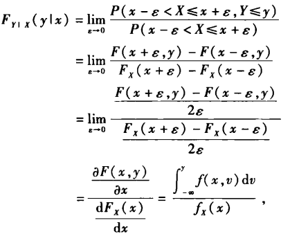

> 又遇到了关于连续型概率密度函数取一块很小的区间的应用。

所以对应的密度函数有
$$
f_{Y|X} = \dfrac{f(x, y)}{f_X(x)}
$$

#### 随机变量的独立性

首先我们是用分布函数引入的独立性 $F(x, y) = F_X(x) \times F_Y(y)$

为连续型随机变量的时候等价于：$f(x, y) = f_X(x) \cdot f_Y(y)$

#### 二维随机变量的分布

##### Z = X + Y

$$
f(z) &= \int_{-\infty}^{+\infty}f(x, z - x) \mathrm{d}x \\
&= \int_{-\infty}^{+\infty} f(z - y, y) \mathrm{d}y
$$

当 X 和 Y 相互独立的时候，我们才可以把密度函数写为 **卷积的形式**

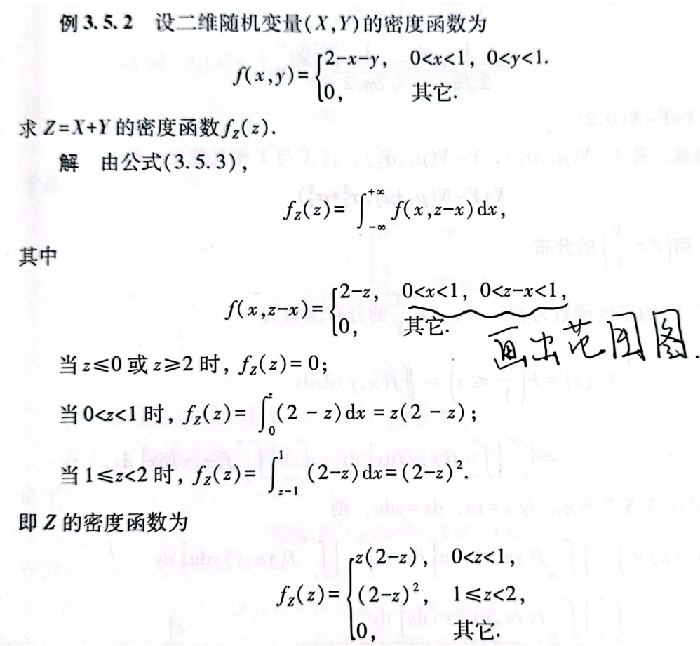

##### Z = XY

$$
f(z) = \int_{-\infty}^{+\infty} \dfrac{1}{|x|}f(x, \dfrac{z}{x})\mathrm{d}x
$$

##### Z = $\dfrac{X}{Y}$

$$
f(z) = \int_{-\infty}^{+\infty} |y| f(yz, y) \mathrm{d}y
$$

##### M = $\max\{X, Y\}, N = \min\{X,Y\}$

$$
\begin{aligned}
F_{\max}(z) &= F_{X_1}(z)\cdot F_{X_2}(z)...F_{X_n}(z) \\
F_{\min}(z) &= 1 - [1 - F_{X_1}(z)][1 - F_{X_2}(z)]...[1 - F_{X_n}(z)]
\end{aligned}
$$

#### 参考

1. 

### 第四章 随机变量的数字特征与极限定理

#### 期望

离散型：如果级数 $\sum\limits_{k = 1}^{+\infty} x_kp_k$ **绝对收敛**，则称级数 $\sum\limits_{k = 1}^{+\infty} x_kp_k$ 的和为离散型随机变量的数学期望。

连续型：积分 $\int_{-\infty}^{+\infty}f(x)\mathrm{d}x$ 绝对收敛，就称积分值为 X 的数学期望。

> 注意：期望的定义是绝对收敛。
> 因为如果某一个级数只是条件收敛，那么它的绝对值并不收敛，则将这一个级数的各项次序改排以后，可以使得他不收敛或者收敛但是和等于事先任意给定的值。这就意味期望的大小与是否存在与 X 所取值的顺序有关。但是 E(X) 作为描述 X 的某种特性的数值，有客观意义，不应该取值随着次序变化，所以在定义 E(X) 的时候，我们要求它绝对收敛。

#### 协方差与协方差矩阵

对于随机变量 X 和 Y 的协方差，定义为：

$$
\begin{aligned}
   \sigma(x,y)=E[(x-E(x))(y-E(y))]
\end{aligned}
$$

对于**二维数据**，我们可以得到四个值构成的协方差矩阵：

$$
\begin{aligned}
   \Sigma=\begin{bmatrix}\sigma(x,x)&\sigma(x,y)\\\sigma(y,x)&\sigma(y,y)\end{bmatrix}
\end{aligned}
$$

如果上面的 X 和 Y 是 **n 维的数据**，$\left.\mathbf{X}:=\left[\begin{array}{c}x_1\\x_2\\\vdots\\x_m\end{array}\right.\right]\mathbf{Y}:=\left[\begin{array}{c}y_1\\y_2\\\vdots\\y_n\end{array}\right]$

这样，对于 $m \times n$ 个 $a_{ij}$ 组成的矩阵 $\mathbf{A} = [a_{ij}]_{m \times n}$，定义：$\operatorname{E}[\mathbf{A}]:=\left[\operatorname{E}(a_{ij})\right]_{m\times n}$，也就是说：

$$
\begin{aligned}
   \mathrm{E}[\mathbf{A}]:=\begin{bmatrix}\mathrm{E}(a_{11})&\mathrm{E}(a_{12})&\cdots&\mathrm{E}(a_{1n})\\\mathrm{E}(a_{21})&\mathrm{E}(a_{22})&\cdots&\mathrm{E}(a_{2n})\\\vdots&\vdots&\ddots&\vdots\\\mathrm{E}(a_{m1})&\mathrm{E}(a_{m2})&\cdots&\mathrm{E}(a_{mn})\end{bmatrix}
\end{aligned}
$$

那么我们又可以把定义写为：

$$
\begin{aligned}
   \mathbf{cov}(X,Y)=\mathbf{E}\left[\left(\mathbf{X}-\mathbf{E}[\mathbf{X}]\right)\left(\mathbf{Y}-\mathbf{E}[\mathbf{Y}]\right)^\mathrm{T}\right]
\end{aligned}
$$

##### 对于维度的理解

可以是 n 个不同对象，也可以是一个对象的 n 个不同角度。

##### 性质

$\mathbf{\Sigma}=\mathbf{cov}(X,X)$ 有以下的性质：

1. $\mathbf{\Sigma}=\mathrm{E}(\mathbf{X}\mathbf{X}^T)-\mathrm{E}(\mathbf{X})[\mathrm{E}(\mathbf{X})]^T$

2. $\mathbf{\Sigma}$ 是半正定的和对称的矩阵
   关于半正定的证明:
   $$
   \begin{aligned}
      \mathbf{\Sigma}=\mathrm{E}(\mathbf{X}\mathbf{X}^T)-\mathrm{E}(\mathbf{X})[\mathrm{E}(\mathbf{Y})]^T
   \end{aligned}
   $$

#### SVD(奇异值分解)

奇异值分解(SVD, Singular Value Decomposition)

#### PCA(主成分分析)

#### 示性函数

对于随机时间 A，引入**示性函数** $I_A$，$I_A = \begin{aligned}\begin{cases}1, A 发生 \\ 0,A不发生\end{cases}\end{aligned}$。

这个函数很特殊，它的数学期望就是事件 A 发生的概率。

#### 马尔可夫不等式

对于随机变量 X 和定值 a，随机事件 $x \geq a$，画出示性函数 $I_A$，如图：
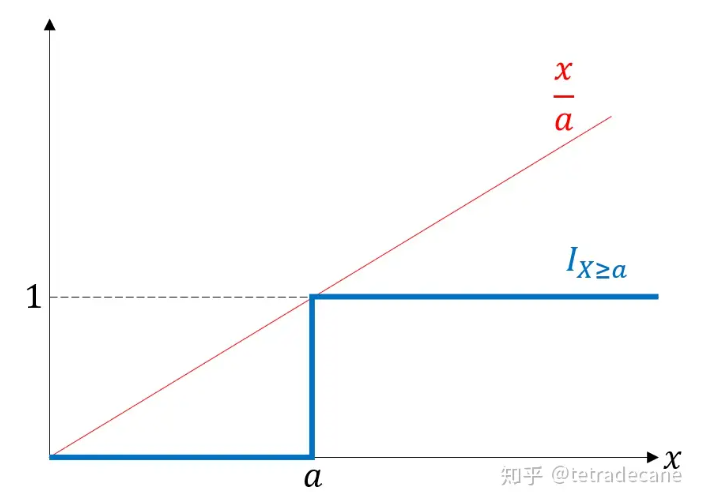

容易发现：$I_{X \geq a} \leq \dfrac{x}{a}$。对于这个式子取数学期望，可以得到：$\mathbb E I_{X \geq a} = P(X \geq a) \leq \dfrac{\mathbb E X}{a}$

#### 切比雪夫不等式

考虑随机事件 $A = \{|x - \mu| \geq a\}$，其示性函数如图：
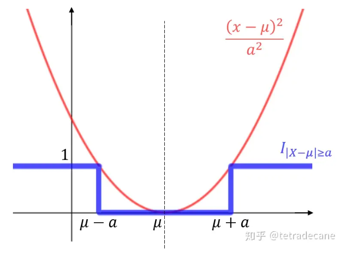

所以 $I_{|X - \mu|\geq a} \leq \dfrac{(x - \mu)^{2}}{a^{2}}$，取数学期望可以得到：$\mathbb E I_{|X -\mu| \geq a} = P(|X - \mu| \geq a) \leq \dfrac{ D X}{a^{2}}$

这个就是**切比雪夫不等式**

课本上给出的证明是根据积分来证明的。
$$
\begin{aligned}
P(|X - \mu| \leq a) &= \int_{a - \mu}^{a + \mu} f(x) \mathrm{d}x \\
&\leq \dfrac{1}{a^{2}} \int_{a - \mu}^{a + \mu} (x - \mu)^{2}f(x) \mathrm{d}x \\
&\leq \dfrac{1}{a^{2}} \int_{-\infty}^{+\infty} (x - \mu)^{2}f(x) \mathrm{d}x \\
&\leq \dfrac{D X}{a^{2}} 
\end{aligned}
$$

>注意到方差的定义的式子。

####  大数定律

大数定律简单来说，就是随机事件发生的频率会向某一个常数值收敛，该常数值为该事件发生的概率。

大数定律告诉我们：**可以近似使用频率代替概率，能用样本均值近似代替总体均值**

| 大数定律                   | 要求                                       | 证明           |
| -------------------------- | ------------------------------------------ | -------------- |
| 辛钦大数定律（弱大数定律） | 独立同分布的变量，对于方差不做要求         | 用到了特征函数 |
| 切比雪夫大数定律           | 独立的随机变量，期望存在，方差存在公共上界 | 切比雪夫不等式 |
| 伯努利大数定律             | n 重伯努利试验                             | 辛钦的特殊情况 |

相比于辛钦大数定律，切比雪夫大数定律未要求同分布，所以更具一般性。

#### 中心极限定理

对于它的证明，用到了特征函数。

条件：**独立同分布** *、*不一定就是正态分布**

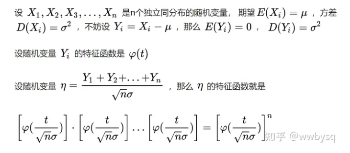

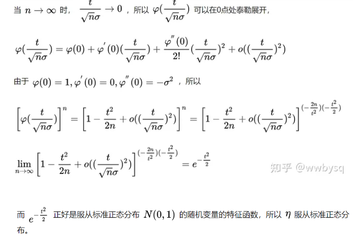

#### 参考

1. https://zhuanlan.zhihu.com/p/259280292
2. https://zhuanlan.zhihu.com/p/491155921
3. https://zhuanlan.zhihu.com/p/29846048 奇异值分解

### 第五章 数理统计的基本知识

#### 统计量与三大分布

样本来源于总体，含有总体的信息。为了对于总体进行推断，需要对于样本的 n 个观测值进行加工处理，把样本含有的**信息集中起来**。具体地说，就是对于不同的问题构造样本不同的函数，再利用这些函数对总体进行推断。**这类函数就是统计量**。

##### 常用统计量

1. 样本均值
2. 样本方差
3. 样本标准差
4. 样本 k 阶原点矩
5. 样本 k 阶中心矩
6. **顺序统计量**

此外，如果是二维的，则常用：

1. 样本协方差
2. 样本相关系数

##### 三大分布

###### $\mathcal{X}^{2}$ 分布

设随机变量 $X_1, X_2, ..., X_n$ 相互独立，并且 $X_i \sim N(0, 1)$，那么 $\mathcal{X}^{2} = X_1^{2} + X_2^{2} + ... + X_n^{2}$ 服从自由度为 n 的 $\mathcal{X}^{2}$ 分布。

- 可加性

- 一种 pdf 的证明方式是使用 n-1 此坐标变换，见参考 2
- 当自由度 $n \to +\infty$ 的时候，卡方分布趋近于正态分布，自由度偏小的时候，呈现偏态，自由度比较大的时候，呈现正态
- $EX = n, DX = 2n$

###### t 分布（学生分布）

设随机变量 X 和 Y 相互独立，并且 $X \sim N(0, 1), Y \sim \mathcal{X}^{2}(n)$，那么称随机变量 $t = \dfrac{X}{\sqrt{Y / n}}$ 为服从自由度为 n 的 t 分布。

- $EX = 0, DX = \dfrac{n}{n - 2}$
- 是一个偶函数
- 自由度趋近于无穷的时候，趋近于一个正态分布，并且一般 n > 30，就认为是标准正态分布、
- pdf 的推导参见参考 4

###### F 分布

设随机变量 X 和 Y **相互独立**，并且 $X \sim \mathcal{X}^{2}(m), Y \sim \mathcal{X}^{2}(n)$，则称随机变量 $Z= \dfrac{X / m}{Y / n}$ 服从自由度为 $(m,n)$ 的 F 分布，其中，m、n 分别称为第一二自由度。

#### 正态分布的抽样分布

##### 一组样本

**注意：**下面讨论的是在**正态分布**的主体之下，上一部分是比较普遍的情况！！！

总体分布已知的时候，统计量的分布可以通过随机变量函数的分布求得，但是在实际的生活之中，往往计算很复杂，但是在正态总体的条件之下，一些常用的统计量有着比较简单的结果，下面给出正态分布中的统计量的分布。

1. $U = \dfrac{\overline{X} - \mu}{\sigma / \sqrt{n}} \sim N(0, 1)$
2. $\dfrac{(n - 1)S^{2}}{\sigma^{2}} \sim \mathcal{X}^{2}(n - 1)$
3. $\overline{X}$ 和 $S^{2}$ 相互独立
4. $\dfrac{\overline{X} - \mu}{S / \sqrt{n}} \sim t(n - 1)$

其实，感觉 1 和 4 还是很对应的，因为 4 是样本方差，少一个自由度，所以不是正态分布，而是接近于正态分布的 t 分布。

对于式子 2 的证明，还是比较复杂的，暂时还没看，等复习一下线性代数之后再看吧。

第三个式子的证明可以从第二个的过程中延申

第四个式子由第三个的结果得来，看看课本可以

所以这几个式子的关系层层递进，关系还是很密切的。

##### 两组样本

上面是一组样本的情况，下面看一下两组样本。

1. $\dfrac{S_X^{2} / \sigma_1^{2}}{S_Y^{2} / \sigma_2^{2}} \sim F(m - 1, n - 1)$
2. 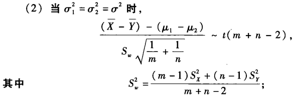
3. 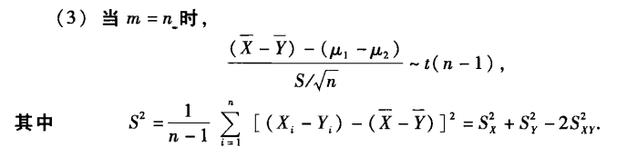

证明还是看课本吧，感觉很大段。

#### 顺序统计量的分布

设 $(X_1, X_2, ..., X_n)$ 是从总体 X 中抽取的一个样本，$(x_1, x_2, ..., x_n)$ 是它的一个观测值，那么按照从小到大的顺序重新排列，得到的 $(x_{(1)},x_{(2)}, ..., x_{(n)})$ 就是**顺序统计量**。

一般他们不是相互独立的。

#### 单个顺序统计量 $x_{(k)}$ 的分布

第 $k$ 个顺序统计量 $X_{(k)}$ 的分布函数为
$$
\begin{aligned}
F_{X_{(k)}} &= \dfrac{n!}{(k - 1)!(n - k)!} \int_0^{F(x)} t^{k - 1}(1- t)^{n - k} \mathrm{d}t \\ 
&= \sum\limits_{i = k}^{n} \begin{pmatrix}n \\k\end{pmatrix} F^{k}(x)(1 - F(x))^{n - k}
\end{aligned}
$$
这是两种常见的书写形式，但是至于下面的式子如何推导得到上面的式子，也不是很清楚，不过好像可以求导证明他俩的相等。

如果是求密度函数的话，可以对于上面的两个式子求导。

其中，对于密度函数的推导还可以是：

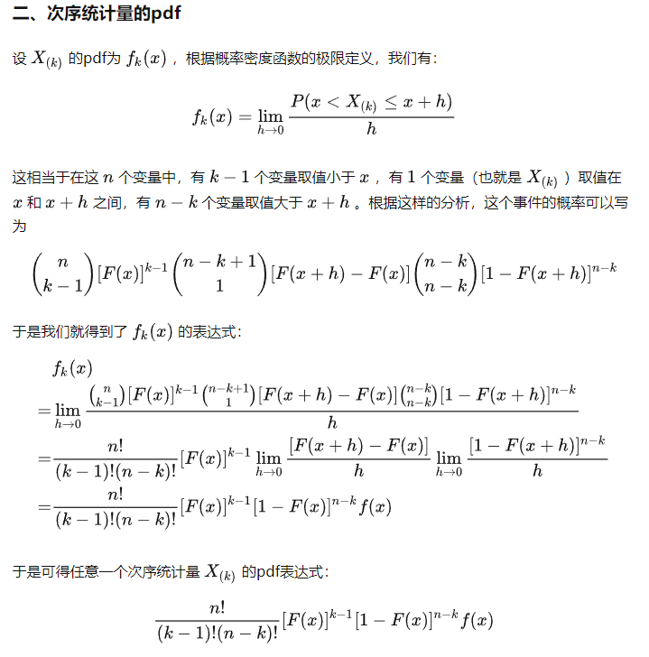

这是一种思路，其中这种极限的思想还是比较常见的。

#### 任意两个次序统计量的联合pdf

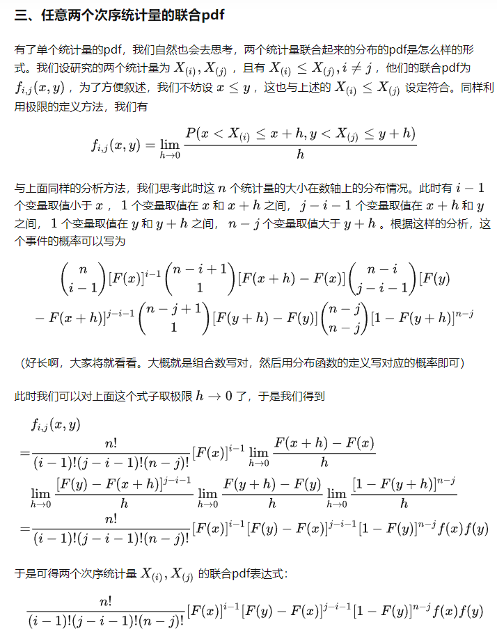

#### 参考

1. https://zhuanlan.zhihu.com/p/595063134
2. https://zhuanlan.zhihu.com/p/476377429 卡方分布密度函数的推导
3. https://zhuanlan.zhihu.com/p/488540788 卡方分布密度函数的推导
4. https://zhuanlan.zhihu.com/p/453323000 t 分布密度函数的推导
5. https://zhuanlan.zhihu.com/p/453635917 F 分布密度函数的推导

### 第六章 参数估计和假设检验

数理统计的根本任务是**样本的推断总体**。很多时候，我们对于参数并不清楚，只有参数确定以后，我们才可以有一个总体的认识。**参数估计就是一种由样本推断总体参数的方法**。

参数估计**有两种形式**，点估计和区间估计。

#### 点估计

##### 矩估计

矩估计就是根据分布的 K 阶矩的式子和样本计算得到的 K 阶矩对应相等，然后解方程组。

矩估计的 $\widehat\mu = \overline{X}, \widehat\sigma^{2} = \dfrac{n - 1}{n}S^{2}$

是一种古老的方式，但是有两个不足：

1. 所要求的总体阶矩可能不存在
2. 解方程组可能很困难

##### 最大似然估计

关键两步，写出 L 的式子，然后求解极值。

##### 估计量的优劣评价标准

MSE Mean Squared Error 均方误差来衡量，指的是估计值个真实值之间的差异。												

$$
\begin{aligned}
MSE(\widehat \theta) &= E(\widehat\theta - \theta)^{2} = E[(\widehat\theta - E(\theta)) + (E(\theta) - \theta)]^{2} \\
&= E[\widehat\theta - E(\widehat\theta)]^{2} + [E(\widehat\theta) - \theta]^{2} \\
&= D(\widehat\theta)  + [E(\widehat\theta) - \theta]^{2}
\end{aligned}
$$

然后让 $E(\widehat\theta)$ 与 $\theta$ 尽可能接近。

所以我们使用估计量的期望来衡量估计量和实际量的差异程度大小。

- X 的一阶矩和二阶矩存在，记 $E(X) = \mu, D(X) = \sigma^{2}$，则样本均值 $\overline{X}$ 是 $\mu$ 的无偏估计，$S_{n}^{2}$ 是 $\sigma^{2}$ 的渐进无偏估计，样本方差 $S^{2}$ 是 $\sigma^{2}$ 的无偏估计。

#### 区间估计

点估计可以给出 $\theta$ 的一个估计的数值，但是只是一个近似值。而且误差是多少我们也不知道，但是人们真实情况下还是比较关注误差的，为此，引入了满足误差范围内的估计区间，**区间估计**。

**区间估计的步骤：**

1. 寻找一个与待估计参数 $\theta$ 有关的统计量 T
2. 找出 T 和 $\theta$ 之间的函数 $H(T, \theta)$，要求 H 分布已知并且与 $\theta$ 无关，其中 $H(T, \theta)$ 称为枢轴变量
3. 寻找适当的常数 c 和 d，使得 $P(c \leq H(T, \theta)\leq d) = 1 - \alpha$
4. 求解得到区间

**一个区间估计的表格吧**

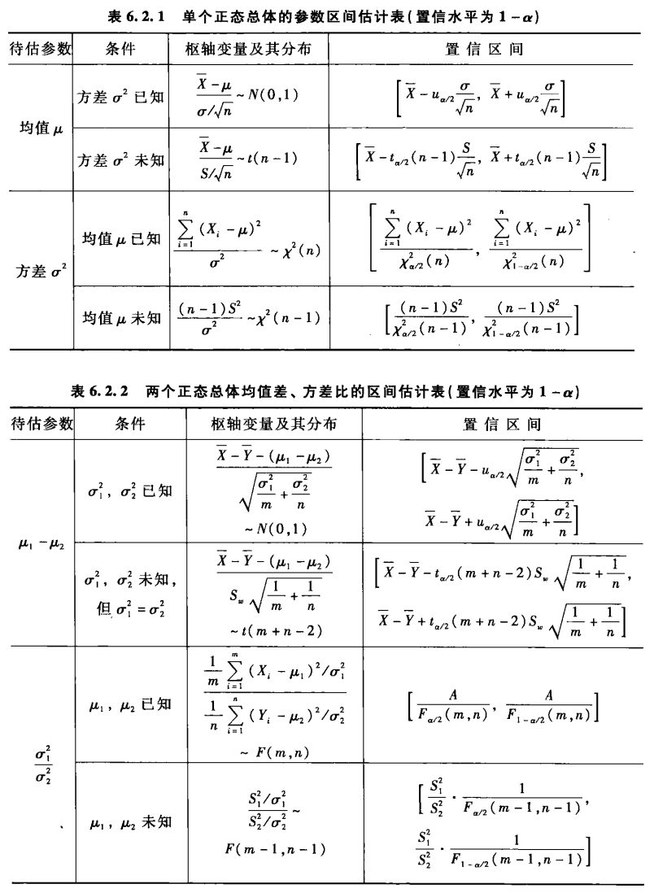

#### 假设检验

前面提到的参数估计是给出未知参数的一个合适的估计值，但是生活中还有另一类问题，一种统计推断的问题。

包括 **参数检验和非参数检验**

**假设检验的步骤：**

1. 建立假设
   原假设 $H_0$
   备择假设 $H_1$
   检验的目的就是在两个之间选择一个
2. 选取检验的统计量，并且在 $H_0$ 成立的条件下确定该统计量的分布
3. 选取检验的显著水平 $\alpha$ 与临界值
4. 做出判断
   计算统计量的观测值，和临界做比较。

##### 原假设与备择假设的选取原则

通常，原假设不能轻易被否定。按照下面的原则：

1. 研究者要证明的为 $H_1$
2. 研究者要反对的为 $H_0$
3. 现状作为原假设的 $H_0$
4. 把不能轻易被否定的作为 $H_0$

##### 双侧检验与单侧检验

如果 $H_1$ 的区域在 $H_0$ 区域的左侧，叫做 **左侧检验**，如果位于右侧叫做 **右侧检验**

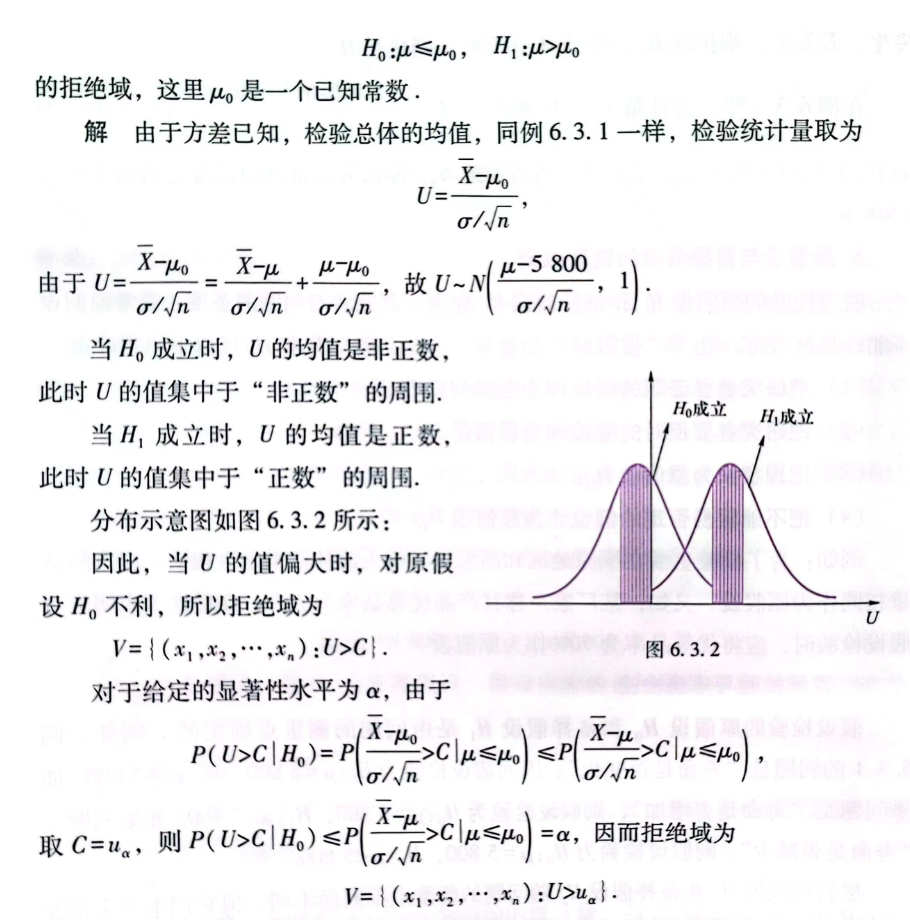

> 注意：其中 **当 U 的值偏大的时候，对于原假设 $H_0$ 不利，所以拒绝域是大于一个数的集合。**

##### 假设检验的两类错误

**弃真** 和 **存伪** 两类错误。
弃真：$H_0$ 为真，但是落入了拒绝域

存伪：$H_1$ 为真，但是落入了非拒绝域

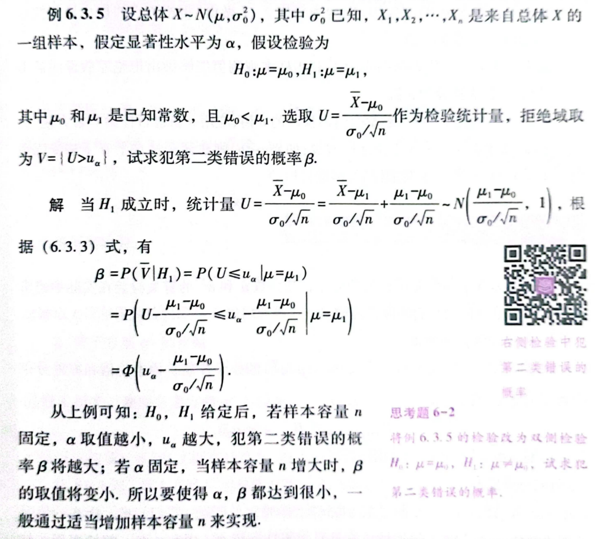

#### 正态总体参数的假设检验

还是特殊的，我们考虑正态分布的假设检验

包括一元的和二元的。就是利用前面提到的一元和二元的各自的三个分布的式子。

#### 分布拟合检验(Goodness of Fit Test, 补充)

判断总体是否为某种分布(如正态分布)的检验问题，通常称为 **分布的拟合优度检验**，简称为 **分布拟合检验**。

##### 为什么是卡方分布

可以看参考 2 和 3。但是感觉证明过程还是超出课程很多的，了解一下就可以了。

##### 离散型拟合优度检验

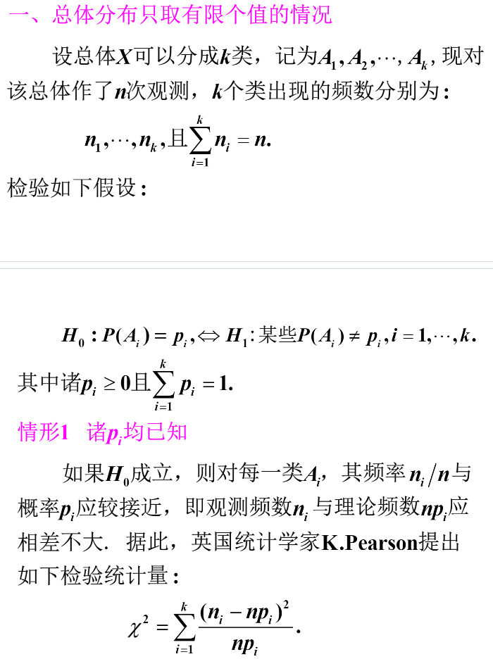

**关于为何是使用卡方分布的推导** 见 参考 2

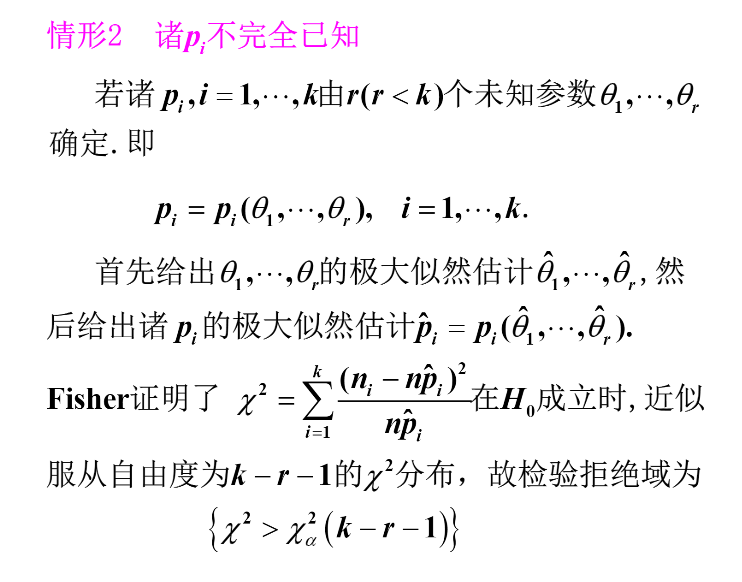

##### 连续型拟合优度检验

可以将 X 的取值范围分割为若干个区间，并且在每一个区间上面计算出相应的理论概率 $p_i$，通过这样处理，将问题转化为离散型问题。

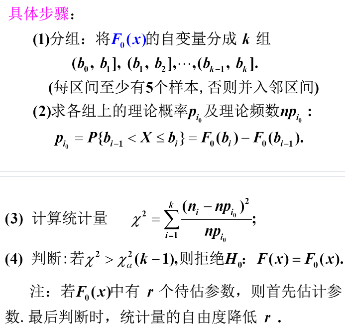

##### 列联表的独立性检验

列联表分析的基本问题是：**考察各属性之间有无关联，即判别两属性是否独立。**

#### 参考

1. https://zhuanlan.zhihu.com/p/602423325 认识估计准则
2. https://zhuanlan.zhihu.com/p/567894150 分布拟合检验使用卡方分布的推导
3. https://zhuanlan.zhihu.com/p/198864907 对于拟合优度检验使用卡方分布的另一个理解

### 第七章 一元线性回归分析和方差分析

#### 回归分析

回归分析主要是处理变量之间的关系。变量之间的关系主要有两类：

1. 确定性关系（函数关系）y = f(x)

2. 统计相关关系 
   变量的相关关系不能用函数关系来表示，但是 **在平均意义下** 有一定的定量关系式。

##### 一元线性回归模型

###### 对于一元线性回归模型的一些理解

1. 每一个 $y_i$ 都是一个变量
2. x 的取值是固定的，当作常数
3. 我们估计出来的 $\beta_1$ 和 $\beta_0$ 都是关于当前得到的 n 个数据点的，其中 x 是被当作常数，y 被当作随机变量处理

###### 正规方程组

一般采用最小二乘方法估计模型中的参数 $\beta_0、\beta_1$，令：
$$
Q(\beta_0,\beta_1) = \sum\limits_{i=  1}^{n}(y_i - \beta_0 - \beta_1 x_i)^{2}
$$
则有：
$$
\begin{cases}\frac{\partial Q}{\partial\hat{\beta}_0}=-2\sum_{i=1}^n(y_i-\hat{\beta}_0-\hat{\beta}_1x_i)=0\\\left\{\frac{\partial Q}{\partial\hat{\beta}_1}=-2\sum_{i=1}^n(y_i-\hat{\beta}_0-\hat{\beta}_1x_i)x_i\right.=0&\end{cases}
$$
其中，这个方程组被称为「正规方程组」

整理得到：
$$
\begin{aligned}
&l_{xy}= \sum_{i=1}^n(x_i-\overline{x})(y_i-\overline{y})=\sum_{i=1}^nx_iy_i-n\overline{x}\overline{y}  \\
&l_{xx}= \sum_{i=1}^n(x_i-\overline{x})^2=\sum_{i=1}^nx_i^2-n\overline{x}^2  \\
&\boldsymbol{l}_{yy}= \sum_{i=1}^n(y_i-\overline{y})^2=\sum_{i=1}^ny_i^2-n\overline{y}^2 
\end{aligned}
$$
所以，求解正规方程组得到：
$$
\begin{cases}\boldsymbol{\hat{\beta}}_1=\boldsymbol{l}_{xy}/\boldsymbol{l}_{xx}\\\boldsymbol{\hat{\beta}}_0=\overline{\boldsymbol{y}}-\boldsymbol{\hat{\beta}}_1\overline{\boldsymbol{x}}\end{cases}
$$

###### 常用性质

感觉还是很重要的

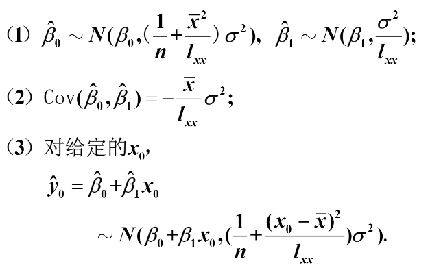

证明见课件。

**注意，最后一个式子是我们后面求解 $y_0$ 置信区间的基础**

其中，一个改写还是比较常用的：
$$
\hat{\beta}_1=\sum\frac{x_i-\overline{x}}{l_{.xx}}y_i,\quad\hat{\beta}_0=\sum\left[\frac1n-\frac{(x_i-\overline{x})\overline{x}}{l_{.xx}}\right]y_i
$$

###### 显著性检验

如果 $\beta_1$ 不等于 0，那么当 x 变化的时候，$E(y)$ 随 x 的变化作线性变化，此时得到的回归方程就有意义，称回归方程是 **显著的**。

综上，对于回归方程是否有意义作判断就是进行如下的显著性检验：
$$
H_0:\beta_1{=}0\Leftrightarrow H_1:\beta_1\neq0
$$
**此时，拒绝表示回归方程是显著的。**

运用方差分析的思想，研究各 $y_i$ 不同的原因，也就是此时，我们把 x 看作了方差分析中的 **控制的变量**，然后 n 个不同的 x 表示 x 的 n 个 **程度**（其实就是一个因素方面的 n 个不同的取值）。

数据总的波动大小使用总偏差平方和表示：
$$
S_T = \sum\limits_{i = 1}^{n}(y_i - \overline{y})^{2} = l_{yy}
$$
引起各 $y_i$ 不同的因素主要有两个方面：其一是 $H_0$ 可能不真，**我们使用波动回归平方和表示** $S_R= \sum\limits_{i = 1}^{n} (\hat{y_i} - \overline{y})^{2}$，另一个是随机因素，**我们使用残差平方和表示** $S_e = \sum\limits_{i = 1}^{n} (y_i - \hat{y_i})^{2}$

可以得到，$S_T = S_R + S_e$

**下面是对于 SR 和 SE 的性质，还是看课件吧。**

**然后是应用。**

对于 $E(y_0)$ 和 $y_0$ 的置信区间估计，其中 $y_0$ 并不是我们初始数据中的 n 个点对应的 x，而是我们使用我们构建的模型来预测的数值。

##### 多元线性回归模型（补充）

现实世界中一个因变量往往受到多个因素的影响，也就是存在多个自变量。

还是看课件吧。感觉东西好多...

#### 方差分析

在科学实验和生产实践中，我们经常要考虑**不同的实验条件是否对实验结果有显著的影响**。

在**可控因素**之中，有些因素对于生产和实验的影响比较大，有一些比较小。我们**希望找出影响显著的那些因素**，以便找到最优的生产或者实验条件。

所以，我们**采用方差分析的方法来推断某一个因素是否具有显著影响**。

之所以是叫做「方差分析」，是因为我们是在 **方差恒定的假设下** 进行的假设检验。

检验具有相同方差的多个正态总体的均值是否相同的一种方法。

感觉顺着课本的思路看就很好。

##### 单因素方差分析

$$
\begin{aligned}
E\left(\dfrac{S_e}{n - r}\right) &= \sigma^{2} \\
E\left(\dfrac{S_A}{r - 1}\right) &= \sigma^{2} + \dfrac{1}{r - 1}\sum\limits_{i = 1}^{r} n_i \alpha_{i}^{2}
\end{aligned}
$$

所以，当 $H_0$ 成立的时候，$S_e / (n - r)$ 和 $S_A / (r - 1)$ 都是 $\sigma^{2}$ 的无偏估计，从而 $\dfrac{S_A / (r - 1)}{S_e / (n - r)}$ 应该接近 1。不成立的时候，应该比值比 1 明显的偏大。

$$
\begin{aligned}
F = \dfrac{S_A / (r - 1)}{S_e / (n - r)} \sim F(r - 1, n - r)
\end{aligned}
$$

##### 双因素方差分析(补充)

分为有相互作用的双因素方差分析和无相互交互作用的方差分析。

#### 参考

### 题目记录

记录一些吉米多维奇或者课后习题中遇到的典型题目。

#### 第一章 随机事件及其概率

##### 符号说明

A + B 表示 **事件 A 和事件 B 中至少有一个发生**，所以 $P(A+B) = P(A\cup B) = P(A) + P(B) - P(AB)$，当 $A$ 和 $B$ 互斥的时候，就有 $P(A + B) = P(A) + P(B)$

A - B 表示 **事件 A 发生但是事件 B 不发生**，所以 $P(A - B) = P(A) - P(AB) = P(A \overline{B})$，当 $B \subset A$ 的时候，有 $P(A - B) = P(A) - P(B)$

所以，如果是单纯对于事件的计算，则有 $A + B = A\cup B, A - B = A \cap \overline{B} = A\overline{B}$

一定要 **注意事件之间的加减和概率运算之间的转换。**

1. 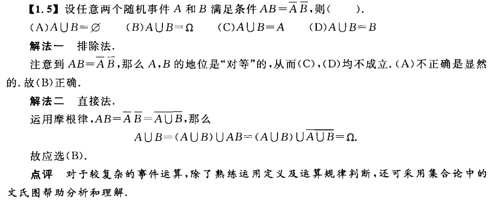

2. 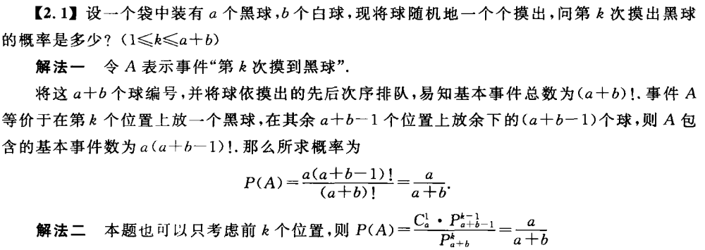
   感觉这个题目使用古典概型还是很好想的。
   一定要有 **古典概型使用事件个数计算的思想。**

3. 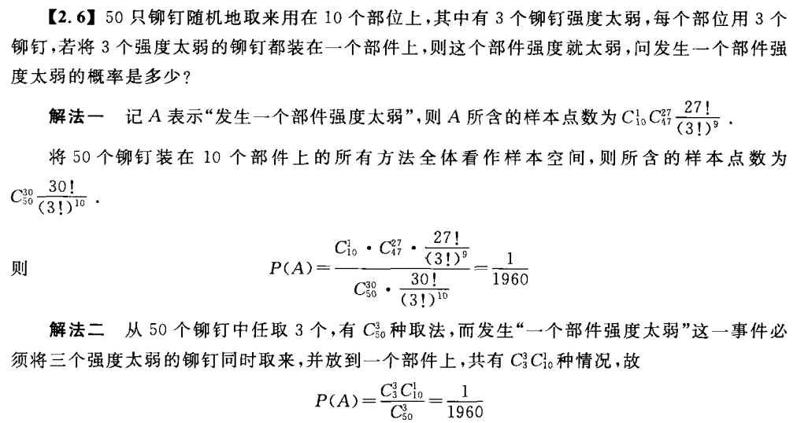

4. 运用摩根律可以得到：
   $$
   P(\overline{A}\overline{B}\overline{C})=1-P(A\cup B\cup C)
   $$
   其实也可以直观理解。

5. 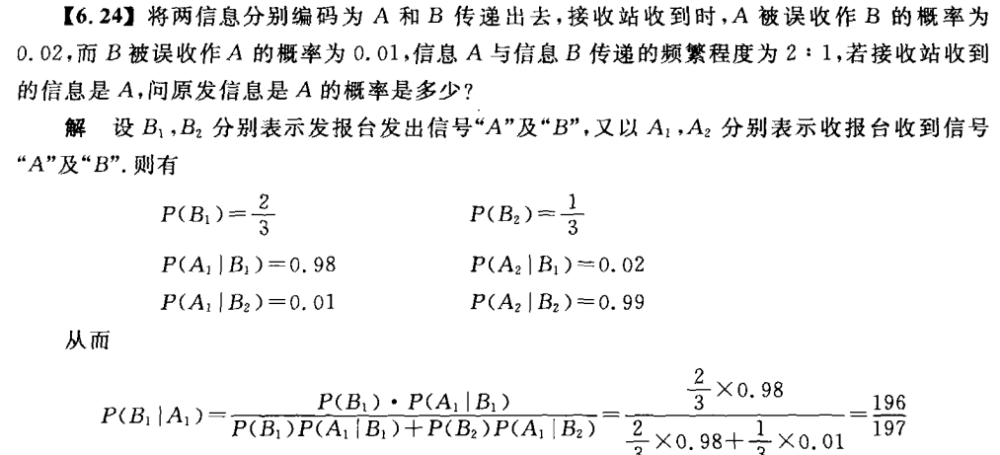
   注意**对于状态的建模**，要大胆去设事件。

6. 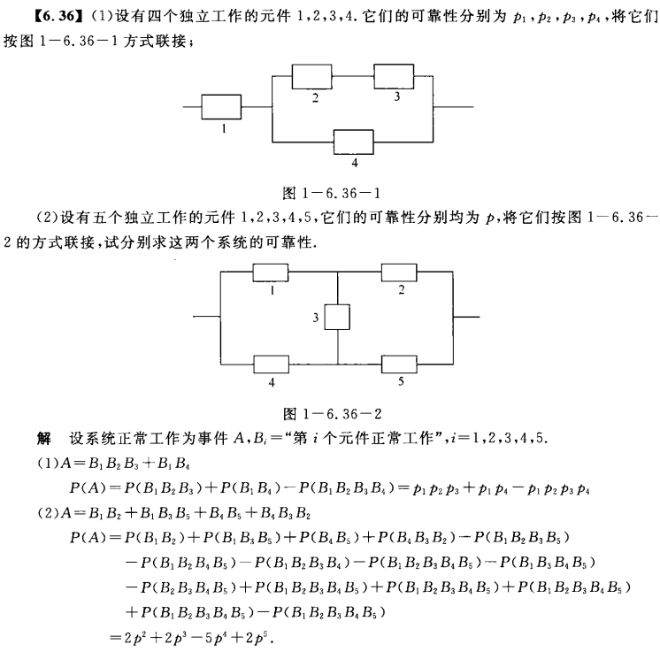
   最后转换为求事件的并，可以使用容器原理计算。

7. 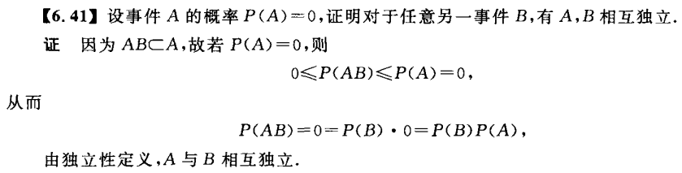

#### 第二章 随机变量及其分布

对于离散随机变量分布，如果已知 X 的分布函数 $F(x)$，则 X 的分布律为：
$$
P(X = x_k) = F(x_k) - F(x_k - 0)
$$
**注意这个定义形式。**

**泊松定理：** 
在独立试验中，以$p_n$ 代表事件$A$在试验中出现的概率，它与试验总数$n$ 有关，如果$np_n\to\lambda$,则当$n\to\infty$时，有：

$$
b\left(k;n,p\right)\rightarrow\frac{\lambda^{k}}{k!}e^{-\lambda}
$$
泊松定理表示二项分布可以近似为泊松分布，同时，如果样本容量很大，远大于我们选取的目标的个数，那么超几何分布也可以近似为二项分布。

同时，正态分布又可以作为二项分布和泊松分布的近似。

#### 第三章 多维随机变量及其分布

这一部分还是多看看题目吧，一定要注意**取值范围**的问题。

1. 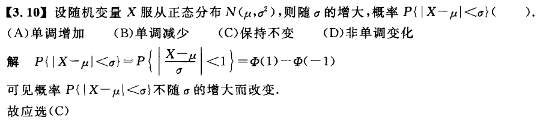
2. 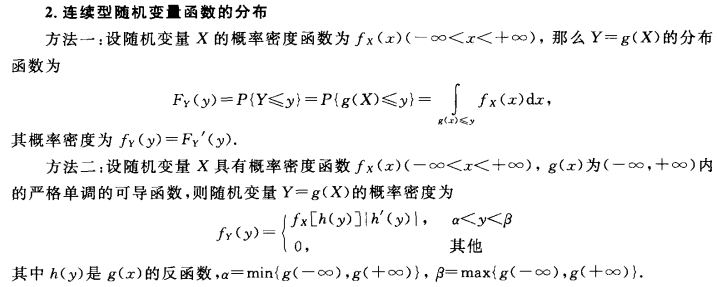
   注意第二种方式是有绝对值的。
3. 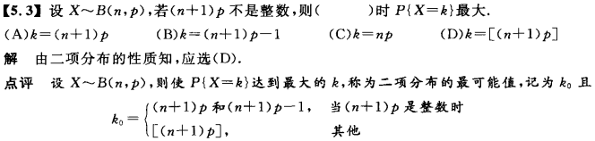
   注意二项分布取得最大概率时的情况，是有公式的。
4. 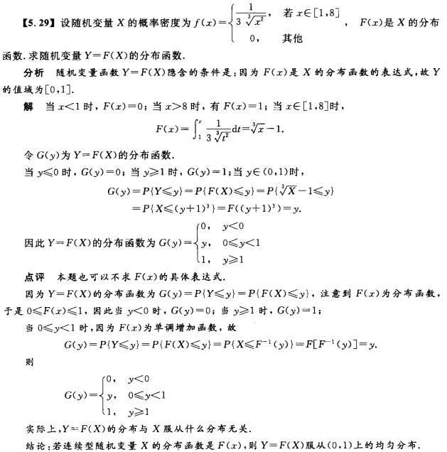
   感觉上可能算一个比较经典的结论？
5. 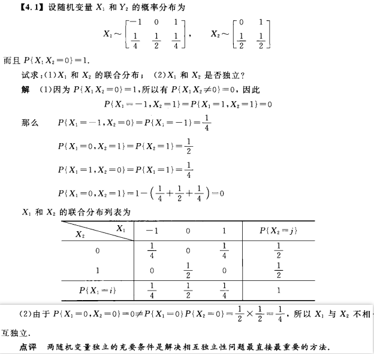
   注意 $P(X_1X_2 = 0) = 1$ 同时也表示 $P(X_1X_2 \neq 0) = 0$
6. 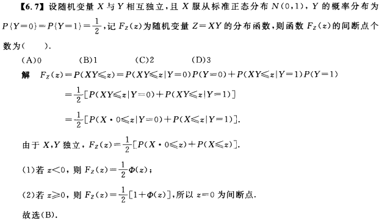
7. 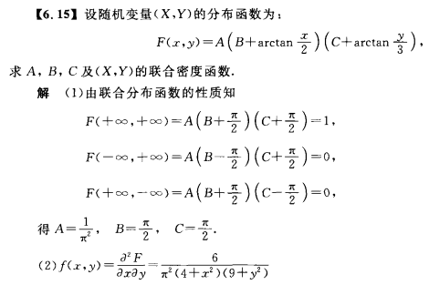
   注意，求解未知量的时候，不仅仅只有概率总和为 1 这一个等式可以利用，还有别的等式。

#### 第四章 随机变量的数字特征

一定要注意，期望的定义是级数或者积分**绝对收敛**的时候才存在。

如果 X 和 Y 相互独立，那么 $E(XY) = E(X) \cdot E(Y)$

$[E(XY)]^{2} \leq E(X^{2}) \cdot E(Y^2)$

1. 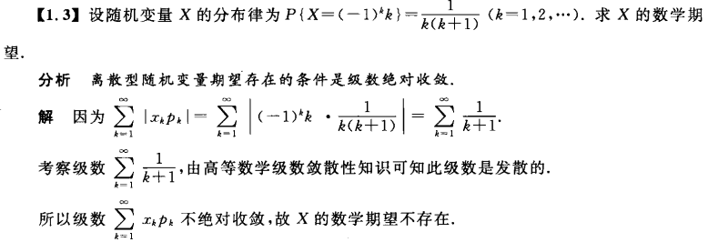
2. 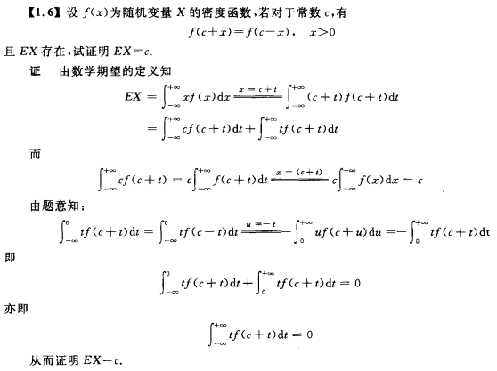
3. 

#### 第五章 大数定律与中心极限定理

注意大数定律是带有绝对值的，但是中心极限定理没有绝对值。

#### 第六章 数理统计基本概念

