### 第一章 计算机系统概念

将高级语言程序翻译为机器语言程序的软件   称为翻译软件，有两种，一种是「编译程序」，一种是「解释程序」。

冯诺依曼计算机的特点：

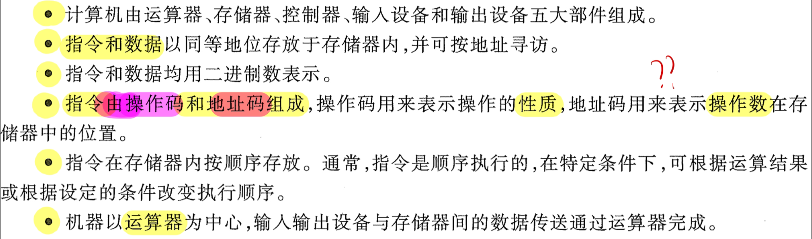

现代的计算机已经转变为「以**存储器**为中心」。

CPU 和主存储器合起来，又可以称为「主机」。

主存储器简称主存或者内存，包括存储体 M、各种逻辑部件和控制电路。**存储体由许多存储单元组成，每一个存储单元又有若干个存储元件**（或者称为存储元、存储基元），每个存储元件都能寄存一位二进制代码。可见，**一个存储单元可以存储一串二进制代码**，称这串二进制代码为一个**存储字**，这串二进制代码的位数为**存储字长**。

主存工   作的时候是按照**存储单元**的地址号来存取

**MAR：** memory address register

**MDR：** memory data register

现在，MDR 和 MAR 通常集成在 CPU 芯片内。

一般情况下，所有的硬件组件（CPU、GPU、外设等）都无法直接访问外存，而是通过内存进行交互。当计算机启动时，操作系统会将需要的程序和数据从外存加载到内存中，然后 CPU 可以直接访问内存中的数据来执行任务。

**PC**，Program Counter 程序计数器，与 MAR 之间有通路连接。

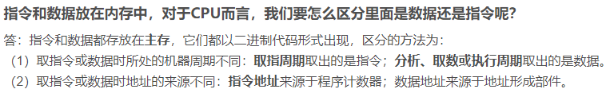

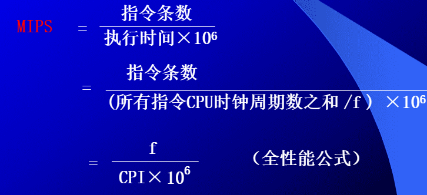

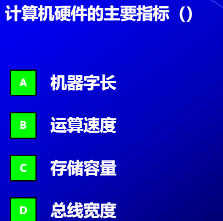

还有主频、吞吐量、响应时间

**指令和数据都存储在存储器中，如何区分它们？**

通过不同的时间段来区分指令和数据，即在取指令阶段(或取指微程序)取出的为指令，在执行指令阶段(或相应微程序)取出的即为数据。
通过地址来源区分，由PC提供存储单元地址的取出的是指令，由指令地址码部分提供存储单元地址的取出的是操作数。

### 第二章 计算机的发展及应用

**计算机的产生和发展**：

1. 第一代电子管计算机，1943 二战时期
2. 第二代晶体管计算机，1947
3. 第三代集成电路计算机

总线 bus

总线按照不同的角度，有很多种分类方式，按连接部件的不同，有三种：

1. 片内总线，指的是芯片内部的总线，如 CPU 芯片的内部、寄存器与寄存器之间。
2. 系统总线，指的是 CPU、主存、IO 设备各大部件之间的信息传输线
   按照传输信息的不同，又可以分为三类：数据总线、地址总线、控制总线
3. 通信总线，这类总线用于计算机系统之间或者计算机系统与其他系统之间的通信。

### 第四章 存储器

按照在系统中的作用分类，可以分为主存储器、辅助存储器、缓冲存储器

主存储器：可以和 CPU 直接交换信息

辅助存储器：不能和 CPU 直接交换信息

主存的结构：

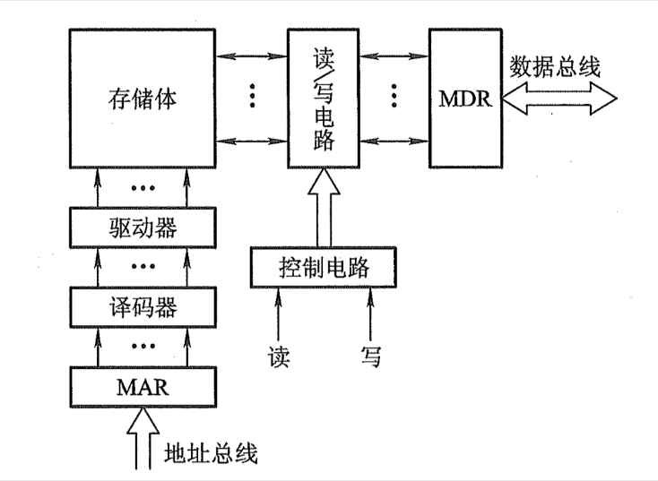

现代的计算机主存都是由半导体集成电路构成，图中的驱动器、译码器和读写电路均制作在存储芯片之中，而 MAR 和 MDR 制作在 CPU 芯片之中。存储芯片和 CPU 芯片可以通过总线连接。

**存储速度**是由**存储时间**和**存储周期**来表示的。

存储时间：存储器的访问时间，指启动一次存储器操作（读或者写）到完成该操作的时间

存储周期：存储器进行连续两次独立的存储器操作所需的最小间隔时间，**通常存储周期大于存储时间**。总线传输周期是包含在存储周期内部的。

存储带宽：表示单位时间内存储器的存取信息量。（与存储周期紧密相连的指标）

**一个关于存储时间和存储周期的解释：**

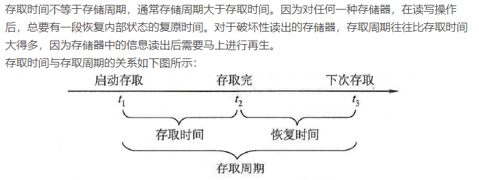

**半导体存储器**是由**许多个**半导体存储芯片构成的，所以需要进行片选，决定哪一个存储芯片工作。

下面是一个存储芯片的构成结构

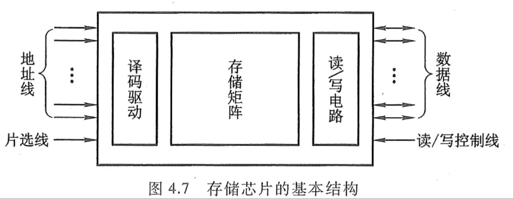

**地址线和数据线的位数共同反应**存储芯片的容量。

##### 随机存储器

随机存取存储器按照存储信息的原理不同，可以分为动态 RAM 和静态 RAM 两大类。

存储器中用于存储 0 和 1 的代码电路称为存储器的「基本单元电路」，也就是存储基元，一个**存储单元**包括多个存储基元。

**静态 RAM：**静态 RAM 是使用触发器原理存储信息的，因此读出信息以后，仍然保持原状，不需要再生，但是掉电时，原来的信息丢失。

**动态 RAM：**动态 RAM 基本单元电路中有三管式和单管式两种，并且共同特点是都是靠 **电容存储电荷** 的原理来寄存信息。

电容上的电荷一般只能维持 1 到 2ms，所以即使电源不断电，信息也会自动消失。所以必须在 2ms 内 刷新一次。

由于动态 RAM 相比静态 RAM 集成度更高、功耗更低，所以目前被各类计算机广泛使用。

**刷新：**
采用定时刷新的方式，规定一段时间，必须对于所有的基本单元电路都刷新一次。这个时间叫做「再生周期」或者「刷新周期」。

刷新是一行一行进行的，通常有三种方式刷新：集中刷新、分散刷新和异步刷新。

1. 对全部的存储单元集中一段时间逐行进行刷新。此刻必须停止读/写操作。
   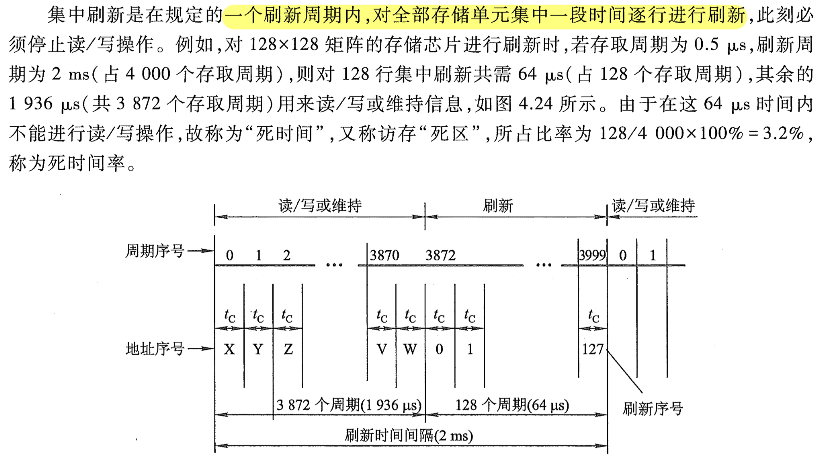
   关于时间死区的计算
2. 分散刷新是指每行存储单元的刷新**分散到每一个存取周期内完成**
   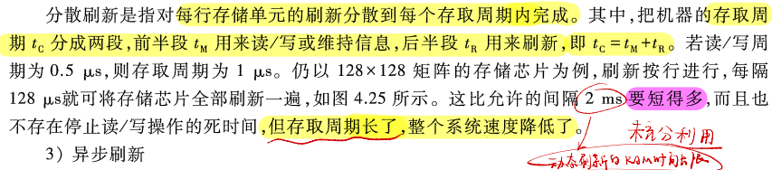
3. 异步刷新。将前两种方式结合，可以缩短死时间，也可以充分利用刷新周期 2ms。

**存储器容量的扩展：**

1. 位扩展
   增加**存储字长**。
2. 字扩展
   字扩展指的是**增加存储字的数量。**

**存储器和 CPU 的连接：**

1. CPU 的地址线通常比存储芯片的地址线数多。通常是将 CPU 地址线的低位与存储芯片的地址线相连，CPU 的地址线的高位或在存储芯片扩充时使用，或者用做其他用途。
2. CPU 的数据线和存储芯片的数据线数可能也不同，**此时必须对于存储芯片进行位扩展**。

**存储器的校验：**

**提高访存速度的措施：**

除了寻找高速元件和采用层次结构以外，调整主存的结构也可以提高访存速度。

1. 单体多字系统
   采用前提是：指令和数据在主存中是连续存放的，一旦遇到转移指令，或者操作数不能连续存放，效果不明显。

2. 多体并行系统

   高位地址交叉编址 和 低位地址交叉编址

关于这两种的时间计算问题

**存控：**

多体模块存储器不仅要与 CPU 交换信息，还要与辅存、IO 设备、乃至IO处理机交换信息。因此，某一时刻，应该决定主存究竟和哪一个部件交换信息。**这就是由存储器控制部件（简称存控）来承担。**

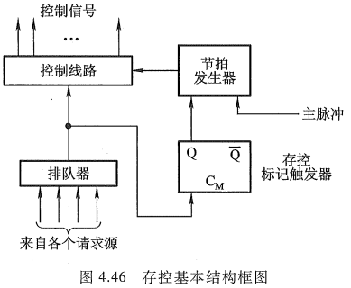

**Cache 主存地址映射** 

Cache 与主存之间的数据交换是以块为单位的，CPU 与 Cache 之间的数据交换是以字为单位的。

由主存地址映射到 Cache 地址叫做地址映射。

在这里我们是按照 **字块** 为单位进行映射的，其中 **字块** 的大小不一定，根据题目的定义来。**字块** 包括了若干个 **字**，一个 **字** 是若干位，这些都是题目定义。

我们把主存和 Cache 分成了若干块，进行映射。

有直接相连映射、全相联映射和组相连映射。

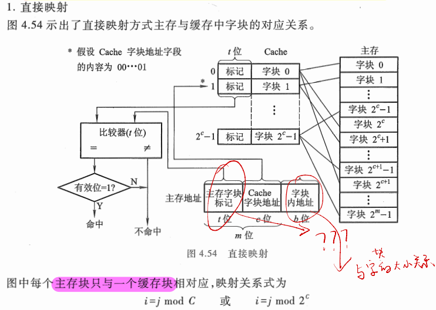

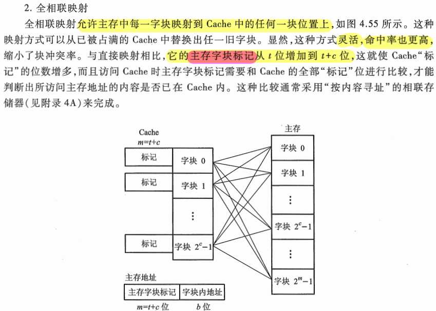

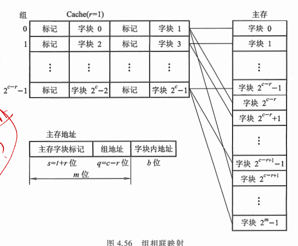

这里的题目还是比较重要的。
**课本 P120**

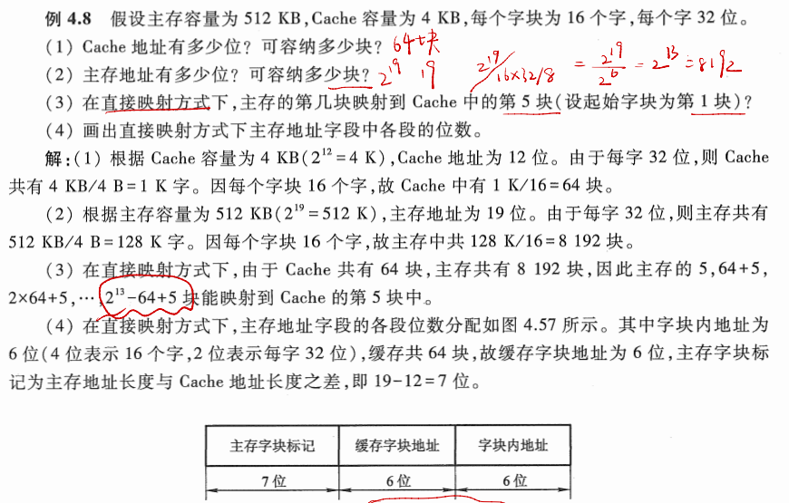

还有若干例题。。。                                                                                                                                                                                                                                                                                                                                                                                                                                                                                             

### 第五章 输入输出系统

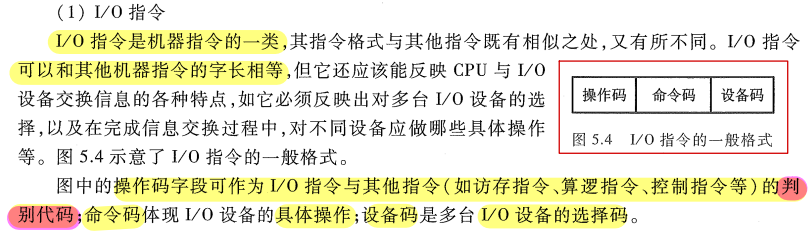

IO 设备与主机交换信息时的控制方式：

1. 程序查询方式
2. 程序中断方式
3. DMA（直接存储器存取方式）

**设置 IO 接口的理由：**

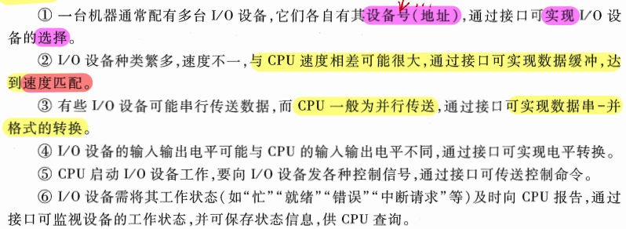

**这三种方式的接口电路设计：**

程序查询方式：

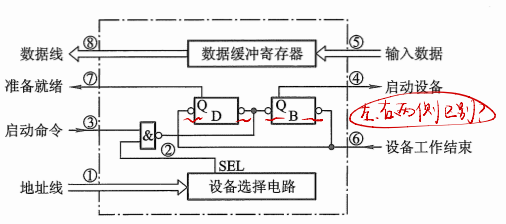

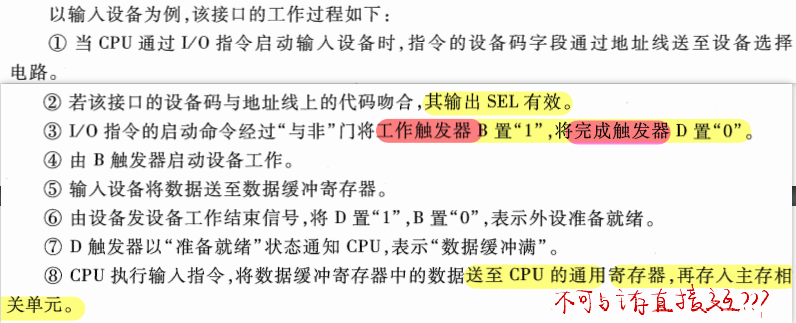

IO 设备直接和主存交互的时候是 DMA 方式，但是这里是程序查询方式，所以我们就是必须经过中间的 CPU，然后再将数据存入主存。

程序中断方式：
CPU **启动设备以后**往往需要等待一段时间才能实现主机与 IO 设备之间的信息交换。如果在设备准备的同时，CPU 不做无谓的等待，而是继续执行程序，只有 IO 设备准备就绪的时候才向 CPU 提出请求，暂时中断 CPU 现行程序进入 IO 服务程序，这就是 IO 中断。

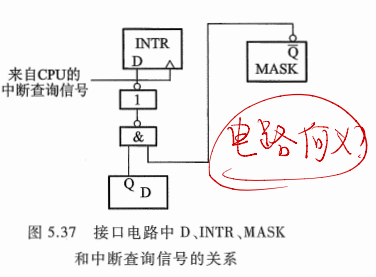

CPU 总是在统一的时间，比如每条指令执行阶段的最后阶段，查询所有的设备是否有中断请求。

中断向量地址形成部件的输入是来自排队器的输出，它的输出是中断向量。

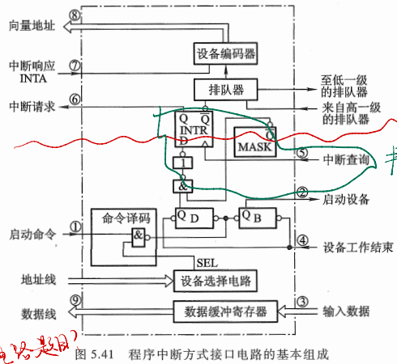

**中断请求、中断判优、中断响应、中断服务、中断返回**五个阶段。

对于其中的**中断服务阶段**，一般来说可以分为：保护现场、中断服务、恢复现场、中断返回

保护现场：两个含义。一个是保存程序的断点，一个是保存通用寄存器和状态寄存器的内容。

恢复现场：在中断服务程序的结尾部分，在退出程序之前，将原程序中断时的现场恢复到原来的寄存器之中。

中断返回：返回原程序的断电之处

DMA 方式：

DMA 接口又叫做 DMA 控制器，数据的传输过程完全由 DMA 接口电路控制。

主存和 DMA 接口之间有一个数据通路。此时主存和设备交换信息的时候，不需要经过 CPU，也不需要 CPU 暂停现行程序去为设备服务。适合 **高速 IO 或者辅存与主存之间的信息交换**。

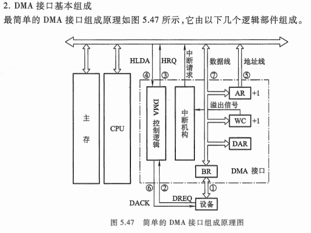

课本 P204

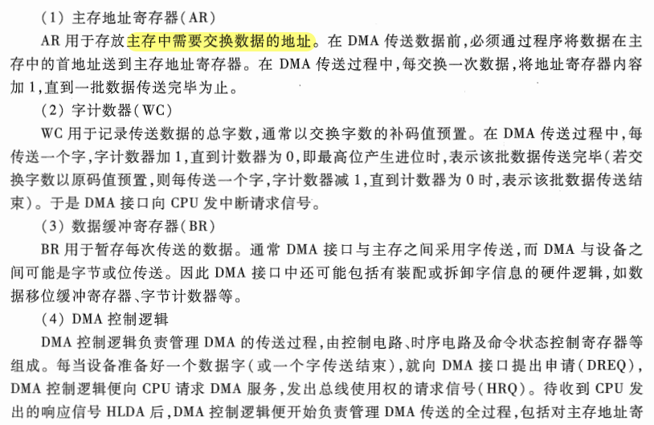

**了解 DMA 方式的工作过程。**

##### DMA 小结：

1. 从数据传送来看，程序**中断方式靠程序传送**，DMA 方式靠硬件传送。
2. 从 CPU 响应时间来看，程序中断方式是在一条指令执行结束的时候响应，而 DMA 方式可以在指令周期内任意存取周期结束时响应。
3. 程序中断方式有着处理异常的能力，而 DMA 方式没有这种能力，主要用于大批数据的传送。
4. DMA 不中断现行程序，所以不需要保护。
5. DMA 的优先级比程序中断的优先级高。

##### DMA 接口的类型

现代的集成电路技术已经将 DMA 接口制造成芯片，通常有选择型和多路型两类。

##### 三种方式的 CPU 工作效率比较

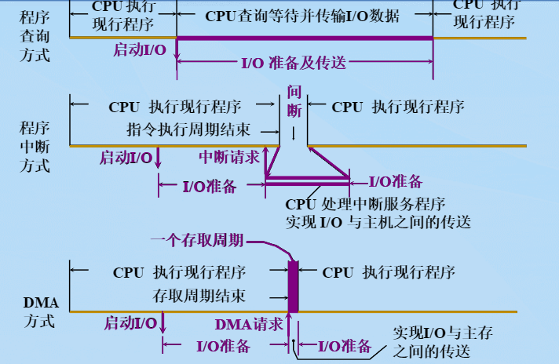

### 第六章 计算机的运算方法

计算机中的数均放在寄存器中，**通常称寄存器的位数为机器字长**

把符号数字化的数称为机器数，把带有「+」或者「-」符号的数字称为真值。

#### 原码

原码是机器数中最简单的一种表示形式。

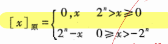

对于小数原码的定义：
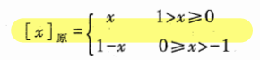

此时，对于 0 的原码：
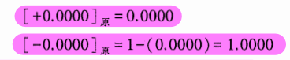

可见 +0 和 -0 的原码表示不一样，**所以原码中，零 有两种表达形式。**

#### 补码

其实就是**模意义下的**一种编码方式。

对于整数的补码编码：

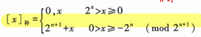

小数的补码定义：

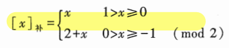

其实和原码相比，就是前面的数 2 的幂次加了 1，但是由 -x 统一变为了 +x

此时的 0，只有一种编码形式。所以它可以比原码能多表示一个数字，如果是小数，可以多表示一个 -1。

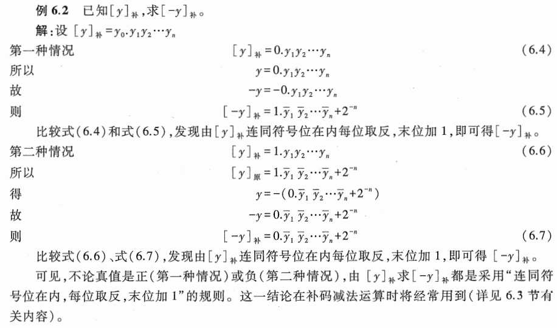

#### 反码

反码通常用作原码求补码或者补码求原码的**中间过渡**。

整数反码的定义如下：
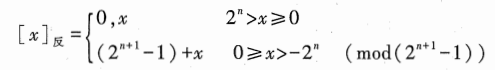

小数的反码定义如下：
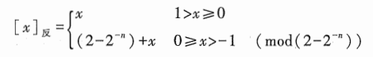

#### 移码

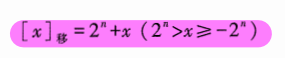

当浮点数的阶码用移码表示的时候，我们可以很方便地判断阶码的大小。、

同一个真值的补码和移码仅仅差一个符号位，所以移码就是对于原码，连带符号位取反加一。

#### 浮点数和定点数

在计算机中，小数点不用专门的器件表示，而是按照约定的方式标出。

定点数与浮点数的比较：

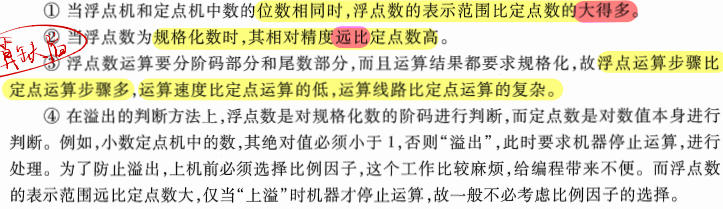

#### 定点运算

##### 移位运算

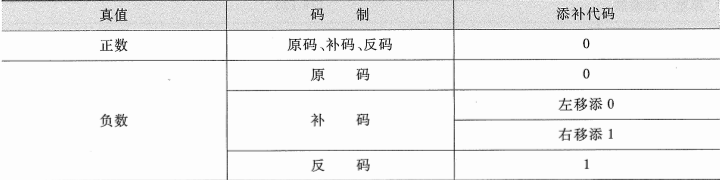

##### 加法与减法

对于补码意义下的加法与减法，其实就是模意义下的运算。

###### 溢出判断

补码定点加减运算判断溢出有两种方式。

1. 一位符号位判断溢出
   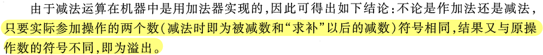

1. 两位符号位判断
   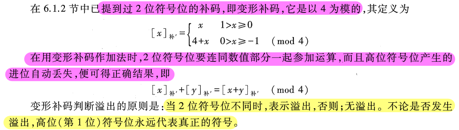
   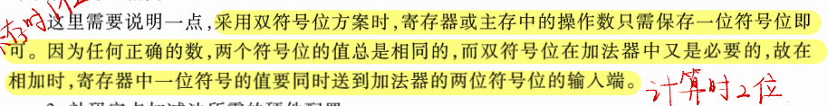

##### 乘法运算

分为原码乘法和补码乘法

###### 原码乘法

其中对于原码乘法，符号位需要单独判断。然后让绝对值相乘。

###### 补码乘法

对于补码乘法，分两种情况：

1. 被乘数 x 符号任意，乘数 y 符号为正。
   
2. 被乘数 x 符号任意，乘数 y 为负。

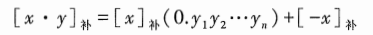

乘积的符号在过程中自然形成，这是补码乘法和原码乘法的重要区别。

###### 比较法

比较法是 Booth 夫妇首先提出来的，又叫做 Booth 算法。

##### 乘法运算

###### 原码除法

符号位是单独处理的。

原码除法中，对于余数的不同处理，又可以分为恢复余数法和不恢复余数法（加减交替法）两种。

###### 补码除法

#### 浮点四则运算

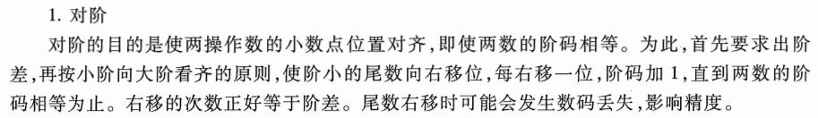

对阶的时候是小阶向大阶看齐，阶小的尾数向右移位，次数为阶差。

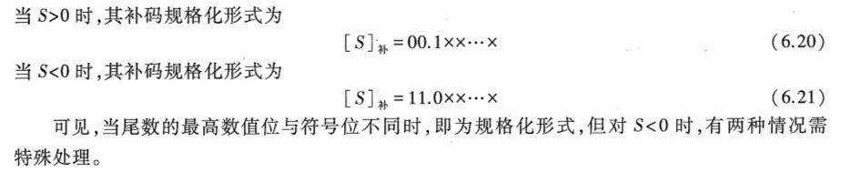

步骤：

1. 对阶
2. 求和（尾数）
3. 规格化
4. 舍入处理
5. 溢出判断

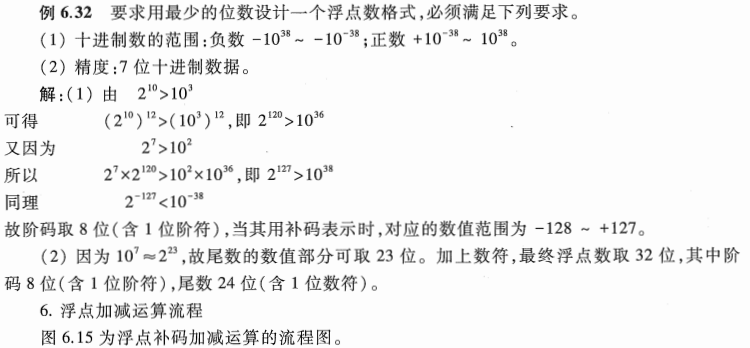

### 第七章 指令系统

#### 指令的一般格式

指令是由操作码和地址码组成的。

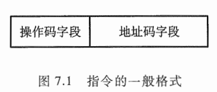

操作码：用来反应该指令要完成的操作。

地址码：用来指出该指令的源操作数的地址（一个或者两个）、结果的地址以及下一条指令的地址。这里的「地址」可以是主存的地址，也可以是寄存器的地址，甚至可以是 IO 设备的地址。

##### 扩展操作码

操作码的长度可以是固定的，也可以是变化的。

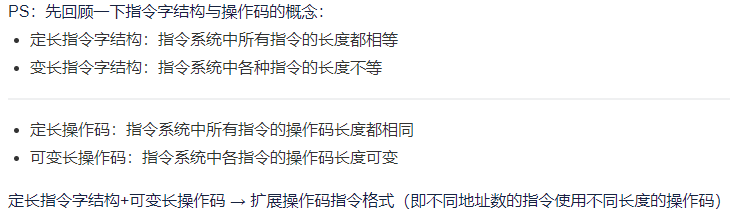

注意最后一句话，点明了 **扩展操作码** 的应用场景。

一种设计方法举例：

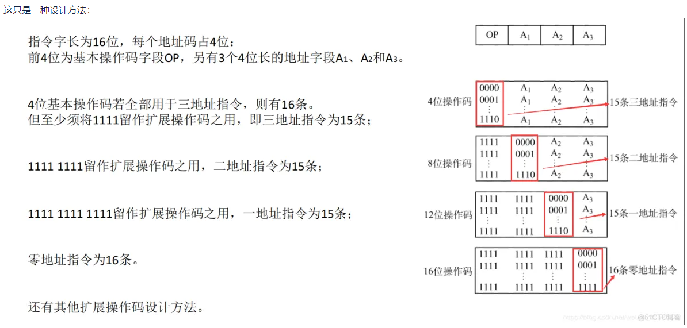

设计扩展操作码时需要注意：

1. 不允许短码是长码的前缀
2. 各个指令的操作码一定不能重复

参考：https://blog.51cto.com/yang/2892195

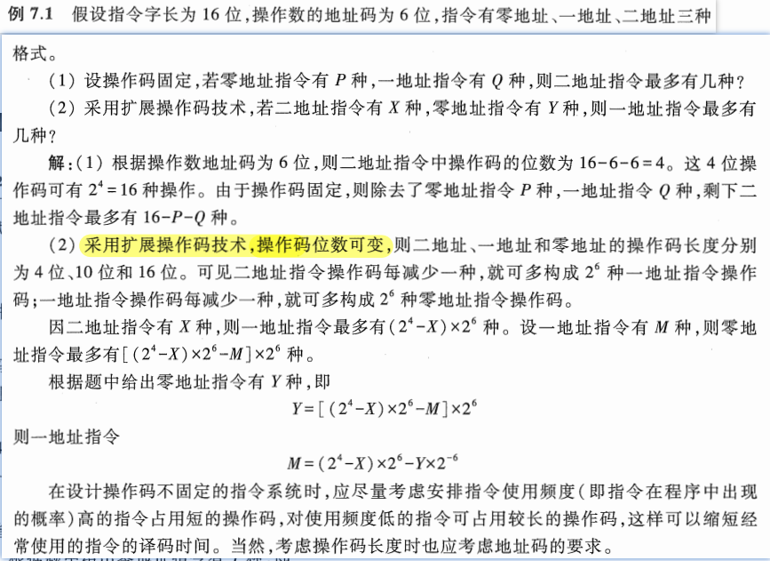

这个例题还是很有代表性的

##### 指令字长

指令字长取决于操作码的长度、操作数地址的长度和操作数地址的个数。

##### 操作数类型

操作数地址就是指令中的地址码字段。

常见的操作数类型有：地址、数字、字符、逻辑数

#### 寻址方式

寻址方式分为**指令寻址和数据寻址**两大类

##### 指令寻址

指令寻址较为简单，分为 **顺序寻址和跳跃寻址** 两种。

顺序寻址就是 PC 自动 +1
跳跃寻址则是通过转移类指令实现

##### 数据寻址

数据寻址的种类比较多，必须设置一字段来表明属于哪一种寻址方式。

指令的 **地址码** 字段通常不代表操作数的真实地址，故把他称为 **形式地址**

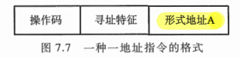

###### 1. 立即寻址

形式地址 A 表示的不是地址，而是就是 **操作数本身**，采用补码的形式存放

一般 `#` 表示立即数寻址的特征

**但是此时 A 的位数限制了所能表述的立即数的范围**

###### 2. 直接寻址

形式地址 A 就是操作数的真实地址 EA(Effective Address)，即 EA = A

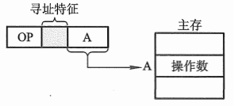

特点：

1. 寻找操作数比较简单，执行的时候只是对于主存访问一次
2. **但是 A 的位数限制了操作数的寻址范围**

###### 3. 隐含寻址

###### 4. 间接寻址

形式地址不直接指出操作数的地址，而是指出操作数有效地址所在的存储单元地址（感觉很像指针）。

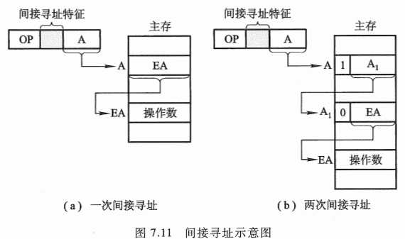

这种方式与直接寻址相比，扩大了操作数的寻址范围。同时，易于编制程序，例如，利用间接寻址可以很方便地完成子程序返回。

间接寻址的缺点在于指令的执行阶段需要 **访存两次或者多次**，致使指令 **执行时间** 延长。

###### 5. 寄存器寻址

地址码字段直接给出了寄存器的编号。由于操作数不在主存之中，所以寄存器寻址在执行阶段无需访存，减少了执行时间。

又由于地址字段只需指明寄存器编号，所以指令字较短，因此寄存器寻址在计算机中应用广泛。

###### 6. 寄存器间接寻址

寄存器 $R_i$ 中的内容不是操作数，**而是操作数所在的主存单元地址号**。所以仍需访问主存，但是比间接寻址少访问一次主存。

###### 7. 基址寻址

基址寻址需设有基址寄存器 BR，**操作数的有效地址 EA 等于指令字中的形式地址与基址寄存器中的内容相加**，也就是 EA = A + (BR)

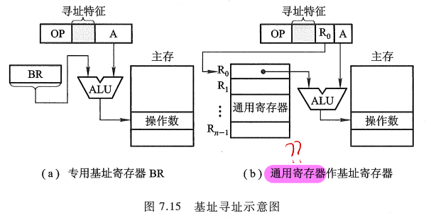

基址寻址**可以扩大操作数的寻址范围**
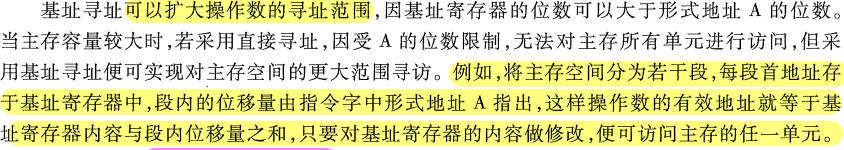

###### 8. 变址寻址

变址寻址和基址寻址极为相似。有效地址 EA 等于指令字中的形式地址 A 与变址寄存器 IX 的内容相加之和，EA = A + (IX)

###### 9. 相对寻址

相对寻址的有效地址是将程序计数器 PC 的内容（即当前指令的地址）与指令字中的形式地址 A 相加，即 EA = (PC) + A

相对寻址常用于转移类指令，其中**位移量 A 可正可负**，采用补码表示。

###### 10. 堆栈寻址

要求计算机中设有堆栈，既可以使用寄存器组来实现，也可以利用主存的一部分空间作为堆栈。

其中，SP (Stack Point) 始终指向栈顶地址。

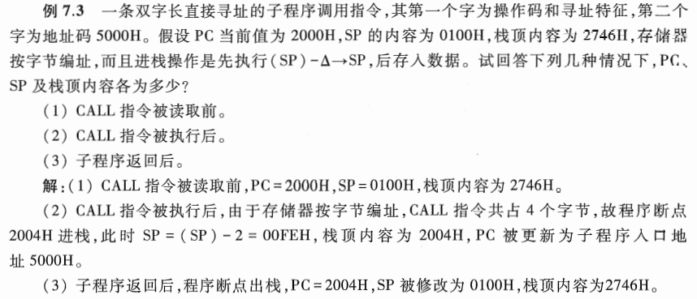

##### 指令格式举例

##### 指令设计举例

#### RSIC 技术

RSIC(Reduced Instruction Set Computer)

CISC(Complex Instruction Set Computer)

**RSIC 的主要特征：**

1. 选用使用频度较高的一些 **简单指令**，复杂指令的功能使用简单指令来组合
2. 指令长度固定、指令格式种类少、寻址方式少
3. 访存指令只有 LOAD 和 STORE
4. CPU 中有多个通用寄存器
5. 采用流水技术 一个时钟周期内完成一条指令
6. 采用组合逻辑实现控制器
7. 采用优化的编译程序

### 第八章 CPU 结构和功能

#### 指令周期

CPU 每**取出并且执行一条指令的时间叫做指令周期**，也即 CPU 完成一条指令的时间。

指令周期的组成如下（一般来说）：

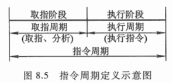

但是如果是间址寻址，还需访存一次主存，取出操作数，所以指令周期就是：

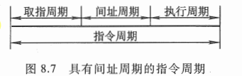

此外，如果在每条指令结束前，发送中断查询，如果进入中断相应阶段，则又包括中断周期。**这样就包括 取值、间址、执行、中断 四个部分。**

上面四个部分都有访存操作，但是目的不同。取指是为了取出指令，间址是为了取出有效地址，执行是为了取出操作数，中断时为了保存程序断点。这四个周期又可以称为 CPU 的**工作周期**。

#### 指令周期的数据流

##### 取值周期的数据流

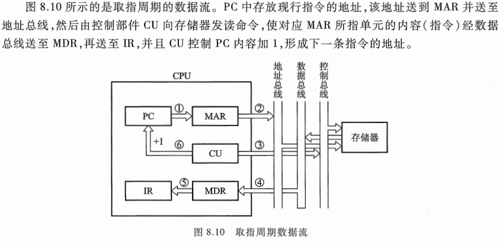

##### 间址周期的数据流

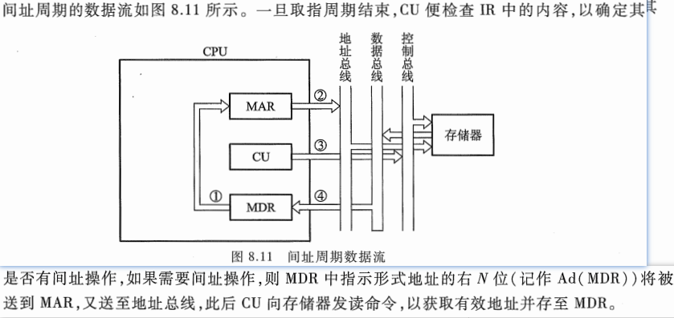

##### 执行周期的数据流

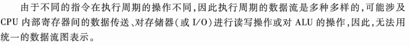

##### 中断周期的数据流

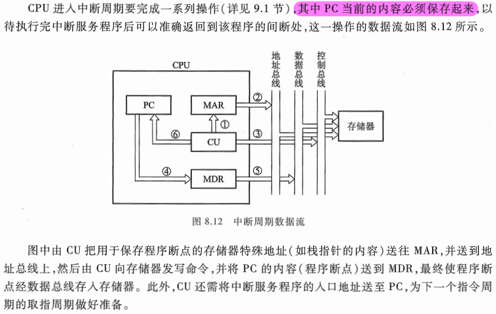

**注意：**有保存断点操作并且有中断服务程序的入口送入 PC 的操作。

#### 指令流水

指令流水大概是类似于一种并行吧。

##### 流水线性能

感觉光看看这里的题目就足够了。

#### 中断系统

##### 中断服务程序入口地址的寻找

通常有两种方法寻找入口地址：**硬件向量法和软件查询法**。

###### 硬件向量法

硬件向量法寻找入口地址速度快，在现代计算机中被普遍采用。

###### 软件查询法

##### 中断响应

与响应 IO 中断一样，CPU 总是在指令执行周期结束后，响应任何中断源的请求。

之所以 CPU 在指令的执行后期进入中断周期，是因为 CPU 在执行周期的结束时刻统一向所有的中断源发送中断查询信号，只有此时，CPU 才可以知道哪一个中断源有请求。

但是计算机中某一些指令的执行时间都很长，如果查询信号还是统一安排在执行周期的结束时刻，则有可能因为 CPU 发现中断请求过迟而发生差错。所以，我们可以在指令执行过程中设置若干查询断点。

保护现场、寻找入口地址、关中断这些操作都是在中断周期内由一条中断隐指令完成的。所谓中断隐指令，即在机器指令系统中没有的指令，是 CPU 在中断周期内由硬件自动完成的一条指令。

##### 保护现场和恢复现场

保护程序断点和保护 CPU 内部的寄存器两个方面。

其中，保护程序断点由中断隐指令完成，各个寄存器内的现场可以在中断服务程序中由用户（或者系统）由机器指令编程实现。

##### 中断隐指令

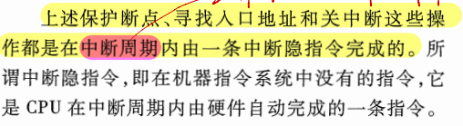

##### 中断屏蔽技术

主要用于多重中断。

**屏蔽触发器与屏蔽字**

屏蔽技术可以改变优先等级

每一个中断请求触发器就有一个屏蔽触发器，将所有的屏蔽触发器组合在一起，便构成了一个屏蔽寄存器，屏蔽寄存器中的内容就是**屏蔽字**。

### 第九章 控制单元的功能

将结合指令周期的**四个阶段**，着重分析控制单元为了完成不同指令所发出的各种操作命令（又称控制信号）。

#### 微操作命令的分析

控制单元具有发出各种**微操作命令**（**即控制信号**）序列的功能。

下面按照指令周期的四个阶段进一步分析其对应的微操作命令。

##### 取指周期

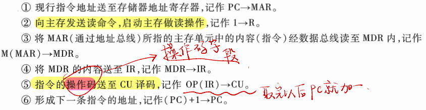

##### 间址周期

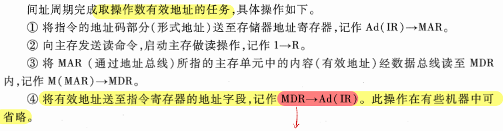

##### 执行周期

不同指令的执行周期的微操作是不同的，下面分别讨论**非访存指令、访存指令和转移类指令**的微操作。

###### 非访存指令

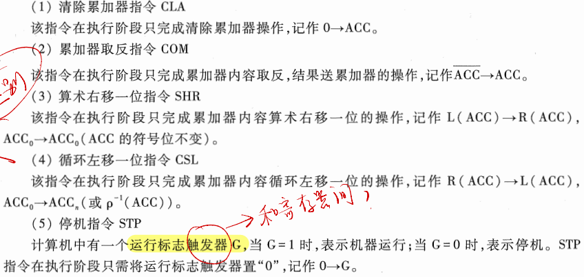

###### 访存指令

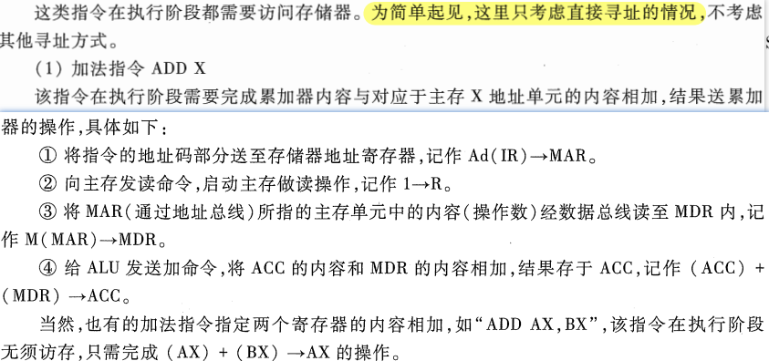

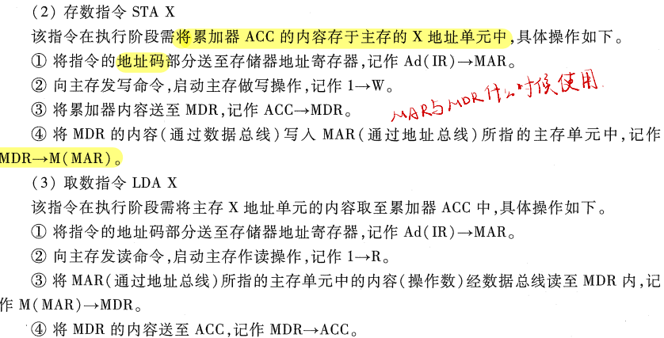

###### 转移类指令

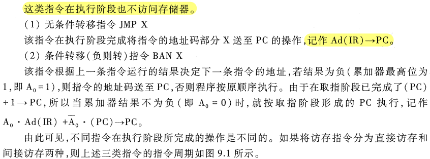

##### 中断周期

在中断周期中，中断隐指令自动完成保护断点、寻找中断服务程序入口地址以及硬件关中断的操作。

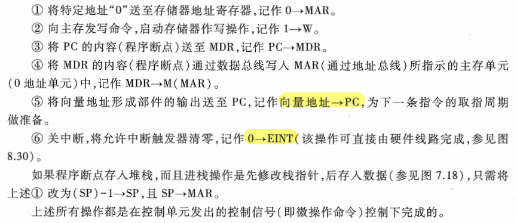

#### 控制单元的功能

##### 控制单元的外特性

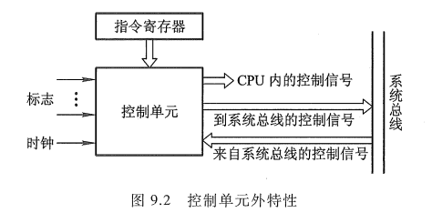

###### 输入信号

1. 时钟
   为了使控制单元按照一定的先后顺序、一定的节奏发出各个控制信号，控制单元必须受时钟控制。**即每一个时钟脉冲使控制单元发出一个操作命令或者发出一组需要同时执行的命令。**
2. 指令寄存器
   现行指令的操作码决定了不同指令在执行周期所需完成的不同操作，所以**指令的操作码字段**是控制单元的输入信号，它与时钟配合可以产生不同的控制信号。
3. 标志
   控制单元**有时候依赖于 CPU 的状态**（如 ALU 操作的结果）产生控制信号（如 BAN 指令，控制信号要根据上一条指令的结果是否为负产生不同的控制信号）
4. 来自系统总线（控制总线）的控制信号
   例如，中断请求，DMA 请求

###### 输出信号

1. CPU 内的控制信号
2. 送至系统总线的控制信号

##### 控制信号举例

控制单元就是发出各种不同的控制信号，下面以间接寻址的加法指令 `Add @ X` 为例，进一步理解控制信号在完成一条指令过程中所起到的作用。

1. 不采用 CPU 内部总线方式（就是 CPU 中的各个相关部件都是相连的）
   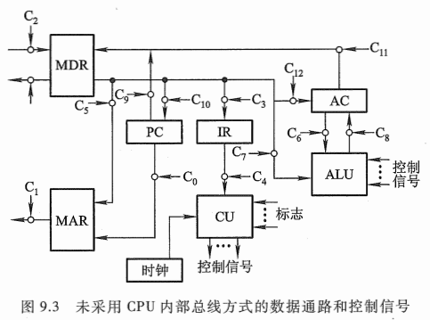
    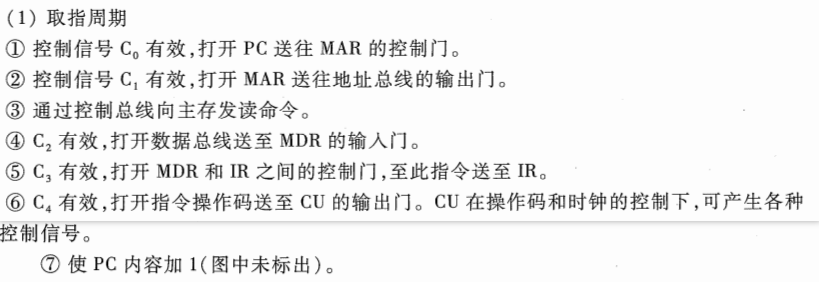
   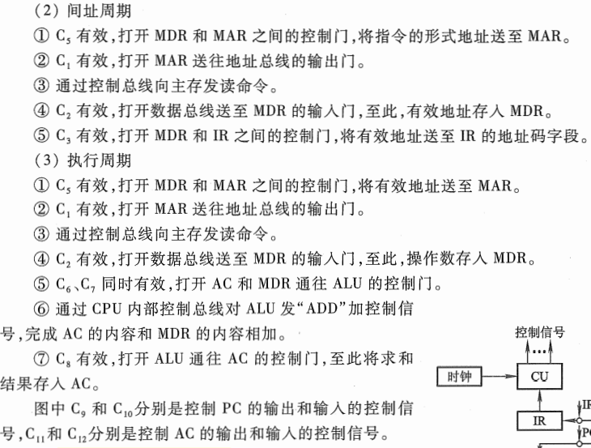
2. 采用 CPU 内部总线的方式
   。。。。课本 P 382

##### 多级时序系统

###### 机器周期

**机器周期可以看作是所有指令执行的一个基准时间。**

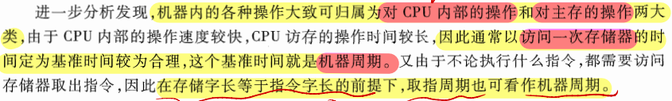

###### 时钟周期（节拍、状态）

一个机器周期里面可以完成若干个微操作，每一个微操作都需要一定的时间，可以使用 **时钟信号** 来控制产生每一个微操作命令。

**时钟信号的频率就是 CPU 的主频**。

**用时钟信号控制节拍发生器，就可以产生节拍。每一个节拍的宽度正好对应一个时钟周期。**

**在每一个节拍周期里面机器可以完成一个或者几个需要同时执行的操作，是控制计算机执行的最小单位。**

**也就是 机器周期包含若干个时钟周期（节拍周期）。**机器周期又是所有指令执行的一个基准时间。

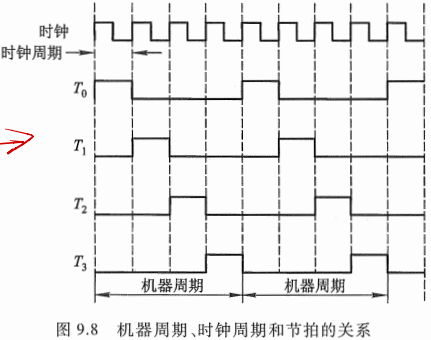

###### 多级时序系统

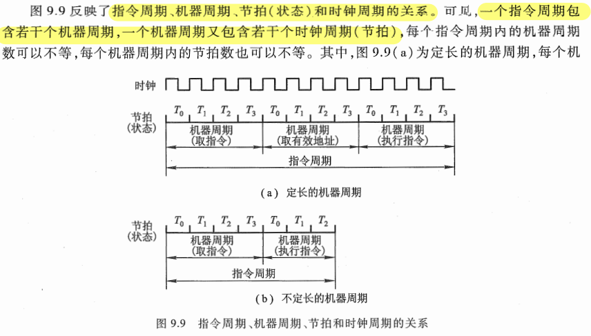

##### 控制方式

通常将如何形成控制不同微操作序列所采用的**时序控制方式**称为 CU 控制方式。

常见的控制方式有：同步控制、异步控制、联合控制和人工控制。

。。。

##### 多级时序系统实例分析

。。。

### 第十章 控制单元的设计

本章将**介绍控制单元的两种设计方法**。

#### 组合逻辑设计

##### 组合逻辑控制框图

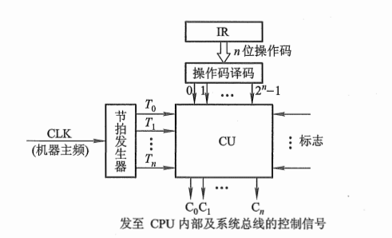

##### 微操作的节拍安排

参见课本 P396

感觉还是很重点的这一块

##### 组合逻辑设计步骤

1. 列出微操作命令的操作时间表
2. 写出微操作命令的最简逻辑表达式
3. 画出微操作命令的逻辑图

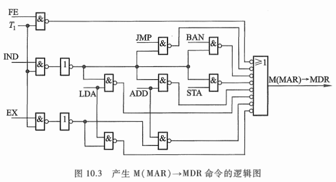

如图，由各个微操作命令和逻辑运算组成的微操作设计电路图。

这样设计思路清晰，但是设计完毕以后就会发现控制单元的线路十分复杂，并且不规范。所以**为了克服这些缺点，我们可以采用微程序设计方案**。

但是，随着 RSIC 的出现，组合逻辑设计仍然是设计计算机的一种重要方法。

#### 微程序设计

##### 微程序设计思想的产生

为了克服组合逻辑控制单元线路庞杂的缺点，他大胆设想采用与存储程序相类似的方法，来解决微操作命令序列的形成。

微程序控制单元的核心部件是一个控制存储器。由于执行一条机器指令必须多次访问存储器，以取出多条微指令来控制执行各个操作，因此需要控制存储器的速度较高。

##### 微程序控制单元框图及工作原理

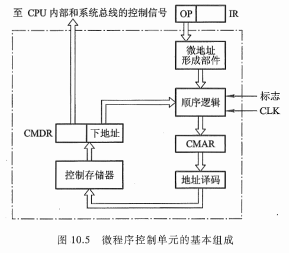

控制单元的内部结构。

其中，控制存储器（简称存控）是微程序控制单元的核心部件，用来存放全部微程序。

CMAR 是控存地址寄存器，用来存放欲读出的微指令地址

CMDR 是控存数据寄存器，用来存放从存控读出的微指令

顺序逻辑是用来控制微指令序列的，具体就是控制形成下一条微指令（即后续微指令）的地址

##### 微指令的编码方式

##### 微指令序列地址的形成

##### 微指令格式

### 杂记

1. 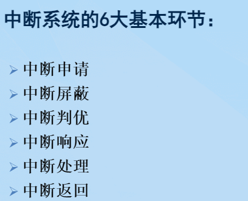

2. 周期窃取又叫做周期挪用，是指利用 CPU 不访问存储器的那些周期来实现 DMA 操作。

3. I/O设备要求DMA传送会遇到三种情况，一种是此时CPU不需访问主存(如CPU正在执行乘法指令，由于乘法指令执行时间较长，此时CPU不需访问主存)，故I/O设备访存与CPU不发生冲突。第二种情况是I/O设备要求DMA传送时，CPU正在访存，此时必须待 存取周期结束时刻，CPU才能将总线占有权让出。第三种情况是I/O设备要求访存时，CPU也要求访存，这就出现了访存冲突。此刻，I/O访存优先于CPU访存，因为I/O不立即访存就可能丢失数据，这时I/O要窃取一二个存取周期，意味着CPU在执行访存指令过程中插入了DMA请求，并挪用了一二个存取周期，使CPU延缓了一二个存取周期再访存。

4. 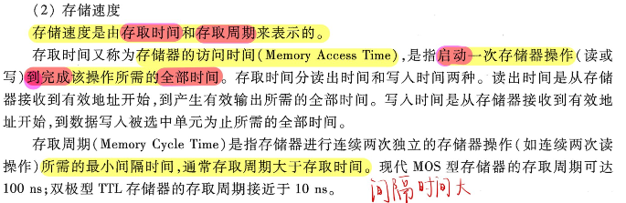

5. 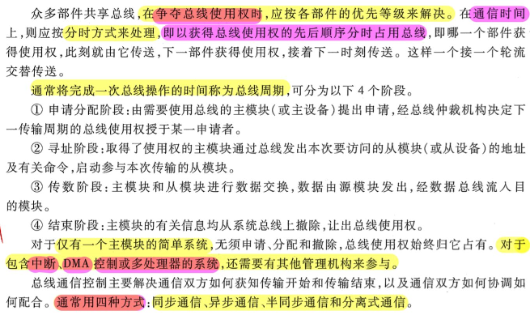

6. 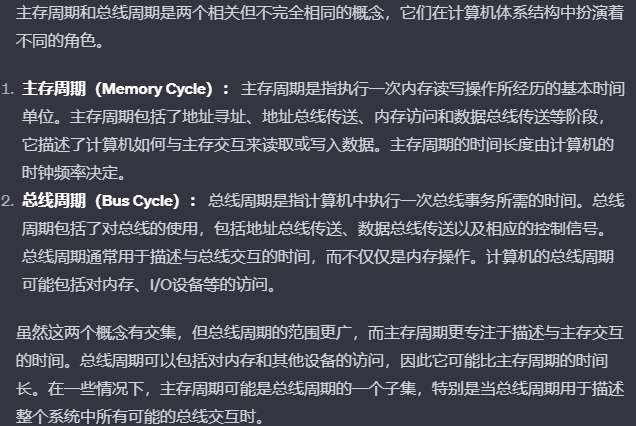

7. 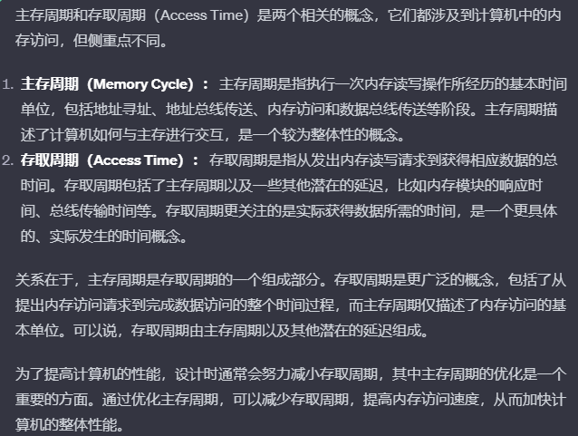

8. 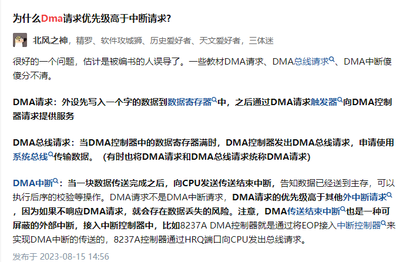

9. https://zhuanlan.zhihu.com/p/633191759

10. 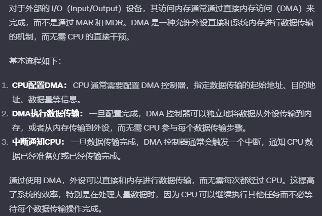

11. 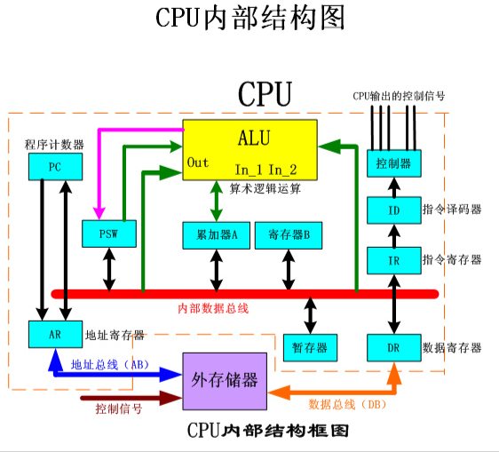

14. 指令字长、存储字长、机器字长

13. 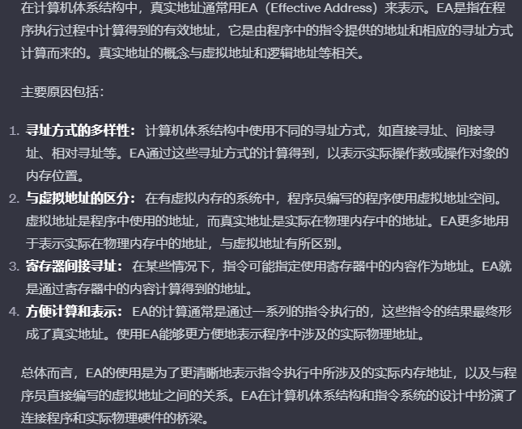

14. 32位的计算机中：32位(bit)=4字节(byte)=1字(word)

    64位的计算机中：64位(bit)=8字节(byte)=1字(word)

    由此可见，**在不同位数的计算机中，一个字的大小也是不同的，所以一个字等于多少字节，是多少位，与计算机的系统硬件有关,不可以错误的对一个字是几字节下固定的判断**。

15. 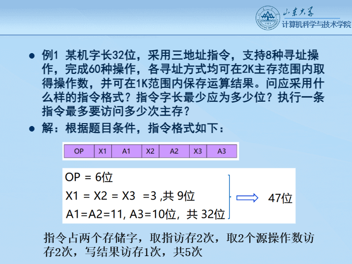
    存储字？

16. 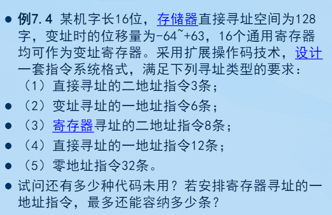
    对于扩展码的实际应用

17. 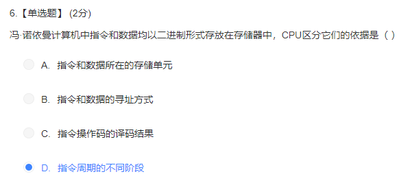

18. 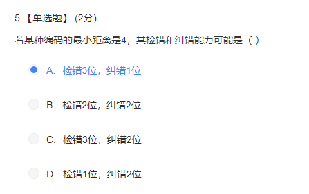

19. 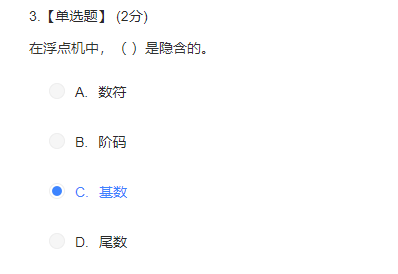

20. 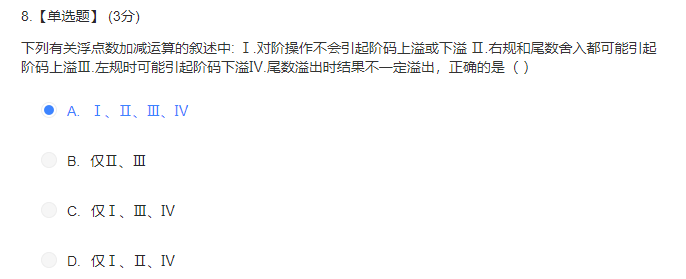

21. 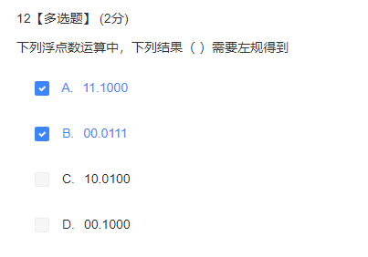

22. 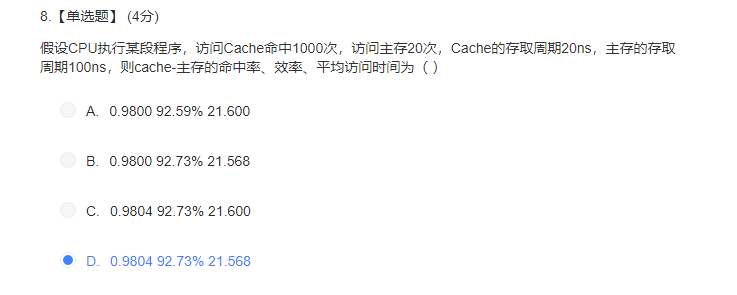

23. 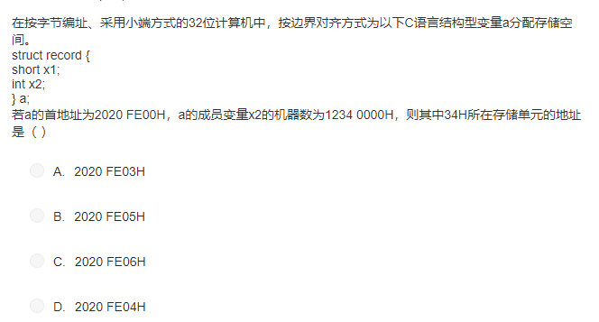

24. 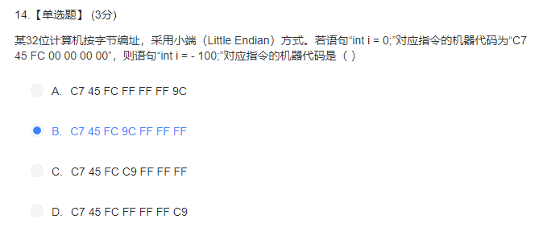

25. 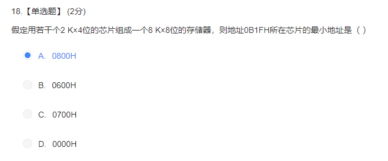

26. 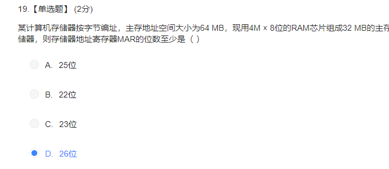

27. 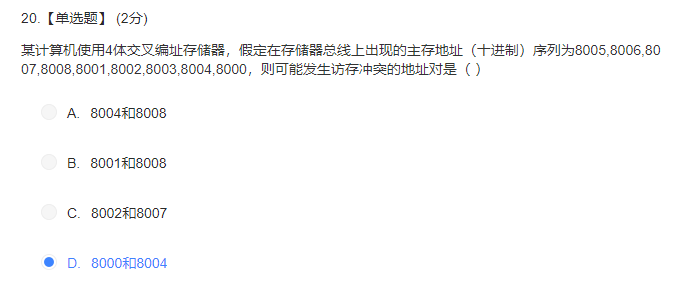

28. 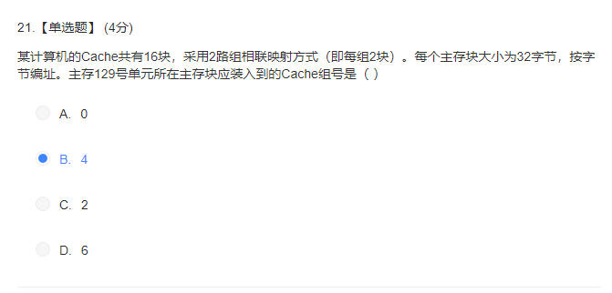

29. 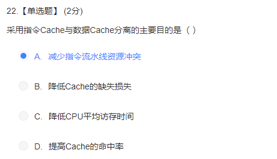

30. 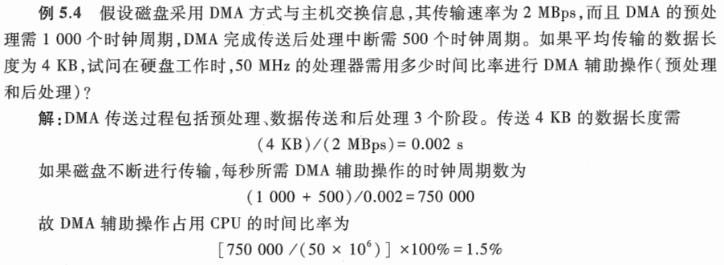

31. 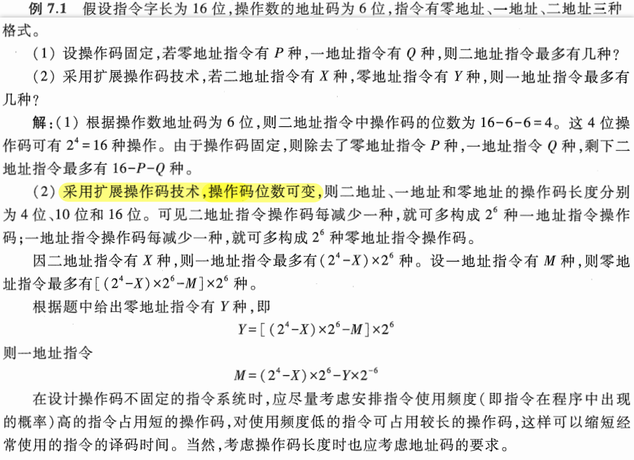

32. 边界对齐

33. 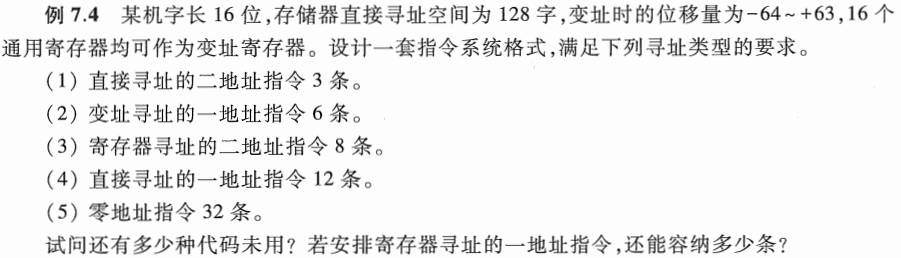
    P328 题目

34. P331 例题7.7

35. 指令和数据都存储在存储器中，计算机如何区分它们？

    1. 通过不同的时间段来区分指令和数据，即在取指令阶段(或取指微程序)取出的为指令，在执行指令阶段(或相应微程序)取出的即为数据。
    2. 通过地址来源区分，由PC提供存储单元地址的取出的是指令，由指令地址码部分提供存储单元地址的取出的是操作数。

36. MAR的长度与 PC 的长度相等，并且 MAR 的长度与存储器的地址线数相等，对应着存储单元的个数。

37. 虽然 MAR 和 MDR 是存储器的一部分，但是现代的计算机中，MAR 和 MDR 都是集成在 CPU 中的，并且 Cache 也是集成在 CPU 中的。

38. 运算器用于执行算数运算或者逻辑运算。运算器的核心是算数逻辑单元 ALU，因为运算器通常还包含若干的寄存器，如 累加器ACC、乘商寄存器MQ、操作数寄存器X、变址寄存器IX、基址寄存器BR，还有程序状态寄存器 PSW，也叫做标志寄存器。

39. 控制器由 程序计数器 PC、指令寄存器 IR 和控制单元 CU 组成。

40. PC 用来存放将要执行的指令的地址，与主存的 MAR 之间有一条直接的通路。IR 用来存放当前的指令，内容是从主存中 MDR 中获取的。将指令中的操作码 OP(IR) 送至 CU，用以分析指令并且发出各种微操作命令序列。地址码送去 MAR 用于取出操作数。

41. 一般将运算器和控制器统一集成在同一个芯片上，称为中央处理器 CPU，CPU 和主存共同构成主机。

42. CPU 和主存之间有一组总线相连，总线中有地址线、控制线和数据线三类。

43. 机器语言又称二进制代码语言，是计算机唯一一种可以直接识别和执行的语言。

44. 汇编语言需要经过汇编程序的翻译，成为机器语言以后执行。

45. 高级语言通常需要编译程序编译为汇编语言，然后经过汇编操作。

46. “存储程序” 工作方式规定，程序执行前，需要将程序所含的指令和数据送入主存

47. 汇编器就将汇编语言翻译为机器语言，生成 .o 的文件，但是后面还需要链接，链接器(ld)将多个可重定位目标文件和标准库函数合并为一个可执行目标文件，或简称可执行文件。

48. 机器字长通常指的是 CPU 内部用于整数运算的数据通路的宽度，代表了计算机处理信息的能力。

49. 指令字长:一个指令字中包含的 二进制代码的位数。存储字长: 一个存储单元存储的二进制代码的长度。这些字长都是字节的整数倍。

50. 主存用来存储计算机运行期间所需的程序和数据，CPU 可以直接随意对其进行访问。

51. 随机存储器 RAM 只读存储器 ROM

52. 磁盘和磁带这些存储介质，在访问的时候需要根据物理位置的先后顺序访问，是「串行存取存储器」。

53. 存储器中，存取周期是连续的两次存储操作之间的间隔，通常大于存储时间，这是因为对任何一种存储器，在读写操作之后，总要有一段恢复内部状态的复原时间。（但是这里的恢复好像还不同于 DRAM 的刷新操作）

54. 为了解决存储系统大容量、高速度和低成本3个相互制约的矛盾，在计算机系统中，通常采用多级存储器结构。主要体现在 Cache-主存 和 主存-辅存 两个方面。

55. 主存储器由DRAM实现，靠处理器的那一层(Cache)则由SRAM实现。

56. SRAM 它仍保持其原状态而不需要再生 (非破坏性读出)，存取速度快，但集成度低，功耗较大，价格昂贵，一般用于高速缓冲存储器。

57. 但是 DRAM 是使用电容来存储信息的，需要定时进行刷新，所以速度要比 SRAM 也就是 Cache 慢。（可以通过这种方式进行理解）

58. DRAM 的刷新方式主要有三种，集中刷新、分散刷新和异步刷新。其中，集中刷新指选定一段时间，一次刷新所有的存储单元；分散刷新是把对每行的刷新分散到各个工作周期中，这样，一个存储器的系统工作周期分为两部分:前半部分用于正常读、写或保持;后半部分用于刷新，但是这种方式增加了系统的存取周期，降低了整个机器的速度，优点是没有死区；异步刷新是对于前面两种方式的结合，具体做法是将刷新周期除以行数，

59. 刷新是一行行进行的，必须在刷新周期内，刷新一行的时间是等于存取周期的。因为刷新的过程与一次存取相同，只是没有在总线上输入输出。

60. ROM 和 RAM 都是支持随机访问的存储器。

61. DRAM芯片容量较大，地址位数较多，为了减少芯片的地址引脚数，通常采用地址引脚复用技术，行地址和列地址通过相同的引脚分先后两次输入，这样地址引脚数可减少一半。

62. 多模块存储器是一种空间并行的技术，利用多个结构完全相同的存储模块的并行工作来提高存储器的吞吐率。常用的有单体多字存储器和多体低位交叉存储器。

63. 单体多字是扩大了存储单元的容量，一次可以取出多个字的内容，但是缺点是指令和数据在主存内必须是连续存放的，一旦遇到转移指令，或操作数不能连续存放， 这种方法的效果就不明显。

64. 多体并行存储器是由多个模块组成，每个模块都有相同的容量和存取速度，各模块都有独立的读写控制电路、地址寄存器和数据寄存器。分为低位交叉和高位交叉两种。

65. 高位交叉方式下，总是把低位的体内地址送到由高位体号确定的模块内进行译码。访问一个 连续主存块时，总是先在 一个模块内访问，等到该模块访问完才转到下一个模块访问，CPU总是 按顺序访问存储模块，各模块不能被并行访问，因而不能提高存储器的吞吐率。

地址格式是：体号   体内地址

66. 低位交叉编址中，低位地址为体号，高位地址为体内地址。这一种方式可在不改变每个模块存取周期的前提下，采用流水线的方式并行存取，提高存储器的带宽。

如果是低位交叉编址，每一个字的存取周期为 T，总线传输周期为 r，那么模块数必须大于 T / r，为了保证下一次访问同一个模块的时候，上一次的存取操作已经完成。

（在第一个模块开始存取操作以后的 r 时间，第二个模块才开始存取操作，它们不是同时开始的）

67. 主存储器通过数据总线、地址总线和控制总线与CPU连接。

68. 主存中，单个芯片的容量不可能很大，往往通过存储器芯片扩展技术，将多个芯片集成在一个内存条上，然后由多个内存条及主板上的 ROM 芯片组成计算机所需的主存空间，再通过总线与CPU相连。（所以说，主存中其实是 RAM 和 ROM 都有的）

69. 主存的容量扩展通常有：位扩展法、字扩展法 利字位同时 展法来扩展主存容量。

70. 位扩展是将多个存储芯片的地址端、片选端和读写控制端相应并联，数据端分别引出。

71. 字扩展将芯片的地址线、数据线、读写控制线相应并联。仅采用字扩展时，各芯片连接地址线的方式相同，连接数据线的方式也相同，但在某一时刻只需选中部分芯片。

72. 在构成主存时，通常选用ROM存放系统程序、标准子程序和各类常数，RAM则是为用户编程而设置的。

73. 一块硬盘含有若干记录面，每个记录面划分为若干磁道，而每条磁道又划分为若干扇区，扇区(也称块)是磁盘读写的最小单位，即磁盘按块存取。

74. 盘面指的是硬盘中单个盘片的两面，每面都被用来存储数据。一个硬盘通常有多个盘片，每个盘片有两个盘面。每个盘面上都覆盖有磁性材料，数据通过改变这些材料的磁化状态来存储。

75. 柱面（隧道）是指在硬盘的多个盘片上，垂直排列的一组磁道的集合。当硬盘的读写头移动到某个磁道时，所有盘面上对应位置的磁道都可以同时访问。

76. 磁盘设备通常由磁盘驱动器、磁盘控制器和盘片组成。

其中，磁盘驱动器和核心部件是 磁头组件和盘片组件。

磁盘控制器是硬盘存储器和主机的接口。

77. 这里提到的磁盘，通常指的是硬盘驱动器(HDD)，还有一种是固态驱动器(SDD)，也就是我们经常说的固态硬盘。

78. 固态硬盘(SSD)是一种基于闪存技术的存储器。它与U盘并没有本质上的差别，只是容量更大，存取性能更好。虽然 SSD 能耗小、速度快、安全性高，但是 SSD 也有缺点，因为反复写之后，闪存块会磨损，所以SSD也容易磨损

79. 由于程序的转移概率不会很低，数据分布的离散性较大，所以单纯依靠并行主存系统（这里的并行主存系统就是前面提到的交叉存储模块）提高主存系统的频宽是有限的。

80. 程序访问的局部性原理包括时间局部性和空间局部性。

81. 主存和辅存共同构成了虚拟存储器。

82. 虚拟存储器具有主存的速度和辅存的容量。虚拟存储器将主存或辅存的地址空间统一编址，形成一个庞大的地址空间，在这个空间内， 用户可以自由编程，而不必在乎实际的主存容量和程序在主存中实际的存放位置。

83. 用户编程允许涉及的地址称为虚地址或逻辑地址，虚地址对应的存储空间称为虚拟空间或程序空间。

84. 一条指令通常包括操作码字段和地址码字段两部分.

85. 不需要操作数的指令，如空操作指令、停机指令、关中断指令等 这类的指令是零地址指令。

86. 寻址方式分为指令寻址和数据寻址两大类。

87. 指令中的地址码字段并不代表操作数的真实地址，这种地址称为形式地址(A)。形式地址结合寻址方式可以计算出操作数在存储器中的真实地址。

88. 指令寻址方式有两种: 一种是顺序寻址方式，另一种是跳跃寻址方式。

89. 但从本质上讲，两者有较大区别。基址寻址面向系统，主要用于为多道程序或数据分配存储空间；变址寻址立足于用户，主要用于处理数组问题，在变址寻址中，变址寄存器的内容由用户设定。（基址和变址通常指的是寄存器中的内容是否会变化）

90. 复杂指令系统计算机 (CISC)，典型的有采用x86架构的计算机；减少指令种类和简化指令功能，提高指令的执行速度，这类机器称为精简指令系统计算机(RISC)，典型的有ARM、MIPS架构的计算机 

91. 在基址寻址中，程序员操作的是偏移地址，基址寄存器的内容由操作系统控制，在执行过程中是动态调整的；而在变址寻址中，程序员操作的是变址寄存器，偏移地址是固定不变的。

92. CPU从主存中取出并执行一条指令的时间称为指令周期，不同指令的指令周期可能不同。指令周期通常使用若干机器周期来表示。一个机器周期是由若干个时钟周期组成的，时钟周期是CPU的基本工作周期。

93. 指令周期一般由取址、间址、执行和中断四个部分组成。

94. 取指周期的任务是根据PC中的内容从主存中取出指令代码并存放在IR中；间址周期的任务是取操作数有效地址；执行周期的任务是取操作数，并根据IR中的指令字的操作码通过ALU操作产生执行结果，不同指令的执行周期操作不同，因此没有统一的数据流向；中断周期的任务是处理中断请求。

95. 由CPU内部产生的意外事件被称为异常，有些教材中也称内中断。

96. 由来自CPU外部的设备，向CPU发出的中断请求被称为中断，通常用于信息的输入和输出。

97. 异常是由CPU内部产生的意外事件，分为硬故障中断和程序性异常，硬故障中断是由硬连线出现异常引起的，如存储器校验错、总线错误等；程序性异常也称软件中断，是指在CPU内部因执行指令而引起的异常事件，如整除0、溢出、断点、单步跟踪、非法指令、栈溢出、地址越 界、缺页等。

98. 中断是指来自CPU外部、与CPU执行指令无关的事件引起的中断，包括I/O设备发出的中断(如键盘输入、打印机缺纸等)，或发生某种特殊事件。

99. 输入/输出是以主机为中心而言的，将信息从外部设备传送到主机称为输入，反之称为输出

100. IO 的基本的控制方式主要有以下4种：程序查询方式、程序中断方式、DMA 方式、通道方式。

101. IO 接口(IO控制器)是主机和外设之间的交接界面，通过接口可以实现主机和外设之间的信息交换。

102. IO 端口及其编址：统一编址，又称存储器映射方式，是指把IO端又当作存储器的单元进行地址分配，这种方式CPU不需要设置专门的IO指令，用统一的访存指令就可以访问IO端；独立编址，又称IO映射方式，需要专门的IO指令来访问IO端口。

103. 程序查询方式的信息交换控制完全由 CPU 执行程序实现，这种控制形式下，CPU 一旦启用 IO，就必须停止现行程序的运行。

104. CPU在程序中安排好在某个时机启动某台外设，然后CPU继续执行 当前的程序，不需要像查询方式那样一直等待外设准备就绪。一旦外设完成数据传送的准备工作，就主动向CPU发出中断请求，请求CPU为自己服务。

105. CPU响应中断后，经过某些操作，转去执行中断服务程序。这些操作都是由硬件直接实现的，我们将其称为中断隐指令。

中断隐指令完成的操作都有：关中断、保存断点、引出中断服务程序。

106. 现场信息因为用指令可直接访问，所以通常在中断服务程序中通过指今把它们保存到栈中，即由软件实现；而断点信息由CPU 在中断响应时自动保存到栈或指定的寄存器中，即由硬件实现。

107. 关中断、保存断点、中断服务程序寻址、保存现场和屏蔽字、开中断、执行中断服务程序

保存断点：即保存PC的值，由中断隐指令完成（即硬件自动完成），压入栈或寄存中

保存现场：将现场信息(各种寄存器中的值)压入主存或堆栈，由中断服务程序的指令完成（即由软件完成）

108. 当 IO设备需要进行数据传送时，通过DMA控制器向CPU提出DMA传送请求，CPU 响应以后将让出系统总线，由DMA控制器接管总线进行数据传送。

109. 中断方式是程序的切换，需要保护和恢复现场；而DMA方式不中断现行程序

110. DMA请求的优先级高于中断请求

111. 从数据传送来看，中断方式靠程序传送，DMA方式靠硬件传送。

#### 考试

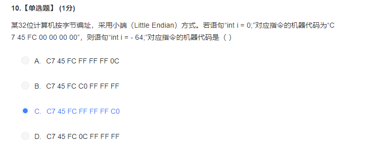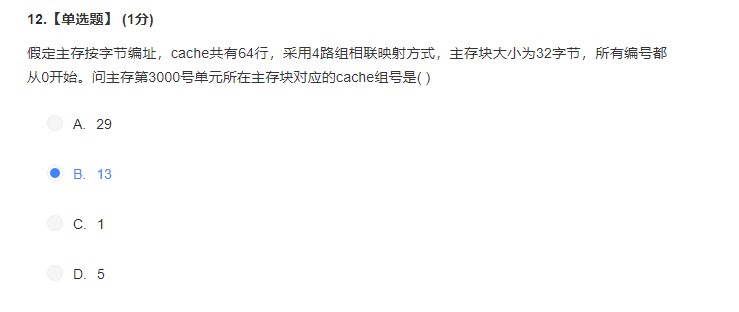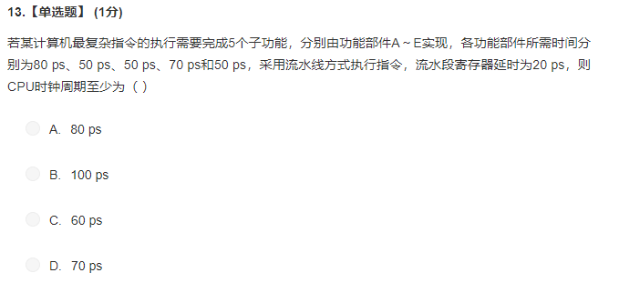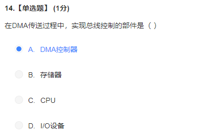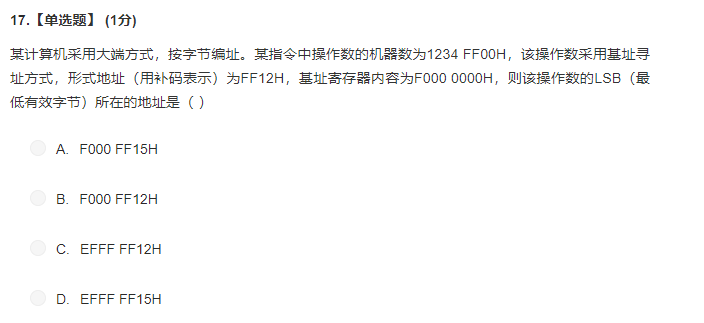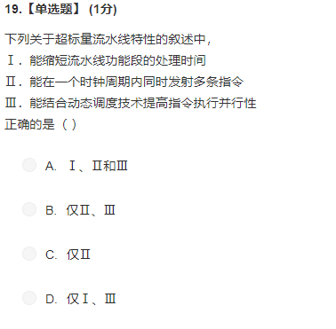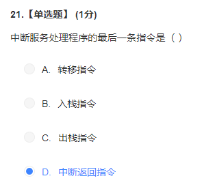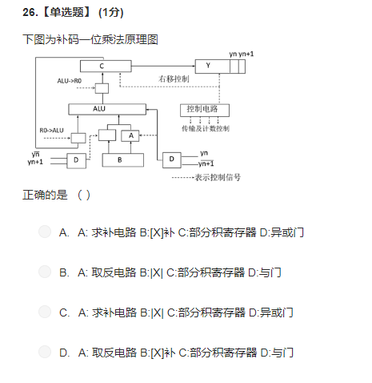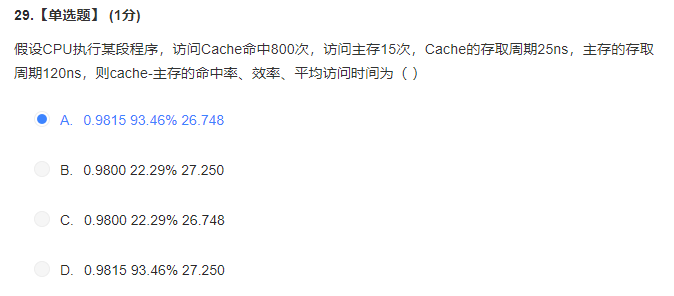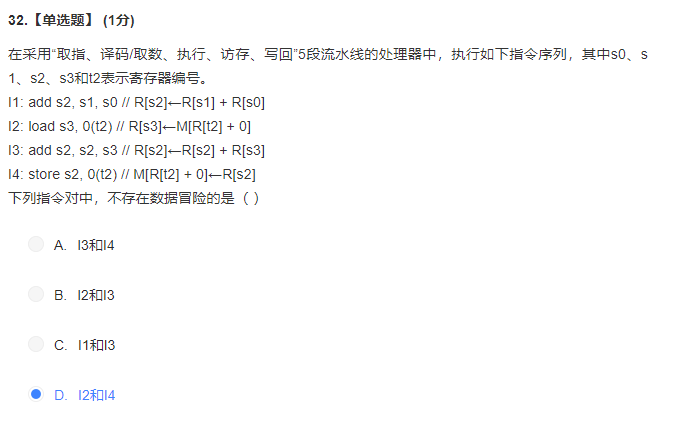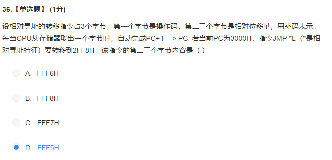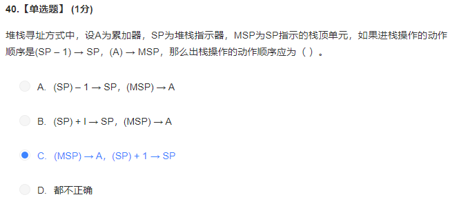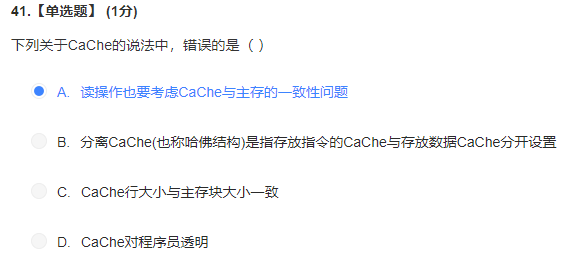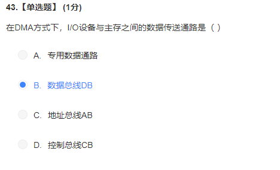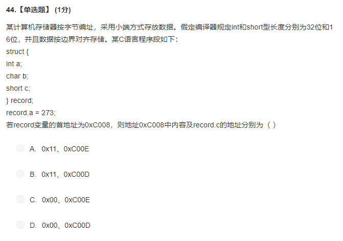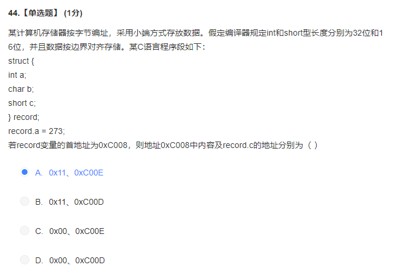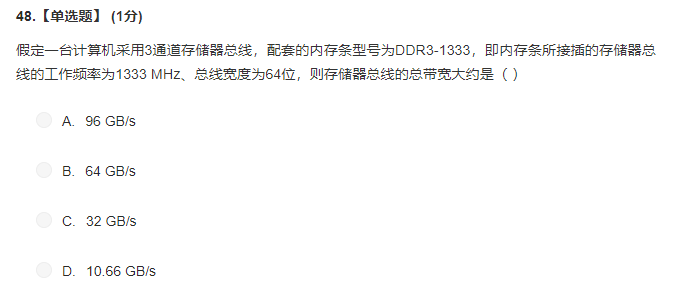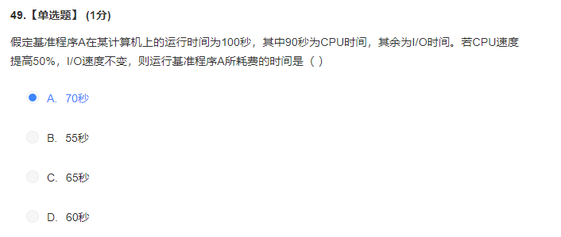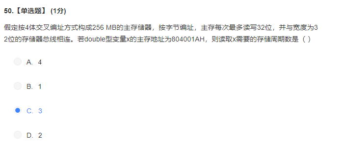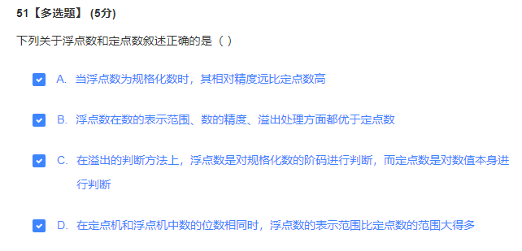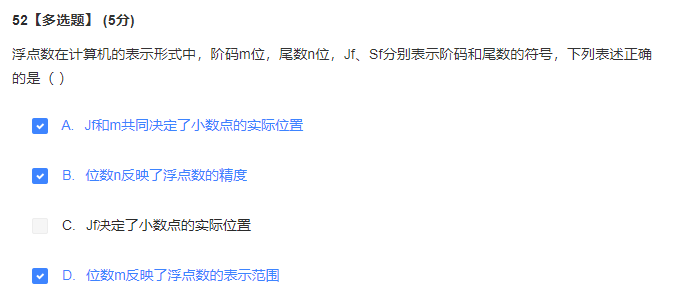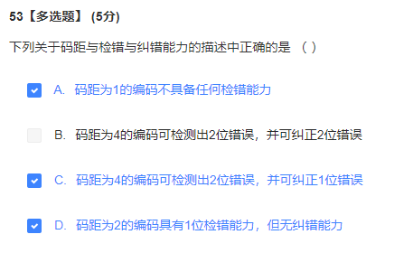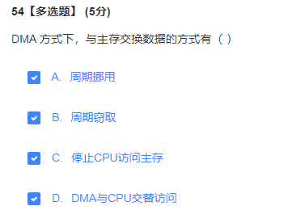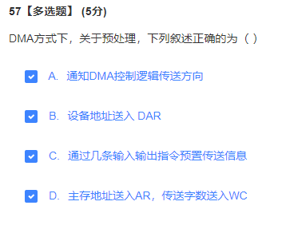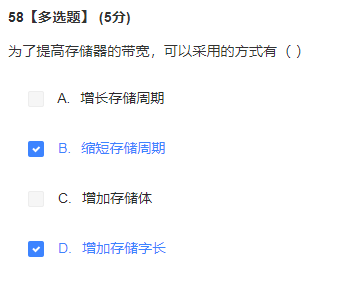提高带宽，减小存储体？ 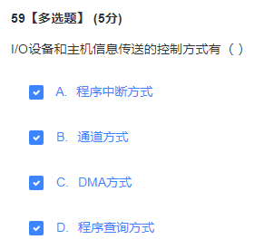通道方式没学？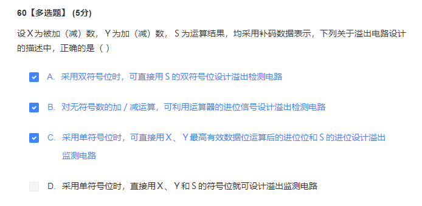

- 决定计算机计算精度的主要指标是计算机的字长。
- 边界对齐方式虽然会浪费一些空间，但是可以提高取指令和取数的速度。
- 多少位的机器，这里的多少位一般指的是「机器字长」
- 每一个 Cache 块都要有一个标记项，来指明是哪一块的副本，所以在计算 Cache 容量的时候，需要同时分析标记项和 Cache 数据块的位数
- Cache 的标记项，包括有效位、脏位、替换控制位、标记位
  有效位是指 一个块是否在 Cache 中
  修改位（脏位）是指 这个块是否被处理及修改（采用写回法的时候）
- 注意区分 Cache 地址和 Cache 行内的内容
  Cache 行内，前部分是标记，后面是数据，标记并不参与编址，后面的内容参与编址。地址就是 Cache 行数 + 块内地址
- 注意 CPU 中，运算器和控制器的寄存器区分。
  运算器有 ACC、PSW、MQ（乘商寄存器）、X（操作数寄存器）、变址寄存器（IX）、基址寄存器（BR）
  控制器有 PC、IR、MAR、MDR（关于指令的一些寄存器都在控制器中）
- 计算机软件按照功能分类，可以分为系统软件和应用软件
  **系统软件**主要有（基本上最后都是 xxx 系统）：OS（操作系统）、数据库管理系统（DBMS）、语言处理程序、分布式软件系统、网络软件系统、标准库程序、服务性程序
  应用软件主要有：科学计算类程序、网络软件程序
- 汇编程序：将汇编语言程序翻译为机器语言程序
  解释程序：将原程序中的语句按执行顺序**逐条翻译**为机器指令并立即执行（直接到机器语言）
  编译程序：将高级语言翻译为**汇编语言**或者**机器语言**程序（都可以）
- 冯诺依曼机最根本的特征是采用「存储程序」原理，基本工作方式是**控制流驱动方式**。
- **机器字长**（字长）是指计算机**一次整数运算**（即定点整数运算）所能处理的二进制数据的位数。
- 在计算机中，CPI 和时钟频率无关，只是频率更快一些的话，可以加快运行速度。
- 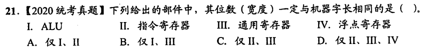
  选 B
- 机器语言和汇编语言与机器指令对应，而高级语言不与机器指令对应，所以有更好的 **可移植性**。
- 指令字长和存储字长都必须是字节的整数倍，所以如果我们计算 **位数**，最后的结果应该变为 8 的倍数
- 移码用来表示浮点数的阶码，只可以用来表示整数
- 一个真值的移码和补码仅差一个符号位
- 补码判断大小：对于正数，很容易判断；对于负数，**数值部分越大**，绝对值越小，**真值越大**
- 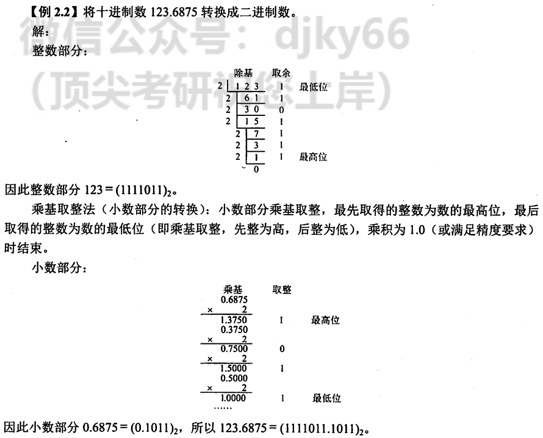
  注意整数、小数十进制和二进制之间的转换
- [-x]补 是 [x]补 含符号位在内，全部取反，末位加一
- n 位二进制最大表示 $2^{n} - 1$
- 补码的情况下，左移高位丢 0 结果出错，右移低位丢 1 影响精度
- 逻辑移位的时候，高位直接移丢，低位补 0
- 溢出判断有三种方式：一位符号位、二位符号位、一位加上最高位进位
- 浮点数运算中，数据一旦产生了上溢，计算机必须中断运算操作，进行溢出处理。当数据下溢的时候，因为绝对值过小，激素那几仅当成机器零来处理。
  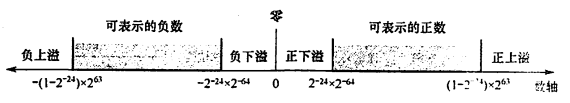
- 基数不同，浮点数的规格化形式也不同，当基数为 4 的时候，原码规格化形式的尾数的最高两位**不全为 0**
  （规格化这里要注意，是对于原码规格化还是说对于补码规格化）
- 浮点数的基数越大，表示的范围越大，但是精度越低。同时，因为对阶或者尾数溢出需右移以及规格化需左移的次数显著变少，因此运算速度可能提高。
- 舍入是浮点数的概念，定点数中没有舍入的概念
- RAM 和 ROM 的存取方式都是随机存取，ROM 可以和 RAM 共同作为主存的一部分，统一构成主存的地址域
- 主存和 Cache 之间的数据调动是由硬件自动完成的，对所有的程序员都是透明的；
  主存和辅存之间的数据调动则是由硬件和操作系统共同完成的，对应用程序员是透明的（如果使用汇编语言，就不是透明的）
- Cache 的效率：Cache 访问的时间 / 平均访问的时间
- DRAM 的刷新是透明的，刷新不依赖于外部的访问
- 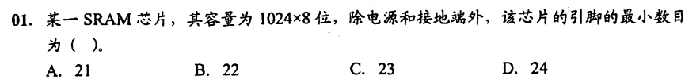
  10+8+2+1（最后的是两个读写控制信号线和一个片选线)，所以是 A
- 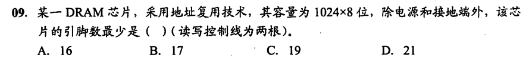
  5+8+2+2
  片选线是两个，因为采用了地址复用技术，所以分为行通选信号和列通选信号
- 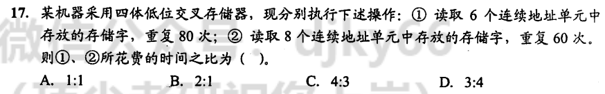
  选 C，这一个题目还是比较有意思的
- 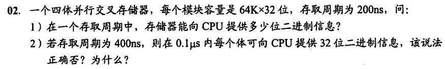
  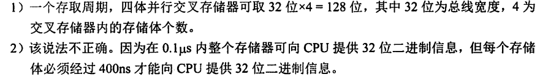
- 高位交叉存储不符合程序运行的局部性原理
- 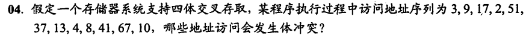
- 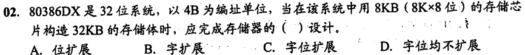
  仔细计算一下会发现，其实只有位扩展，所以选 A
- 算数移位的时候，只有低位的符号位参与移动
- IO 设备统一编址的时候不需要单独设置指令，访存指令就可以，而单独编址的时候需要设定单独的访存指令。
- SRAM 不是破坏性读出，而 DRAM 是破坏性读出
- 由于程序的转移的概率不是很低，数据分布的离散性较大，所以单纯依靠并行系统提高主存系统的频宽是有限的，这就必须从**系统结构**上进行改进，所以提出了 Cache-主存 和 主存-辅存 层次。
- 当 CPU 发出读请求时，若访存地址在 Cache 中命中，就将此地址转换成 Cache 地址，直接对于 Cache 进行读操作。
- CPU 与 Cache 或者主存之间交互的单位是「字」，而 Cache 与主存之间的信息交互单位是「字块」
- 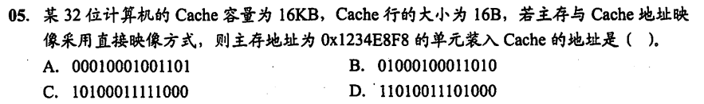
  根据直相联映射，直接选取地址的后 14 位（因为 Cache 的容量为 16KB)，所以选 C
- 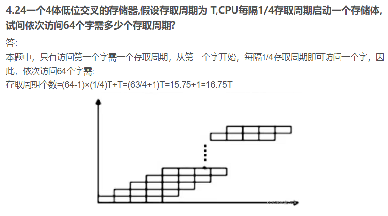
- 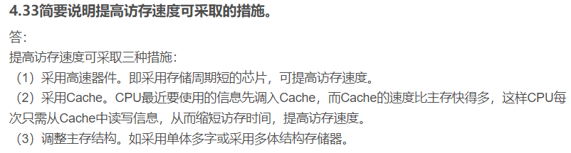
- 单重中断和多重中断之间的区别：
  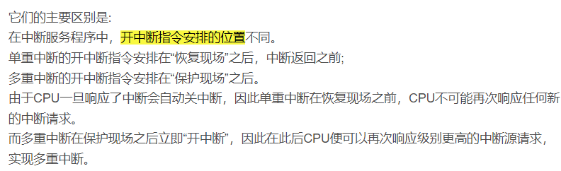
- 中断处理的全过程：
  1. 关中断
  2. 保护断点
  3. 中断服务程序寻址
  4. 保护现场和屏蔽字
  5. 开中断
  6. 执行中断服务程序
  7. 关中断
  8. 恢复现场和屏蔽字
  9. 开中断、中断返回，**中断服务程序的最后一条指令通常是中断返回指令**
     （整个进入）
- 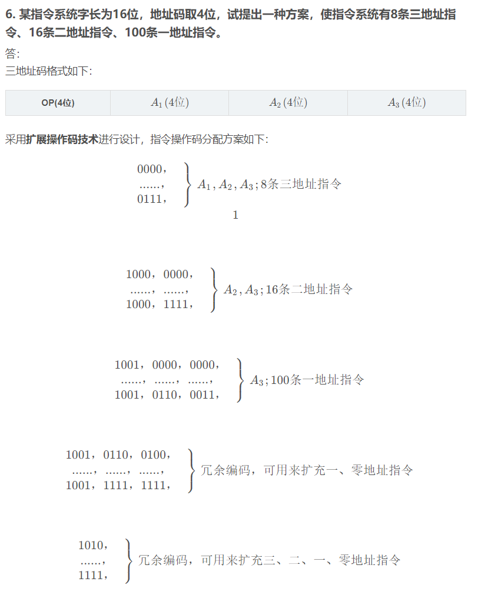
- 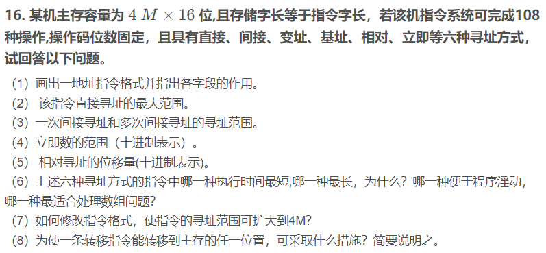
- 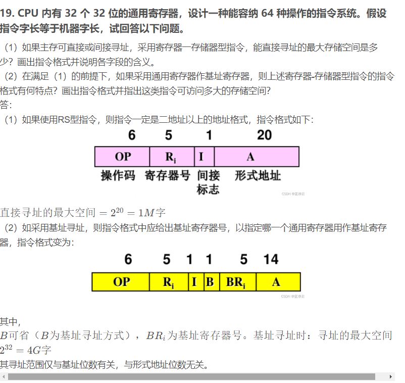
- 调用子程序的指令和转移指令的区别：
  1. 执行调用指令时必须保存下一条指令的地址，当子程序结束的时候，根据返回地址回到主程序继续执行
  2. 转移指令不返回执行
- 程序控制类指令的功能是改变程序执行的顺序
- 在指令格式中，采用扩展码设计方案的目的是：保持指令字长度不变而增加指令的数量
- 立即数寻址的地址字段就是操作数本身，而不是地址，**采用补码的形式**
- 直接寻址的寻址方式，优点是简单，在执行阶段仅仅需要访存一次，但是**操作数的地址不易修改**（因为我们一般不能改变指令的格式）
- 相对寻址广泛用于转移指令，**便于实现多道程序**
- 基址寻址中，基址寄存器的内容不变，形式地址可变，有利于多道程序设计，并且可以用于编制浮动程序，但是偏移量 A 比较短
- 变址寻址中，形式地址 A 不变，所以利于编制循环程序（对于数组的应用）
- 寄存器寻址，寄存器中的数字就是我们要取的操作数；寄存器间接寻址，寄存器中是我们要取的操作数的地址
- 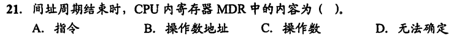
  为 B，操作数地址
- 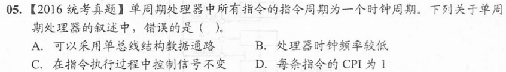
  A
  对于 D，控制信号指的是 CU 根据操作码发出的信号，所以对于单周期的处理器来说，一个时钟周期内指令不会变化，所以控制信号就不会发生变化
- 控制存储器（CM, 存储微程序的）在 CPU 内部，使用 ROM 实现，是微程序控制器的核心组成部分
- 微指令编码中，**直接编码方式**简单、直观，执行速度快，操作并行性好；但是指令字长过长，造成存储器容量极大
  **字段直接编码方式中**，分为若干块，比直接编码方式慢
- 因为指令无法直接读取 PC 和 PSW 等，所以在关中断以后，先保护断点在栈或者特定的寄存器中；而对于现场信息，指令可以直接访问，所以通常在中断服务程序中通过指令把它们保存在栈中。
- DMA 控制器（又叫做 DMA 接口），功能是接受外设发出的 **DMA 请求**，并且向 CPU 发出**总线请求**。（注意区分两个请求和两个对象）
- DMA 在数据传送的过程中，完全由硬件实现（预处理、数据传送、后处理三个过程）
- DMA 不中断现行程序，不需要保护现场，除了预处理和后处理，不占用任何 CPU 资源
- 中断向量是硬件方法
- **中断向量就是**中断服务程序的入口
- 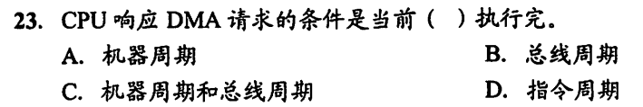
- 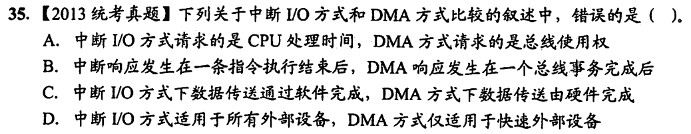
- 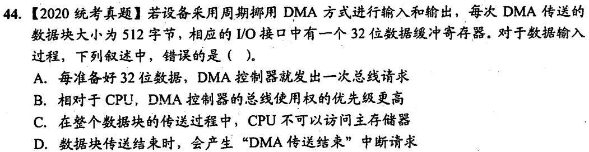
- 在 DMA 方式下，主存和 IO 设备之间有一条物理通路相连吗？
  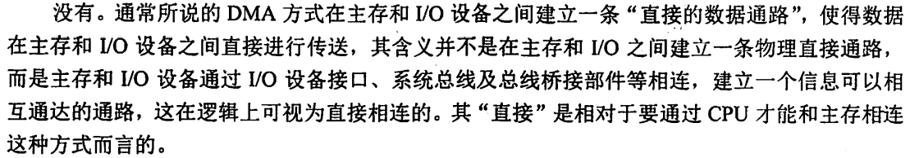
- 寄存器由一个触发电路（触发器）构成
- 决定计算机计算精度的主要指标是字长
- 十进制数 137.5 的八进制是 211.4
- 变形补码运算中，有着模 2 的补码运算的全部优点，并且更加容易检测是否有溢出
- 算数移位中，双符号位的移位操作只有低符号位需要参加移位操作
- 浮点数运算中的对阶，只存在右移，不存在左移
- 采用规格化主要是为了增加表示数的精度
- 浮点数中，尾数是定点小数，也就是说只能是 0-1 绝对值的小数
- 主存和 Cache 之间的数据调动是由硬件自动完成的，对所有的程序员都是透明的；而主存和辅存之间的数据调动则是由硬件和操作系统共同完成的，对应用程序员是透明的。
- DRAM 芯片容量较大，地址位数较多，为了减少芯片地址的引脚数，地址通常采用引脚复用的操作，行地址和列地址通过相同的引脚分先后两次输入。
- 多模块存储器是一种空间并行技术，常用的有单体多字存储器和多体交叉存储器
- 高位交叉又叫做顺序方式，低位交叉又叫做交叉方式
- 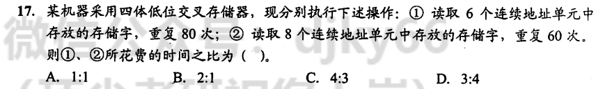
  画图画图画图！！！！
- 访存控制信号 MREQ，只有 CPU 访存时，MREQ 才为低电平，当 CPU 访问 IO 设备的时候，MREQ 为高电平，表示不需要存储器工作
- 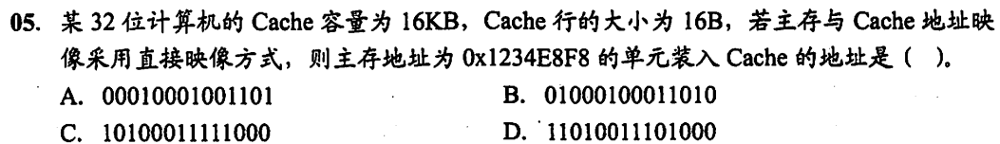
  直接取 行数 + 块内地址数
- 为了在指令字长有限的情况下仍然保持比较丰富的指令种类，可以采取可变长度操作码
- 调用指令和转移指令的区别：执行调用指令时必须保存下一条指令的地址
- 为了缩短指令中某个地址段的位数，通常采用寄存器寻址的方式，因为寄存器的位数不会太多
- 指令译码指的是对于指令的操作码字段进行翻译
- 间址周期取有效地址，执行周期取操作数
- 取指操作时自动执行的，不需要控制器受到相应的指令
- CPU 内有四个触发器，可以用来标识指令执行现在处于哪一个阶段，所以控制器可以区分存储单元中是存储的数据还是指令
- 硬布线控制器 又叫做 组合逻辑控制器，由复杂的组合逻辑门电路和一些触发器构成
- 微程序控制器采用存储逻辑实现，也就是把微操作信号代码化，目前，大多数计算机都采用微程序控制器
- 控制存储器 控制存储器 控制存储器
- 控制存储器位于 CPU 内部，采用 ROM 实现
- 地址寄存器(MAR) - 微地址寄存器(CMAR) 指令寄存器(IR) - 微指令寄存器(CMDR)
- 垂直型微指令一次只能完成一个操作
- 采取独立编址的时候，IO 端口地址和主存地址可能相同
- IO 指令实现的数据传输是发生在 IO 端口和通用寄存器之间的
- 关中断，否则断点或者现场保存不完整
- 中断服务程序中保护现场
- 返回之前，恢复现场；中断程序的最后一步是执行中断返回指令
- DMA 方式是一种由完全由硬件进行传输信息的控制方式
- 预处理 数据传输 后处理
- 预处理：初始化 DMA 控制器中的有关寄存器、设置传送方向、启动该设备
- 后处理：CPU 执行中断服务程序做 DMA 结束处理
- DMA 不中断先行程序，不需要保护现场
- 存取时间和物理地址无关，叫做「随机存取」方法
- 异步刷新也不会出现「死区」
- 校验码中增加冗余位的目的是为了增大码距
- 码距越大，抗干扰能力越强，纠错能力越强，数据冗余越大，编码效率越低，编码电路相对复杂

### 名词

1. 主存储器 MM(Main Memory) 又叫做内存
2. 辅存 又叫做 外存
3. 指令集结构 ISA
4. CPI Cycle Per Instruction
5. MIPS Million Instructions Per Second
6. MREQ 访存控制信号 Memory Request
6. 
6. 

### 复习课

#### 第一章

如何区分指令和数据？

计算机硬件的主要指标（三个）：计算速度（CPI（不同情况下不同概念）、百万指令条数）、机器字长、？？

关于计算时间的作业题，这里的计算大概是重点

还有一个层次结构，理解了就行

#### 第四章

两级存储体系：缓存（纯硬件实现，为了解决速度问题，自己设计一个 Cache，设计一个流水的访存指令？）主存-为了提高访问主存速度，主存辅存-为了解决容量问题

存储单元的属性（每一个都有自己的地址和内容），字节编址？字编址？大端小端？、命名字的地址（不管大端小端都是低地址）？

C 语言变量在内存中分配字节数

不管读写主存，CPU 都是送出地址，然后一个读写命令

**重点：** 存储体有一个 **地址锁存器**，地址译码器，还有存储体，读写逻辑，读出来的信息放在数据缓冲器寄存器里面，然后送给数据总线

动态存储的刷新（使用电容存储电荷来存储信息，不然会掉电丢失）三种刷新方式必须掌握（最好的刷新方式？）

**重点难点：**存储器设计、译码器、容量计算、每一个选中的芯片都有片内地址（无法参与外部的译码电路）、片外地址、小容量的芯片一定需要二次译码、二次译码差几倍就是几根地址线？选的不同芯片不要差别太大，不然电路设计麻烦

汉明码（奇偶校验，看题干）

**重点** 低位和高位交叉编址的带宽计算，与由多少存储体组成有关

**重点** Cache 命中率、效率、访问时间计算

**重点** Cache 主存地址映射，会出  大题

几个片选信号写几个范围

汉明码先纠错，再取有效信息

低位存取周期？？？？

#### 第三章

总线没讲，因为太老了，但是智慧树的习题上面有几道例题，讲的数据总线。

涉及到的题目大部分是数据总线上的数据传输率的题目

